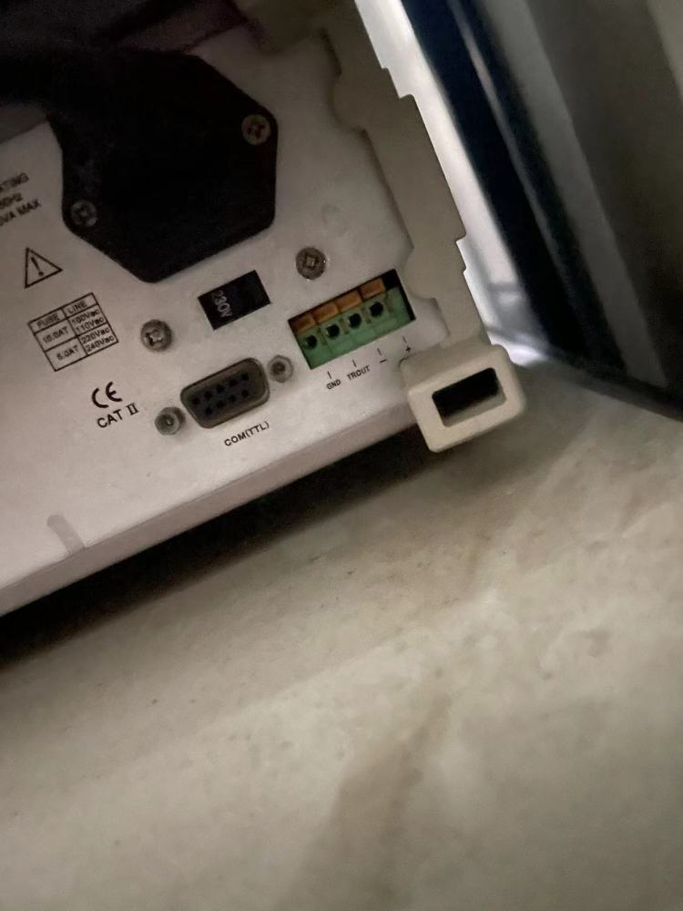
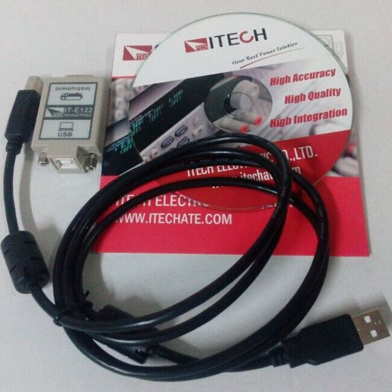
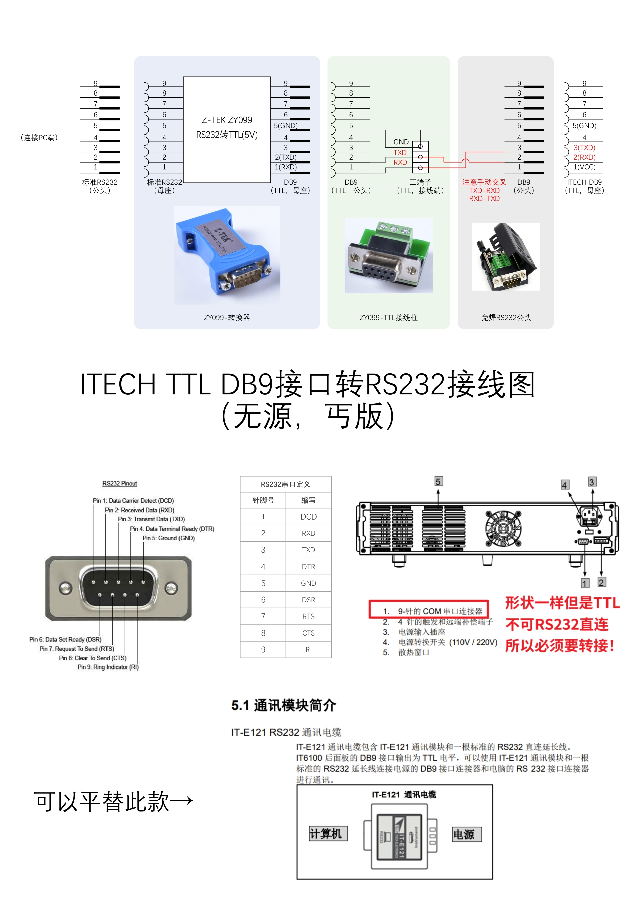

## 查看接口
老旧的ITECH设备背后往往并未配备USB、RS232、488接口，

只有一个DB9接口。注意这个接口形状确实是和RS232长得一样，但是引脚定义和电平信号并不一样，因此贸然乱接线可能对设备有损伤。

## 连接方案
官方建议的连接方案就是~~氪金~~买他们的控制线：

但这玩意儿一根线几百块钱，而且不够长。实际上不要花这个钱，DIY一样可以满足需求。核心就是：根据ITECH的TTL引脚定义，接一个随便淘宝就能买到的RS232转TTL(5V)转换器，只要引脚正确，就能完美使用。
接线图：

高清图见：[引脚定义高清图纸](file/ITECH%20TTL转RS232.pdf)
