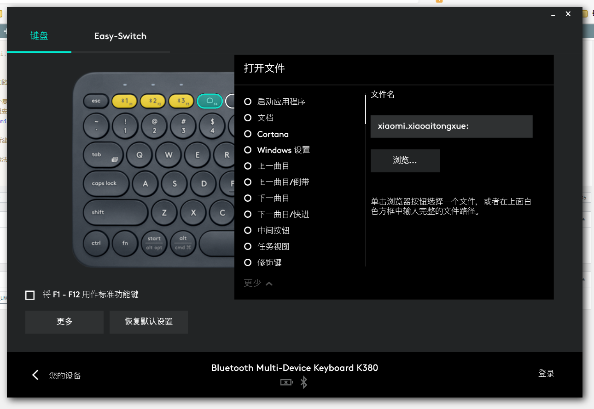

## Win10小爱同学UWP版下载

小米前段时间又发了新笔记本，同时带来的内置小爱作为语音助手可以直接控制米家让人瞬间忘了不争气的Cortana……

这个小爱同学直接去微软商店是搜索不到的，下载链接：

    https://www.microsoft.com/zh-cn/p/%E5%B0%8F%E7%88%B1%E5%90%8C%E5%AD%A6/9mw76kfhnz0c

这个随便百度就有，安装过程此处不赘述。

## 通过URI Scheme唤起

看了网上一堆教程，都是找到快捷方式后绑定快捷键的。个人觉得不算很好的办法，因为 UWP 的安装路径不是传统 Windows 应用那样"稳定"的。

因此，我直接搜了下注册表，找到这么一条类似 URI Scheme 的东西：

    xiaomi.xiaoaitongxue:

这个和路径无关，是类似`ms-settings:`一样的。

把这个复制粘贴到资源管理器的地址栏可以直接唤起小爱同学。如果你是Windows10电脑正在访问本页面，且安装完了小爱同学，你可以试试点击这个：[点击此处呼出小爱同学UWP](xiaomi.xiaoaitongxue:)。正常应该直接蹦出来了。

或者新建快捷方式，把路径/网址填写成这串，再设置快捷键也可以。

我的做法是把我罗技键盘自定义键位在 Logitech Options 里面设置为"打开文件"，路径设为这个就行了。

## 进一步猜想

既然有了这个 Scheme

那很可能后面也有某种参数，使得`xiaomi.xiaoaitongxue:xxx`可以直接打开小爱并处于语音状态。当然这个是猜测，目前还未发现这个参数究竟是啥。

