> 这些是我从2015年入学以来与社团有关的记忆碎片，不代表任何社团，仅代表一个曾经是**社员、管理层、社长**且恰好曾经在**仙林、鼓楼两地社团**呆过的人的观点。这种文章本来应该毕业季去写，但当时有其他打算了。最近各种场合的社团问题看的我特别闹心，我仍然觉得有必要去写，**我想给大家展示的是这么多年来一些后来者并不知道的东西**。如果可以的话，我希望这篇文章能有助于有缘的读者去思考：**我们到底想要什么样的社团文化？社团管理在一纸条例之外的现状到底是什么样子的？**

全文近一万两千字，从九月开始边观察边写了很久，阅读请注意把控时间。希望这篇文章能被某些社团管理部门的人看见，**这是我用个人经历对你们发出的诘问。**

## 仙林，开始的地方

### 学生会

2015年夏，我进入了南京大学，也在军训期间某个吹水的晚上，进入了我的第一个社团。

其实大一我并没有参加那么多的社团，甚至没有一个"校级"社团。由于我对歌舞琴棋书画一窍不通，独独对平面设计非常感兴趣，我最先加入了叫做焦点报社的院级社团。焦点报社主要做一些偏生活娱乐向的内容，然后做成报纸以供院内同学阅读。

同时我还进入了物理学院学生会的宣传部，姑且也算一个"社团"吧。

萌新进入社团的步骤大多是面试、破冰、内训、干活，中间夹杂着各种各样的团建活动。初入大学，我其实特别好奇"面试"的目的在哪，为什么大家凭着爱好、兴趣进入的社团还要"刷人"*（后来才明白这是个常见误区，"面试"不一定是为了"筛"，更多是为了有个基本了解；事实上，更多社团巴不得你加入）*。

学生会宣传部问我的面试题我至今还记得："如果你的任务和期中考试冲突了，你怎么办？"这种送命题一下把我搞懵了。后来部长心爷话锋一转，"吓你的"，我才松了口气。至于焦点报社，那就更加有意思了，所谓"面试"其实不过是打桌游，大家乐乐呵呵、稀里糊涂地就入社了。

入社了还能咋办，有活就做呗。

接下来的半年里，宣传部和报社都陆续安排了内训，我基本没缺席都去参加了。**和绝大多数无基础的萌新一样，我什么也不会，但是又什么都想学，听了一段时间后发现自己仍然没有长进。**

那年11月，[迎新晚会来了](https://mp.weixin.qq.com/s/IUUJnsd-Lx6k1L4tBV5Igw)，大家开始用刚学会的技能尝试自己做第一个大项目。这是我第一次真切地感受到

**"纸上得来终觉浅，绝知此事要躬行"**。但奈何大家水平有限，部长心爷一个人还是担下了重担子帮我们修改甚至重做

*（后来我曾经听说心爷期中考试前后自己肝到凌晨三点，其实还挺愧疚的）*。

回过头看，那一次集中大量的制作宣传物品所带来的经验，是相当难得的。

迎新晚会上，能歌善舞的同学们在张心瑜小剧场地聚光灯照耀下熠熠生辉；他们的名字不停地在表白墙、留言墙上浮现，舞台下的欢呼与大笑此起彼伏。学生会各部门在后台紧张待命，对讲机一刻不歇，道具组一身深色衣服，藏匿于门后、幕布后、钢琴旁，或站或蹲，有的作弓步，如箭在弦。

我藏在钢琴后面，手里拿着三四个话筒，同样栖身在这角落里。转场来临，黑夜里窜出身影，一拥而上；在下一次灯光亮起时，舞台便完成了一次时空转换。

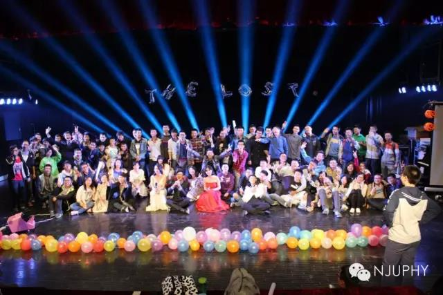

迎新晚会终于成功举办，大家也长长地舒了一口气。这带来的凝聚力、成就感是无法比拟的。结束后，大家一起去仙鹤门附近平摊费用找了个地方刷夜，那也是我人生第一次通宵。

刷夜很热闹，有唱有说有笑。我们几个熟人有些怕吵，打算出去转转图个清静。后来，我们在二十四小时营业的麦当劳和同样寻清净的部长相遇了。这晚大家聊得挺开心，但却不知道这样的机会两年后将彻底成为历史。

后来大二我也进入了部长群，成了副部长。那一年的主要事情都是部长在做在带，部里的新人很强，氛围还算不错；我就是个水群活跃气氛的。

在学生会宣传部的经历对我影响是巨大的。如果问在学生会宣传部我学会的最重要的东西是什么，不是Photoshop，不是Illustrator，不是Premiere，也不是学校生活经验，更不是"学霸秘籍"——尽管这些，学长学姐们也都告诉过我们。

总结下来，最重要的是一句话：**"做平面设计也好，做其他东西也好。很多类似的工作，你可能永远也不会进入台前，你可能会孤独地呆在幕后，没有太多人关注你。"**

原话已忘记，但大意如此。

### 《焦点》报社

如果说学生会宣传部育成了我"现实"的内核，那么焦点报社则赋予了我"热爱生活"的特质。

在报社里，我最初进入的是编辑部——主要是排报纸版面的。这份将"以物理人的视角看世界"作为理念的报纸，内容部分向物院同学征稿，每一期社长、主编、指导老师会选定一个主题。围绕这个主题，报社宣传部去做问卷调查，记者部去采访相关人物，最后林林总总汇集到一份报纸上。

其实大一的时候，我并不热衷于报社，因此很多次排版任务我都有其他事情推脱掉了。但是没有想到，报社换届的时候我还是被"钦定"做了主编。因此我不得不从头学起其实并不熟练的排版业务，去做了暑期特刊。

做报纸是之前从未有过的体验，仅仅做平面设计是很少有机会接触到印刷业的种种知识的：出血、转曲、四色黑、校色......因此在做主编期间，我从印刷的角度又重新学习了一遍很多平面设计相关的知识，也受益良多。

报社日常就是做做报纸、约出去打桌游

*（我们甚至有个"焦点桌游社"的花名）*，平常没有特别大的活动。

突然有一天，报社迎来了它的高光时刻——化学院的《化院纵横》杂志与支点学社的《支点》杂志邀请我们一起举办活动。于是在115周年之际，大家在杜厦图书馆[举办了一次"纸有良媒"的联合展览](https://mp.weixin.qq.com/s/7baqKW5LSpecoXtg6xdC6Q)——我们自嘲叫"旧媒体联合展览"。

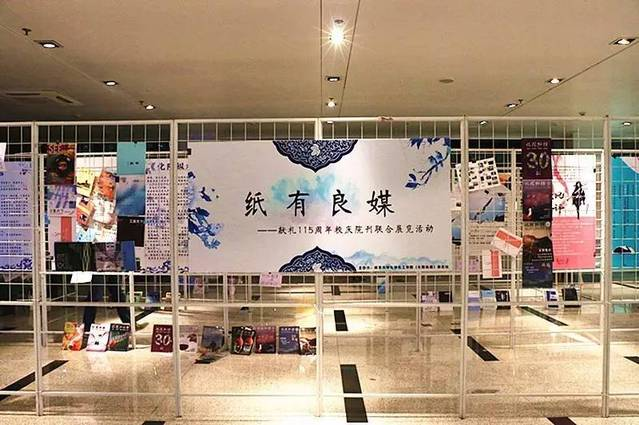

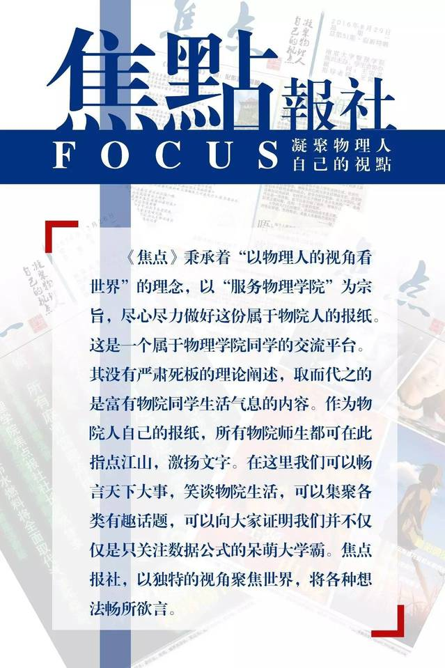

**我们以为，这是"旧媒体"的一次枯木逢春，是纸媒重回大家视野、突破院系圈子的曙光，但万万没想到这竟是一次"回光返照"。**

2017年，突如其来的大类招生一下改变了原有的大一新生结构，各个院系团组织不允许提前在大一招新，以免影响分流公平。顺应这种改变，学院内部也在改革，学生会有几个部门被取消，焦点报社也面临着解散。

那天，辅导员突然把我与社长叫到办公室，告诉了我们报社解散的决定。我和社长异常平静，我甚至有一丝无法掩饰的激动：**我终于要结束和日常崩溃的CorelDraw的斗争了！**

万岁！之后我俩经常以"末代社长"和"末代主编"互相称呼。

但表面的轻松其实难掩内心的复杂，回去之后我们着手策划起了停刊号。最后一份报纸恰逢物院即将搬到鼓楼，我们在报纸上留下了一个类似定向越野的纪念谜题游戏，需要解谜者亲自前往仙林校区各个地点才能知道答案并拼凑线索，但至今邮箱还未收到第一个通关者的消息。

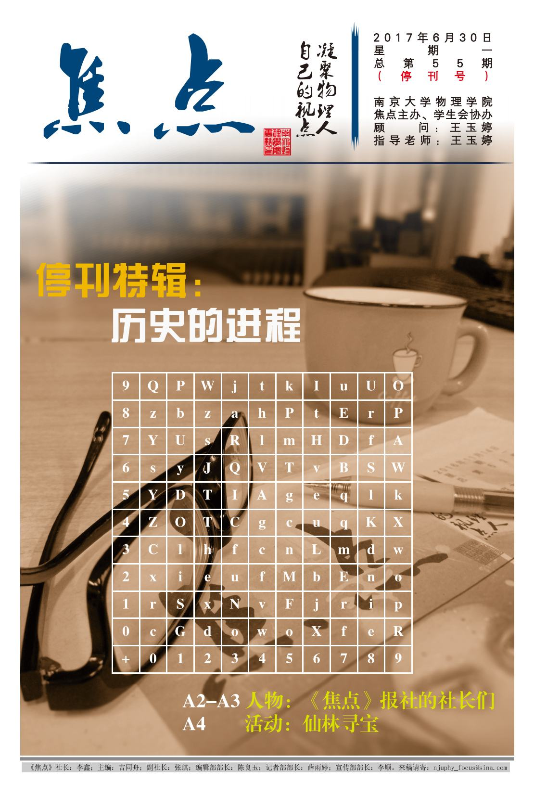

学生会裁剪、报社解散后，一些人自愿补充进了当时换届遭遇难题的支点学社。因此，我来到了我的第三个社团，成为了技术部副部长。

## 鼓楼，偏僻的市中心

2017年来到鼓楼，那真是和仙林完全不一样的世界。

**往好了说，叫有烟火气，适合养老专心学术；往坏了说，叫更加现实，单调乏味缺少活力。**

这里地处市中心，但是在校园文化氛围上，是穷乡僻壤。

在鼓楼想搞社团活动除非有特别强的利益驱使，否则很难成气候。这话可能有点绝对，但也八九不离十。

**幸亏没有人一拍脑门觉得应该把新生丢过来，不然的话这些新生将在进入大学探索自己的黄金时期，彻底与多样化的南大校园文化氛围脱节。**

### 支点学社

支点学社上来就遇到了一个非常头疼的问题：新的管理层理应要换届到16级了，但是因为本身经营问题以及院系调整，管理层仍然是15级，只不过换了几个人罢了。可是，社团内的16级成员保留不多；17级新人招了一批，不仅仅断代了，甚至还有跨校区的麻烦。

当时，指导老师的策略是将重心放在鼓楼，挖掘宣传物理学院的学术资源，去帮助本科生对接乃至了解前沿的科研。活动有时在仙林、有时在鼓楼；有时即使活动能办起来，却还需要人来捧场。**于是做成茶会提供饮食、拉人凑数；什么方法都用了，最后还是比不过隔壁随便办个招聘宣讲会。**

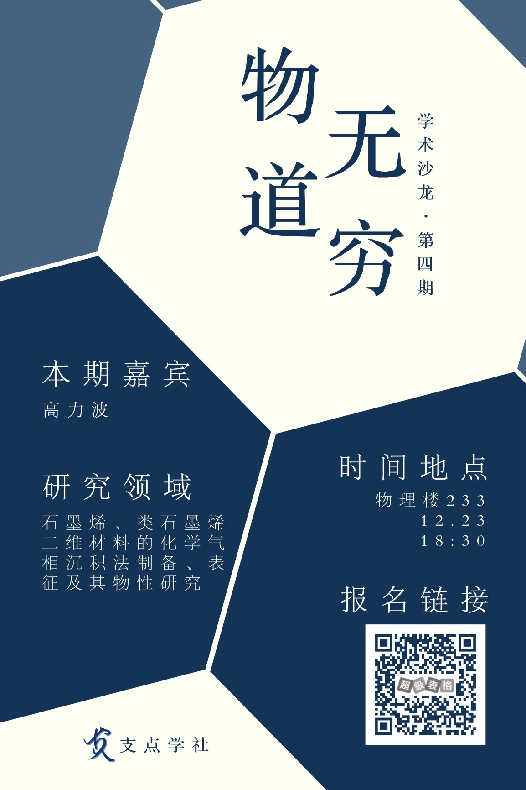

17公里之隔，管理层无法亲自带新生，传承也存在很大的风险。我当时作为技术部的副部带了一些内训，跑去仙林实在是有点吃力。虽然当时的新人也很厉害，但最后直到又一次换届，我明显觉得两代的关系完全不像之前我还是新人那样紧密。

那一年，支点没有出杂志。换届后，我对后面继任的16级部长千叮咛万嘱咐，如果下一届积极性不高，一定要重点培养18级的新生，你把自己当成17级，但是得辛苦点两头跑。否则，断代问题将延续下去，无穷无尽。

我后来没有再关注支点的发展了，但我大概能猜到他们仍然很艰难。

2016年我还在仙林的时候，恰好被辅导员喊去帮忙处理丢在系图书馆的一台浦口运来的旧服务器。

当时我读了盘里的数据，发现竟然藏着不少物院十多年前的记忆——606（数字似乎是这个）小组、早已消失的`einstein.nju.edu.cn`、物理系FTP和论坛以及支点初创时的一些活动资料。

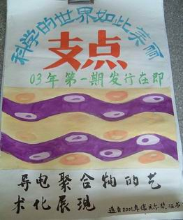

当时支点学社在浦口能办讲座、篝火节、物理文化节，据说还外联到了nVidia的显卡赞助、冠名足球赛——要知道那可是二十一世纪最初几年。这样的规格放到现在恐怕也没有几个社团能做到。

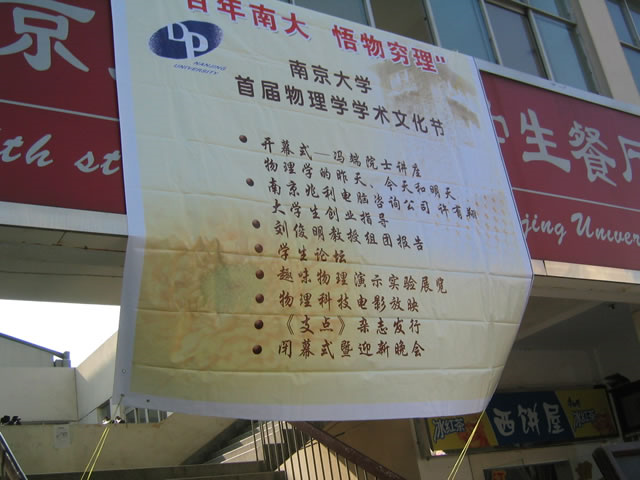

所以，想想其实挺可惜的。

### 科幻奇幻协会

在进入鼓楼的时候，我还云加入了第四个社团，科幻协会。

起因是当时还是社长的学弟在空间做了一波宣传，我感慨"终于找到了组织"，带着我的南大Whovian小群组

*（Doctor Who剧迷群，虽然就几个人）* 加入了社团。

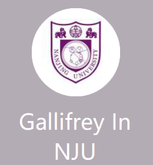

这个社团的发现一下让我找到了小众文化的归属。这种归属感，我从入学开始，每隔一段时间在南京大学表白墙上寻找同好时，就一直在寻觅。

在科幻协会的日子很开心，大家没事水水群，交流交流科幻作品，玩玩梗；有时组织到教室公开放电影，有时出去约饭约电影院；偶尔还有硬核一点的讲座。

这种简单的快乐大概持续了只有两年。2019年，《流浪地球》从春节档杀了出来，《复仇者联盟》迎来了漫威电影宇宙第一个十年的终结，《我的三体》《灵笼》等国产原创科幻动画引起热烈讨论；**而社团想尽办法也没有找到挂靠老师和院系，终于失去了校级社团的身份。**

失去校级社团身份意味着没有办法申请场地、宣传。这对社团的招新、线下活动造成了很大的影响，2020年疫情的到来更是雪上加霜。大家变成了一个普通的爱好群，通过心口相传、表白墙打打小广告宣传，于是科幻协会消失了——

——那是不可能的，看起来消失只是你观察的维度太低了，我们已经变成了高维生物（误）。

大家试着自发组织起线上开语音看电影，其实还挺开心的。水群照旧，发现了新人再宣传宣传，即使社团的名义、形式没了，最终把大家聚在一块的还是对科幻文化的热爱，这没有变。

科幻社经历的麻烦远不止我所看见的，我毕竟只是一个社员，不是管理层。[曾经的社长做过一次访谈](https://mp.weixin.qq.com/s/B3jYf3m2TLvjmYzvvhOpPw)，有兴趣可以移步看看他的心境。

但在鼓楼，还有另外一个社团，后来成为了我的"第二社团人生"。这个社团就是IT侠。

我在大一的时候就已经对IT侠有所耳闻，但我从来没有找到加入他们的方式。直到我换了校区，发现鼓楼校区竟然还有分部，于是从仙林的渠道联系到了鼓楼的组织，加入了他们。

**这一段经历对我是如此重要，以至于我需要单独给它一个篇节。**

## 成为"IT侠"

关于我在IT侠的体验，我想先从我幼稚的时候谈起。**这也算是我对IT侠的新人、还有很多自认为"小白"的同学一直想分享的经历。**

我的计算机教育有着非常奇妙的过程。我来自一个郊县，那里计算机教育水平可以说是落后，几乎所有这类课程都会沦为补课。幸而因为家里人工作的需求，我很早就可以接触（物理意义上地接触）计算机，虽然仅仅是能玩其中的游戏，出了问题也不知道该怎么办。

我玩过MS-DOS、Windows 95、Windows 98、Windows XP、Windows7上的各种单机小游戏，拆坏过家里的软盘，但是啥也不会、啥也不懂。小学了，学校机房可以联网，我终于突破到会玩4399、7k7k上的flash小游戏了。

记得六年级的时候，老师让我们家里有条件的拷贝几个照片，我在家里的电脑上复制了一份快捷方式交了上去......**这简直是电脑白痴的阶段**。

但一切在初中发生了改变。

初中的时候，计算机课不出所料地被主课经常替代，教学也非常划水。计算机课几乎等于看电影课，大家在一学期的计算机课上看完了一部《阿凡达》。

那个时候实行教材回收了，因此课本也不会给带回家，但是习题册可以。于是我就拿着习题册，回家纸上学Visual Basic，学了点基础。

恰好我家这个时候接入了互联网，我也因此拿家里电脑装上了VB6，通过互联网学起了Visual Basic、Photoshop（学校要做展板）和World Editor（魔兽争霸地图编辑器），玩得不亦乐乎。年少热血的时候，崇拜黑客，甚至拿着入门水平的VB写了个灌数据的程序去"灌"钓鱼网站。

大约就是这个时候，360全家桶突然闯入中国互联网，还与腾讯大战一场，史称"3Q大战"。当时少不更事，迈入了**第二个阶段：会了一点点工具就热衷于到处帮别人"整理"电脑，全然不管他们的实际情况。**

因此有好多台电脑被我装上了360全家桶，一旦遇到问题就去"一键修复""电脑门诊"。

说来有意思，当初我是360的忠实拥趸，现在已经是个黑了——人大概就是在不断否定和扬弃过去的认知中不断前行的。回头望望这个阶段，大概是刚学会使用工具的阶段，尽管全然不知道背后是什么原理。

到了高中，人也沉稳了下来，开始思考"算法"究竟是什么——大家很频繁地提起，一定很重要吧。

大家都知道，高中数学有一段内容叫"伪代码"，高考大纲内。其实那就是BASIC语言，我对于"算法"也有了一个浅显的理解，就是：有限的资源内高效条理地完成一件事。**它不仅仅是计算机命令，其实在日常生活里也可以是一种颇具效率的思考、优化方式，区别仅仅在于你用什么样的语言来描述这一切，使其精准地传达问题、整理思路、寻找答案。**

想到这里之后，我觉得VB也好、魔兽地图也好、伪代码也好、易语言也好，虽然在实现和描述对象上千差万别，但都在精确、高效地用有限资源完成某个目的。

在江苏，高中那么多计算机课只是为了一个"合格"的计算机水平考试来获得最终高考的第一张通行证

*（第二张叫"小高考等第达到C"）*，我们小地方的高中采取的策略是：打印操作考纲，早上读书背，计算机课上机操作。Office比较好考，于是学校安排大家背Word、Excel、PPT三件套的题目和操作。当然，考完就忘的占大多数。此时我在互联网上知道了"信息学竞赛"这玩意儿，颇感兴趣，买了本竞赛教程和《C语言程序设计》回去看。

终于，有天按捺不住了，在上机折腾完Office之后向老师问出了疑惑很久的问题："我们学校还是有几个人搞数物化生竞赛的，那有信息竞赛吗？"

计算机老师一脸茫然："那是什么？"

后来，我发现了网易公开课，就着C语言的网课（好像叫CS50）开始自学C语言。主讲的教授用的是OS X，代码都是vim写然后gcc直接敲命令行。当时就觉得，真的很酷。

虽然高中不怎么能碰电脑，但是我碰巧有了人生第一部安卓机，话费送的。我也开始了解Android这个系统和Linux。安卓应用里有个叫C4droid的应用，可以在手机上简单运行C语言代码，这就成了我的playground。**当我用这部小手机看起了更广大的互联网平台，越来越感到我的无知。**

你可能觉得，我经历这么多之后，终于在高考后决定成为一个计算机专业的学生。事实上，我选择了更加让我好奇的物理学专业，这个选择让很多人惊讶，我很开心大家都没想到。

前面废话了那么多，其实是想说，**互联网对于有欲望去自学的人来说是个好东西，积极性是个很重要的东西**；如果引导得好，还可以成长得更快。

**每个人都是从小白开始的，大多数问题查查总能自力更生找到解决方法**，"我不懂"其实应该翻译为"我懒得学，你帮我解决一下吧"，很多人不愿意承认罢了。

进入大学后，才是我与IT侠的一切的开始。

说来好笑，我入学见过不起眼的地方有个"IT侠"的介绍，完全不知道它是干啥的，似乎很厉害。但我当时忙于两个组织或社团的技术部门，根本没时间去参与更多的活动。

虽然没有加入社团，但是折腾却早就开始了。其实我买电脑的时候，先在网上问熟人推荐，敲定型号后不太敢信任网购，我妈托熟人从工厂实体买的。又遇上基友借修电脑撩妹，拿了我的电脑来重装Windows 7失败，因为分区表问题没搞清楚，在野鸡维修店那里把我预装Windows 8.1的笔记本全盘格式化了，一点数据没备份（这也是为什么上面学生会那里我没有图片的原因）。在这之后，我突然知道学校有买正版的Windows，就趁机会重装了Windows 10。

恰好，高中开始我就有着执念，若我有了个人笔记本，我一定要装上Linux玩。终于大一的时候有了这样的机会，开始折腾起装系统。为了把Ubuntu+Windows 10双系统装上，引导问题、显卡问题没少遇到。网上教程复制粘贴，充满着错误和个例，也导致一路踩坑无数；什么EasyBCD的教程到现在都能看见，我相信乱模仿的都崩过。**但今时不同往日，事物都在变化，一些教程早已过时，实在误人子第。**

就这样陆陆续续折腾了大大小小的各种问题，我突然意识到：**我知道的东西，是不是过于散乱，以至于其实并不是最好的方法？**

于是我在大三搬到鼓楼，打算换换空气（夜宵口味）的时候，突然想起了IT侠，希望可以在大量的样本里学习到更加广泛的内容。几经折腾，我终于找到了当时曝光度很低的IT侠，然后到了鼓楼分部，发现工作环境非常简陋。

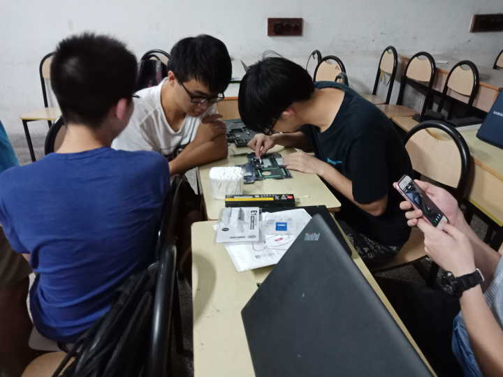

不过这并不影响大家交流、解决问题的热情。

我进入社团的第一次值班，带了自己的电脑打算拆着试试。没想到一位大佬上来二话不说给我拆完了，留下七零八落的部件和螺丝，说了一句"我有事先走，你自己装下吧"然后就赶紧走了。

所幸，我花了两个多小时，在前辈的指导下，把它装了回去。当它被点亮的时候，我有了一种"置之死地而后生"的感觉。

起初，我不敢接单，因为拆得太少。

至今我当时的前辈说的一句话我还记得，叫 **"唯手熟尔"**。

转念一想，不知道怎么拆，我就查拆机图，遇到困难就问问值班同学请教，在场的都不会就群里问。总是有解决办法的。于是我就不管会不会，预约接来看看再说。运气不好的时候，一连几个都是很诡异的问题——那就硬着头皮去修。说实在的，这样的确很难，但是**次数多了，什么奇怪的问题都见过了，也不再害怕了。**

大三一年，从完全不会拆解到不要拆机图大部分可以盲拆，我成长速度飞快，得益于大量实战和经常归纳。拆开难无非是螺丝和卡扣，卡扣无非几种结构，螺丝无非藏在几个看不见的地方，细细研究之后注意一些受力的细节就可以了。虚的话，查拆机图就行。

拆电脑其实是细活，只要足够细致，没有图其实也可以观察出来设计走向，急不得。拆机拆多了，对于内部构造也能有些了解，软硬件结合之后对于电脑各种问题的理解也会有很多帮助。

大四一年关注起软件问题，于是把林林总总好多问题和同伴一起写成了《在线互助群问题集》，希望可以缓解维修的压力。

我对于计算机的认识，从什么不懂一窍不通到会模仿教程半桶水，再到深入了解自觉无知最后到严谨实验务实研究，这个过程希望可以给后来的朋友们一些参考。

我也不知道下一个阶段到什么程度，或许因为其他事情太忙而止步于此。但就现在看来，IT侠里磨练出来了一个很重要的能力——**对于未知的问题，也要敢于逐步分析，大胆假设小心求证。**

修着修着，我对于IT侠所遇到的各种问题开始了进一步思考。正如之前说的，相当多的人，其实是"我懒得学，你帮我解决一下吧"这样一种态度，电脑无穷无尽、不断迭代，是不可能修完的；你甚至还会遇到各种奇葩求助者，觉得我们就应该解决TA的问题，不该有七情六欲，会因此说你"公益"就"应该"怎么样。

我们也经常自嘲，**"互助"到最后就像是"扶助"**。

我想大家可能也和我小时候一样，**在枯涸的计算机教育下，很容易变成一个畏惧计算机的人。**

我们也遇到过，虽然很多非IT侠朋友也会帮助解决一些电脑问题，但由于缺少交流，存在很多误区导致很多问题没有完美解决，偶尔会导致有人来找我们，我们重新科普、纠正、解决历史遗留问题；或者是因为自身条件优渥，所以给出的建议不考虑他人的实际情况导致没有必要的花费。

我个人挺珍视这种帮助的精神，**其实非常希望大家可以向周围这样的大佬们推荐下我们，加入一起研究更好地解决问题**。

即便这样经常遇到困难，我们还是希望可以向大家普及这些知识。有人不理解、不理睬，认为花自己时间帮别人解决问题毫无意义，**做这些无偿维修和知识普及工作究竟有什么意义？**

往大一点说，这是**整个高中教育里计算机教育缺位、大学新生特别是研究生新生入学的信息化教育不到位、校园内缺少相关服务组织、校园内和周边某些商家利益熏心**，迫使校内师生需要这样一个组织存在。南大的师生对计算机的维修需求在逐年上升，[这几年前我们做过数据分析](https://mp.weixin.qq.com/s/HLH8g1qOeoDX4YBSAhUHQw)。

往小一点说，我为什么要选择成为一名IT侠？

再回顾以上的这个过程，我想已经不言而喻了。

我加入成为一名IT侠，最初单纯只是因为好奇和分享；是为了许多实战的经验、接触到很多同样兴趣的朋友；是相信在这个组织内，还存在**不计较利益得失去做自己喜欢的事情、去做好一个"南大人身边的普通人"的一群人**。意外之喜是，我还在IT侠认识了我可爱的女朋友。

我个人其实不愿意把这么一件事情称之为"公益"，**比起社会公益，我们做的太少了，也做不了那么多**。

回归到IT侠的口号，"侠之大者，为国为民；侠之小者，为友为邻"，我们做不了"大侠"，但**每个普通人都可以是"小侠"**。

IT侠还有另外一句话，"人人都是IT侠"，落实到行动上就是一个个"互助"群的出现。

并不是说一定要修电脑，这理解实在是太狭隘了。

最初IT侠的成立，就仿佛是：

"哎，我这电脑不好使了，要不我去珠江路看看？"

"不用去了，那边水深，我来帮你弄下吧，不费事。"

这样一段对话。

**没有什么国家大义，没有什么高尚情操，就是简简单单的、任何普通人能做到的——与人为善**。

而这样的事情，往往单枪匹马是不够的。大家喜欢做这样的事情，认为对自己有意义，希望能拉来同伴开心做下去，就是社团大家聚在一块的最简单意义。

当然这只是我个人的理解，并不代表IT侠其他人的看法。

以上其实是作为社员的体验，是我很久前写过的东西。后面成为主席的经历让我真实面对了社团之上的那些现实问题。

我在IT侠呆的第二年开始，被"钦定"为唯一一位竞选鼓楼主席的候选者。其实直到成为鼓楼主席后，我才发现社团面临的问题如此之多。

IT侠创立几年来，大大小小的情况导致工作室腾挪数次。

仙林分部临时得到了电子学院的帮助才得以有落脚的地方，但鼓楼的工作室因用于堆放建材收回之后再无音讯，期间社团甚至有不得不在走廊值班维修的经历。幸而有物理学院的帮助，社团才能每周借一处条件简陋的教室值班。

社团的工具箱不得不放在附近研究生的办公室，更多的东西则因为暂时无处安放而继续锁在了食堂楼上的仓库里。

**不到自己来做社长，你根本想不到社团有多艰难。**

我们总说自己用爱发电，**实际情况比用爱发电还要奇怪**。仙林分部不停肝活动写活动策划，才有了不少报销额度，而鼓楼分部则是我们自己的部分毕业社员和一些客户零零散散给我们捐款......

这真的已经完全是倒贴钱了。但大家毕竟一直能边修电脑边聚着聊天，很开心，条件艰苦忍忍也还是可以继续运转的。

场地和资金的问题倒是其次，社团最核心的人手问题，**这在鼓楼是最严重的**。

鼓楼这个地方大量**不受社联（现在是社管部）管辖的非校级社团和商业活动，不需要遵从统一安排**，只需要自己归属的主管部门同意和审批就可以随时贴出海报、拉横幅、办展台、搞活动；而IT侠由于是校级社团，还必须要跟着规矩走，有事不得不跨校区加盖公章。因此，IT侠的招新宣传总是慢半拍，加上**鼓楼的氛围相当"现实"**，想要加入我们的人少之又少，不做宣传根本没有办法吸引到大家。

我那年对这种情形很不解，**为什么我们费力成为校级社团，却比其他的组织要更加拘束？**

我问了当时的社联，我们遵守规定，那招新的时候能有什么帮助吗？

社联的同学很无奈地告诉我，**没有办法**。这个问题一旦行成滚雪球之势，下一届换届人就不够，我想但凡社团负责人都有过体会，更别提应付乱七八糟的社团规章制度了。

我们这样的特殊社团，不能全是让大家义务劳动，也总在想有什么办法可以慰问一下辛苦的大家。

最后发现，竟然还是得靠毕业的社员捐赠的经费来改善下值班的环境，买卖水果什么的。全靠自己贴，真的太奇怪了。

于是几年前在仙林的努力下又接入了志愿时长系统——这东西每个院系重视程度不太一样，有人锱铢必较；有人根本不会去换算，觉得为了这东西去刷"业绩"有点违背本心。

对于研究生来说，这些东西更加没有意义了。**抽出自己科研、实习的时间参与到这个几乎不计回报的事情里，在一片被现实挤压的研究生群体内多少显得有点异类。**

就我个人来说，我自动放弃了一百多单（实际远不止）的志愿时长，因为我觉得这是非常虚的东西。我觉得我在IT侠磨练出的诸多能力是最宝贵的收获，但像我这样想的肯定不多。

而后，我又干了一件我觉得很酷的事情：我在维修单数能进入当时历史前10的时候，匿名掉了自己在社团的数据，希望向最初的前辈致敬——[一位维修了500多单，最后选择删掉自己名字的不知名IT侠](https://mp.weixin.qq.com/s/HLH8g1qOeoDX4YBSAhUHQw)——以表我对这些虚名、数据的毫不在乎。

**我只是IT侠几千次维修中的一个参与者，善举无需要以多少来论英雄。在"为友为邻"的善意上，我和任何一位新人乃至小白都没有区别。**

大致说完了我的一些个人经历，下面我要进入正题了。

## 社团的暗面

我在就任鼓楼分部主席期间，被乱七八糟的事物折腾到压力山大，情绪波动也很大。

但这还是有人替我分摊了一部分的结果——另一位不像我这样能写很多感受的人，也就是仙林分部的主席谢沛东，当时默默承担了很大部分的社团"行政"事务。

真的要感谢他，不然我那时候必然要遭受心理上和生理上（跨校区跑）的巨大压力。

我真的难以想象，**如果没有毕业的社联人谢泽强学长开发的社联系统，那些繁文缛节般的社团规章制度和流程要怎么一个个去填写、盖章、申请、跑腿、归档**。

有时候只要上面有新的管理文件下来，下面的社团就会手忙脚乱的应付半天。社联的同学被夹在社团和学校部门之间，也突然会多出一堆事务。

2018年的10月，因为严格社团制度的需要，[社团们招新被卡了很久](https://mp.weixin.qq.com/s/OZ8dQoqtdmAI4XsR_xVKZw)，也有社团因此注销失败，引发了很多很多不满。

其实在那之前，悄悄消失的校级社团也有几个，印象比较深的是[性别性向平等协会](https://mp.weixin.qq.com/s/It5G22vn1t5t3gyAkAWGSA)，2016年寒假的"南星计划"招生宣讲大家还在把它作为自豪的南大多样文化，没想到一年不到他们就不在校级社团之列了。

当时究竟经历了什么已经是一个谜，可能只有当事者知道。

与此同时，我作为2018年的亲历者，也发现某学校部门违反了自己立下的社团需试运行一年转正和十佳社团评选规定，[带头创立了某个名字很长的社团](https://mp.weixin.qq.com/s/MVvSexOlbczpWULK1HtIAA)，甚至还[送上了十佳社团第一](https://mp.weixin.qq.com/s/eSTtmUaw6WtpjkB9VCYAFg)（后来传说被取消了，但推送仍然存在）。

为什么说违规？因为评选需要正式注册社团

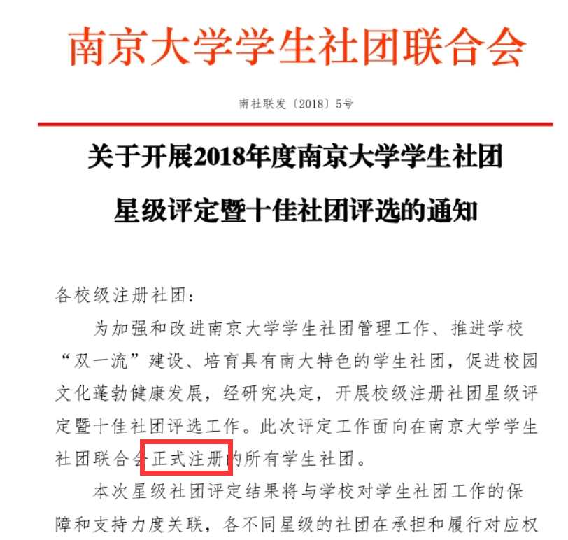

正式注册的规定可以在2018版《南京大学学生手册（本科生部分）》内找到《南京大学学生社团管理暂行办法》第三章第九条第4条件：

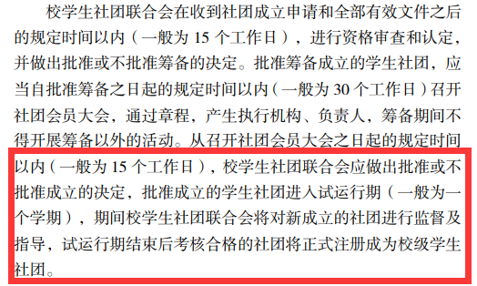

你们算算，这时间**就算足够正式注册，刚注册就参评十佳社团，很难不令人浮想联翩。**

我在群聊里质问过该部门的老师，该部门老师最后给出了一句"公示期没人提出异议"这样的理由。

这对于其他社团必然是一件不公平的事情，这样的回复，不会有人信服。

在卡住招新的"再注册"制度下，每个社团特别是小众的社团开学不得不找挂靠院系和指导老师。但是最吊诡的地方在于，**社团可能上一年是这样挂靠的，下一年换届之后负责人变了，院系和指导老师也不得不改变**；有的则是院系突然不愿意挂靠社团了，怕承担风险，社团们最后仿佛是烫手山芋。

那段日子，社团负责人们东奔西走去寻求挂靠和指导（如我呆过的科幻协会），但各个院系出于管理的考量非常谨慎地接收社团。**看起来，这些部门之间根本没有形成共识，有的院系甚至把社团视作校团委一厢情愿安排的任务，各个院系要做的只是"尽可能配合工作"，但也有权拒绝。**

这真是我见过最离谱的设计之一。

社团要忙碌很久才找到一个挂靠单位和指导老师，却在下一次再注册的时候可能因为换了个负责人被直接抛弃，甚至忙了半天还不如学校单位领头建设的那些社团轻松；社团成立的时候一份份文件申请，仿佛披荆斩棘，却可以不明不白地被用再注册卡住，甚至从此注销。**社团的成立与注销存在严重不平衡与不透明。**

2014年，有位学校领导说过"优胜劣汰"这个词，**我认为放在社团里根本不合适**。

上边这些，2018年我如是说过，2020年我要再提一遍。

即便是挺过了再注册，社团负责人仍然要面对千奇百怪的规定和"倡议"。

譬如，对社团负责人有成绩排名的规定，对特定类型的社团要求负责人政治面貌，甚至传闻出要建立团支部，上缴社团收入后按人头划拨活动经费等措施。虽然部分不是强制的，却给很多自己问题还没解决的社团带来了许多额外负担。

对于好多社团来说，换届是一个很头疼的问题，**能找到接班人已经不容易，你们还要加以限制，这种"优胜劣汰"到底淘汰的是什么？**

是GPA吗？还是政治面貌？

不同社团的活动模式也不一样，按照人头数计算给活动经费，**看起来很美好，实则根本没考虑实际分配、消耗的问题，更别说公平性**。

其实很多社团也不需要特别频繁的大活动，把平平淡淡的日常小活动做长久了，也是很大的成就。为了获取各种资源，肝策划书肝到秃，报销还面临手续复杂、发放滞后的问题——这样的生活，估计也让热情地想要改变社团现状的负责人们在卸下重担的时候，有死而复生的感觉。

**我原以为2018年社团的环境已经很糟糕了，没想到2020年，事情可以更加糟糕。**

这些文件，可能毫无征兆冷不丁地出现，让人措手不及。**我挺同情社联或者社管部里那些一心想要为南大社团做事的朋友，他们一定很难过。他们很多时候试图调和这些问题，最终却老师批评、社团不满，里外不是人。**

但这样的同情也**仅限于那些真正对社团感同身受的人**，包括一些老师。他们或许偷偷哭泣过，也面红耳赤地去争取过，甚至和其他人闹得不愉快，最后处于某些原因只能选择不说话。**我真的非常理解这些人，非常非常理解。**

## 肺腑之言

我回忆我所经历的一个学生会与四个社团，最终还是写完了这一篇冗长的文章。直到我敲下这些字句的时候，我的内心已经习惯了研究生脱离社团生活的平静。

但即便这样，我也经常被现在如今的某些学生干部的发言弄得哭笑不得，**一时不知道究竟是我太幼稚还是他们太幼稚，虽然我知道他们也就和我差不多大**。

没事，我们可以先抛开那些人，说说心里话。

**如果你是社团成员，你可能看见有些社团管理层很少冒泡**。那可能是他们太累了，因为他们换届时候也许并不是自愿留下来的，结果还要负担学业、生活和社团繁杂事务的多重压力。**好好珍惜愿意带领你们体验这不可或缺大学文化的学长学姐（甚至是学弟学妹），他们替你们扛下的东西可能超出你们的想象**。

哦对了，萌新其实不需要太害羞，不用过于畏畏缩缩、低声下气——**社团终将会是你的社团，你的大胆参与才会为社团注入新鲜的生命力**。等到你们慢慢独当一面了，社团里的前辈们会很欣慰——你可以从学会顶嘴反驳开始（误）。

**倘若你是社团管理层，好好珍惜自己的同事们，也就是其他的管理层**。如果社团的管理层都是一盘散沙，互相不交流，那么后果将是可以预见的冷漠。

也要**关心关心你的组员**，很多萌新可能比较害怕迈出第一步，其实他只缺你的一次引导。如果你一直不关注他们，他们慢慢边缘化后，一定不会觉得多么开心。

还有一个人很容易被忽略，就是**真正顶住许多烦心事、应付千奇百怪文件的社团负责人**，你们也要关心，不要让他觉得孤军奋战。

最后，**别忘了你自己**，虽然你可能是因为换届没有人和你竞争而被"钦点"的，但是大家换届的时候仍然是认真负责的。不要自我贬低、自暴自弃，大家把你选出来就已经认可了你的表现，你大可以自信一点。

**倘若你是社团负责人，你辛苦了**。无需多言，请收下我的敬意。

但我仍然会多劝一句，如果大家为了那些规章制度过得并不开心，那好好思索一下你们聚在一起的原因吧，或许只是几个人定期在操场黑夜中相聚也能寻回简单的快乐。

当然我知道这不是很现实，因为为了这份热情可以传递，你们必须要校级社团的宣传资源，才能为更好地存续做好准备。

**这确实是一个困境。**

而那些仍然在内心挣扎着，不知道应该无条件服从还是实事求是的人，**坚定地去做你们认为对的、合适的事情**。实事求是地去做事没有什么好怕的；**言听计从、没有思考的人，才是真正的工具人**。如果你实在受不了这样的选择题，放弃和退出未尝不是一个选择，**不要再折磨自己的心灵了**。

好，该回到某些学生干部了。

我想对你们说的也很简单，只有一句诗——**"纸上得来终觉浅，绝知此事要躬行。"**

南大有很多很多平凡人，他们做的事情带来了很多改变；**你们如果做不到，请至少不要阻止他们去做——但请你们记住，你们的使命与责任之一就是为了帮助这些热烈的灵魂更好地燃烧。**

**你们强调"辛苦"**——实话说，你们"争取"到的很多是你们作为社团管理部门要做到的**底线**。而还有很多，是你们言听计从给自己增加的脱离实际的负担。

**你们强调"友好"**——虚伪的友好除了表面和气毫无建设意义，反而圆滑回避了更多问题。只要言之有物、有建设性，露点锋芒又何妨？

我期待你们能够真的**唤回"春天"**，但现在的你们真的不值得我，一个在社团里也算翻腾了四五年的老咸鱼的同情。

**做回一会儿普通学生、真正地玩几个社团吧，朋友。**

还有一些老师领导们，世界不是只有"保密"和"公开"，或者"不说"和"官腔"两个选项，这道理你们肯定懂。

难道南大的同学们真的不懂为什么社团要严加管束吗？但是**严加管束和精准施策矛盾吗？**和**灵活的管理、审批制度革新**矛盾吗？

社团这个庞大的集体，**难道坐在办公室里看看微信推送就可以了解他们在做什么**？

通讯稿的一派祥和、热闹，就**真的是社团本身的面貌吗**？

我在这里提出问题，并不会给建设性的意见，或许这会让你们觉得我在"抱怨"而对这篇文字一笑置之。

我并不是没有建议，但是**我不认为现在的社团管理设计允许社团负责人们参与到整体的管理。**

社团之家的QQ群也好，线下负责人培训会也好，只是一个单向发布政策信息、回应鸡毛蒜皮反馈的渠道罢了。

## The End

最终，我也因为太多繁忙的事情，会慢慢淡出社团的文化圈，和很多退休的负责人们一样。

但我离开，并不意味着我不会偷偷瞄几眼后辈们做成啥样，也和很多退休的负责人们一样。

我不知道有多少负责人现在还和我一样，偶尔看看自己呆过的有感情的那个小破社团，回忆着最初简单的快乐与相聚。

但我想他们中不少早已离开南大的，一定想不到自己的继任者们为社团付出的热爱，正逐渐被乱七八糟的事务冲淡。

**What a pity**.

