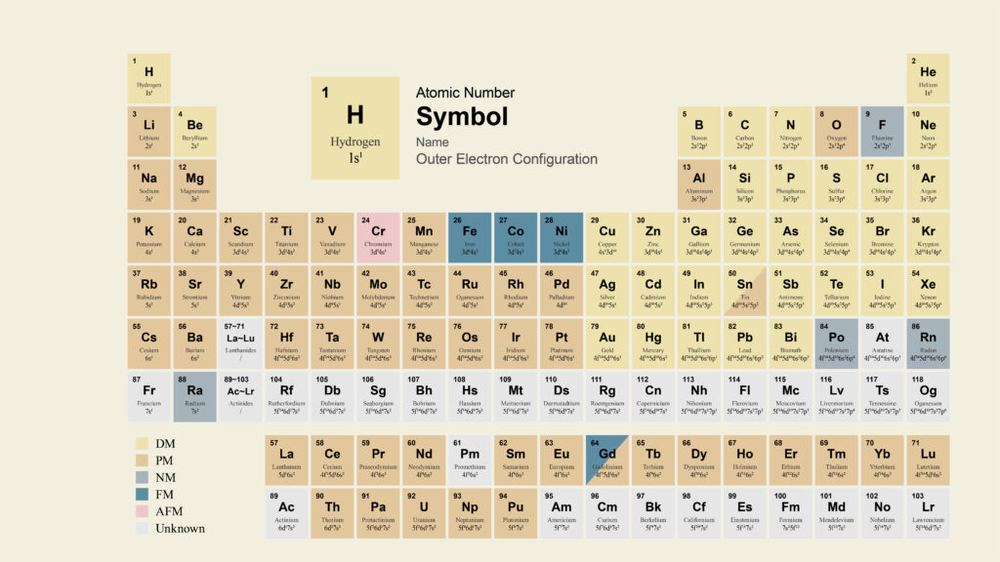
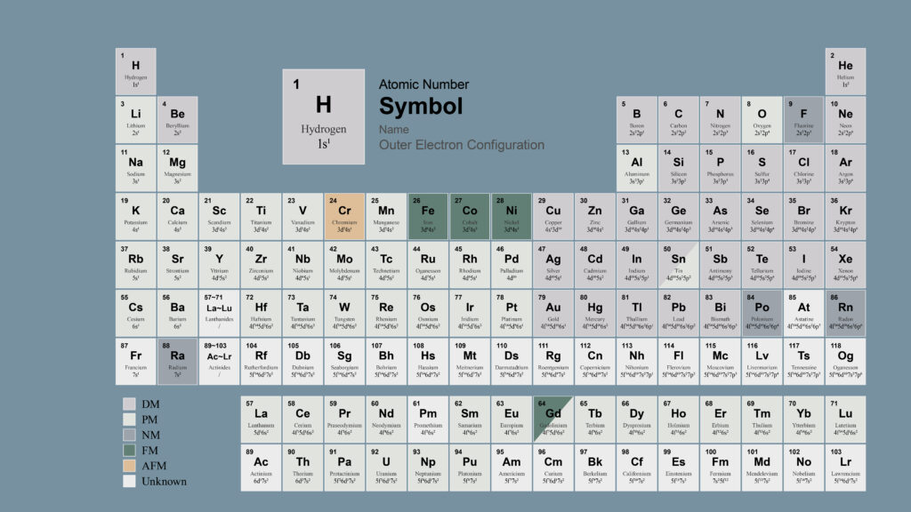
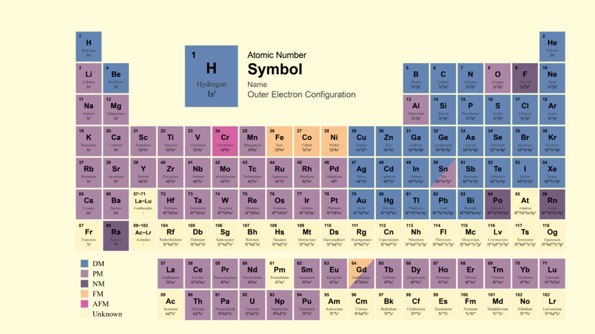
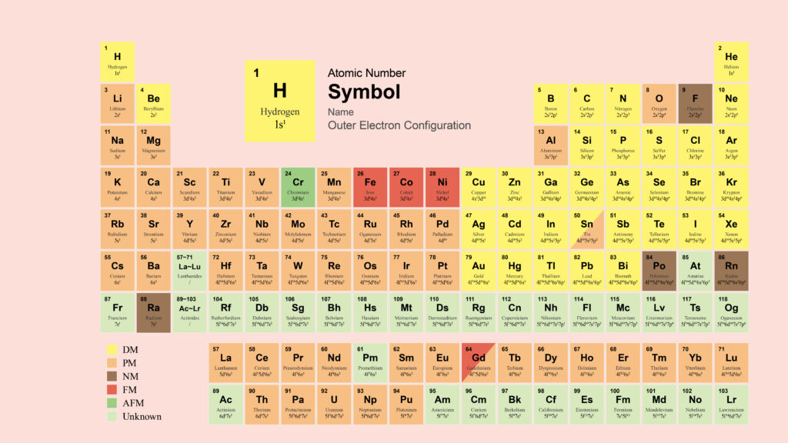
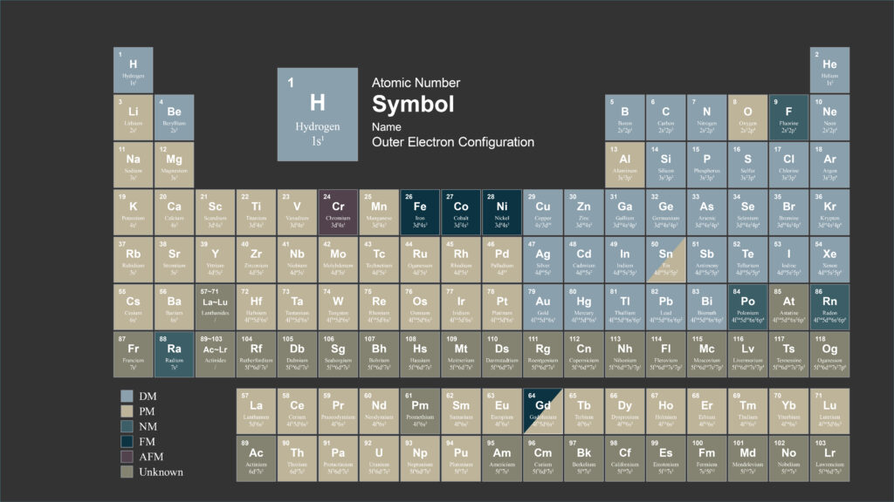

> 最近想换桌面壁纸，但是不知道换什么。看了一圈风景照，觉得还是换个风格吧。于是想来点比较有逼格的内容，我便把目光投向了元素周期表。

这元素周期表当然不能烂大街，所以我决定结合专业方向弄一个磁性元素周期表*（其实就是元素周期表标出磁性而已）*。但是没想到这个东西做的人确实不多，即使有人做了，其"艺术风格"也比较简单粗暴。

好吧，那还是自己动手吧。

## 材料准备

其实互联网上有千奇百怪的元素周期表，[Internet Database of Periodic Tables](https://www.meta-synthesis.com/webbook/35_pt/pt_database.php)就收录了不少*（然而并不能用来当桌面背景）*。

做的比较好的是[PubChem](https://pubchem.ncbi.nlm.nih.gov/periodic-table/#property=ElectronConfiguration)的这个元素周期表，但它也有几个小问题：

-   分辨率不高，不适合做壁纸

-   几种样式里面没有元素磁性

-   配色单一

-   电子排布式并非习惯写法（默认用的Los Alamos National Laboratory的数据，PubChem还有个NIST的数据源）

不过它是个很好的参考，结合[Magnetic Type of the elements](https://periodictable.com/Properties/A/MagneticType.bt.log.html)和[MAGNETIC ELEMENT](http://www.piping-designer.com/index.php/disciplines/chemical/chemical-elements/1875-magnetic-element)两者的磁性元素表，可以自己做一个。

为了清晰，我决定用 Adobe Illustrator

来绘制矢量图。有一说一，`Ctrl+D`真是个好东西......

## 设计成品

一时兴起做了几个主题，如果不满意的话欢迎自行下载AI文件制作。

### 默认主题

### 工业金属

### 蓝莓蛋糕

### 水果冰淇淋

### 暗色主题

### AI文件

可以下载解压后自行编辑。

[磁性元素周期表](files/磁性元素周期表.zip "磁性元素周期表")

做的比较匆忙，如果发现错误请记得直接联系我\~

