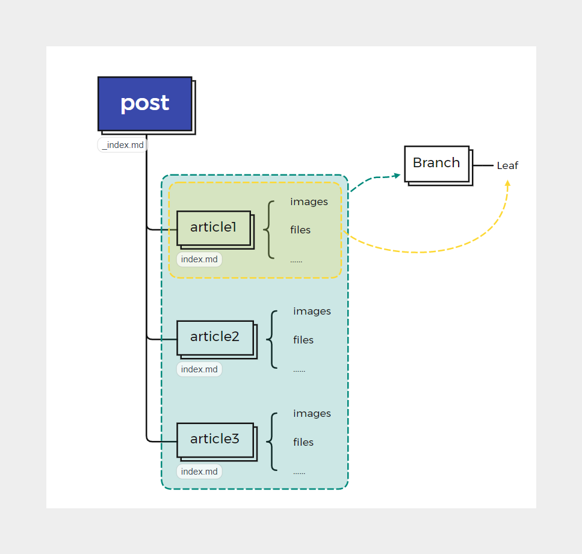
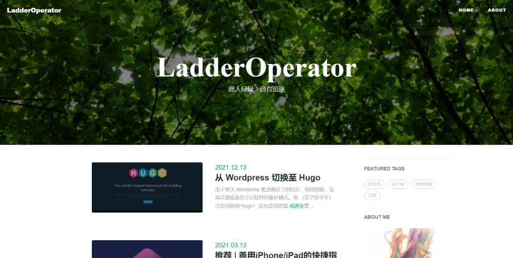
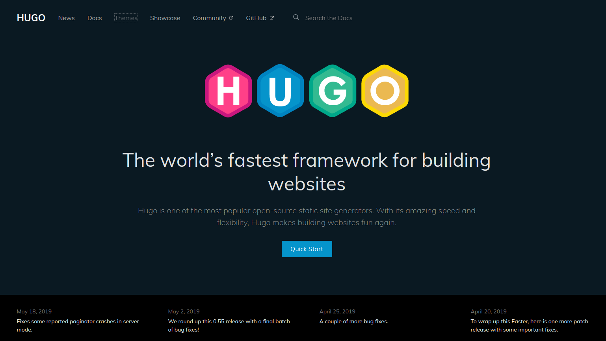

由于某次 Wordpress 差点崩没了的经历，细思恐极，觉得文章应该有个比较好的备份模式。故 *（花了快半年）* 决定切换到 Hugo！

这也是我的第一篇 Hugo 文章~

# 不要靠近 Wordpress

不要靠近 wordpress，会变得不幸。

## 维护好累.jpg

### 数据安全

事情起因是2021年5月前后，突然有天原先 Wordpress 的博客突然访问不了了。

当时我的文章几乎都在服务器上，没有其他地方的备份。为了把存档的 Wordpress 数据库救出来，试过：
+ sftp 直接下载：巨慢
+ 单独开了一个OSS下载：快是快，但下载一下就要钱
+ Wordpress 备份上传：某插件传到 WebDAV 要钱

……

所幸，最后只是因为SSL证书配置出了点小问题，还是给恢复过去了。

### 写作体验

同时，为了写作体验我还折腾（甚至自己魔改）了一段时间 Markdown 写作插件。*（实话说，体验不是很好，总觉得卡卡的。）*

但是这插件对于公式的支持实在糟糕，完全不是`$1+1=2$`或`$$1+1=2$$`这么愉快，竟然要

    ```katex
    1+1=2
    ```

类似这样的写法……于是前面的文章，根本没有几个公式。

### SSL 证书

阿里云的免费SSL证书每年都要手动更新一下……感觉是在是太愚蠢了。

于是在上面几条劝退之下，我决定考虑使用其他博客——

最终，我决定使用**Hugo**。

## 烂活：爬取旧站点

原先的 Wordprss，虽然为了转移方便我考虑了 Markdown 编辑器，但是他是单向的——别的地方复制来的 Markdown 粘贴来固然有用，但是图片吧我还要单独上传下（尽管插件也支持复制上传）。等我这次想弄出来时，发现给自己埋了个大坑。

我能怎么办，我也很无奈啊！

得亏现在博客还能打开。于是，我只能整点烂活——对我自己的博客来一次爬虫。脚本见：`https://git.nju.edu.cn/ladderoperator/blog-moveout`

由于 Wordpress 主题各不相同，所以为了潜在的通用性我单独分离了一个`blog_info.ini`供配置：

```ini
[post-info]
;; CSS选择器，作者
author = 'a[rel=author]'
;; CSS选择器，正文
article = 'div.post-content'
;; CSS选择器，标题
title = 'h1.entry-title'
;; CSS选择器，下一篇文章的链接
next_post = 'a[rel=prev]'
;; CSS选择器，分类或标签
tags = 'a[rel="category tag"]'
;; CSS选择器，插图
images = 'img'
;; CSS选择器，移除不需要的部分，逗号隔开
remove_content = 'div#ez-toc-container','div.wbp-cbm','span.ez-toc-section','span.ez-toc-section-end'
;; CSS选择器，封面图
;; 如果直接有图片而不是元素背景， 则用 cover 参数
;; cover = 'img.example'
cover_background = 'div.nl-header-img'

;; CSS选择器，发布日期
date = 'p.post-meta'
;; 正则表达式，正则提取日期字符串
date_str_reg = "\d{2}\.\d{2}\.\d{4}"
;; datetime格式, 由于configparser读取百分号会存在问题，故使用@，程序会自动替换
;; 参考 https://docs.python.org/3/library/datetime.html#strftime-and-strptime-behavior
date_str_fmt = "@d.@m.@Y"

;; 正则表达式，识别附件的正则表达式
files_url_reg = "https://ladderoperator\.top/wp-content/uploads/\d{4}/\d{2}/.+\.(zip|mp4|mp3)"
;; URL，开始爬取的第一个帖子
start_post_url = "https://ladderoperator.top/2021/03/13/ios_shortcuts/"

```

脚本的原理非常简单，就是从某个帖子开始，不停地“下一篇”或“上一篇”，把相关的内容摘取下来并存储为 Markdown 格式。

脚本需要两个库：
+ pypandoc
+ bs4

但是实测下来`pypandoc`效果一般，比起 Typora 的转换功能差了太多，对于表格等复杂一些的网页元素**它有它自己独到的理解**。因此后期我还是发扬工匠精神手工修了一下。

爬取（并精修）完毕后，我就获得了“纯净”的 Markdown 格式文章内容。

# 初步上手 Hugo

## 兼容本地工作流

在之前，我写 Markdown 主要用 Typora。但是众所周知，Typora 自1.0正式版[要开始收费]((https://support.typora.io/What's-New-1.0/#purchase--activate-typora))了！

尽管 dev 版本和禁止更新的旧版本依然可以免费用，我也有花钱补票的想法，我还是开始折腾起 VSCode 的配置。在南大 LUG 群群友的推荐下，最终选用了 VSCode + Markdown All in One + Paste Image（可以把剪贴板图片自动保存） 的搭配。

于是，一个文章目录可能是这样：

```
article
├── images
│   ├── pic1.png
│   └── pic2.png
└── index.md
```

在这个目录下，只要配置我们正文写作在`index.md`中，并且自动复制图片到`images`目录下，并把`article`作为整个文章的目录。

这样我们所有的文章攒在一起，在 Hugo 中便体现为一个所有文章所在的`post`目录下。其完整的结构类似：

```
.
├── _index.md
├── article1
│   ├── images
│   │   ├── pic11.png
│   │   └── pic12.png
│   └── index.md
├── article2
│   ├── images
│   │   ├── pic21.jpg
│   │   └── pic22.png
│   └── index.md
└── article3
    ├── images
    │   └── pic31.jpg
    └── index.md
```

可能太抽象了，咱来换个画法：



没错，这就是 Hugo 的 [Pages Bundles](https://gohugo.io/content-management/page-bundles/)。

按照这种组织方式，就可以更好地组织内容，也与 Git 完美结合。

## （近似）复刻我的主题

原先的 Wordpress 主题经过主题色、CSS魔改等修改后，我还是挺满意的~

Hugo 的主题明显可定制化更强一些，我选用了`https://themes.gohugo.io/hugo-theme-cleanwhite`这个主题，并且进行了魔改。

现在，Copyright年份不需要费力维护、各种配置修改也非常快速。

这次为了主题修改方便，我把主题拆分为子模块（git submodule），因此我的这个魔改版本你也可以在[我的仓库](https://github.com/LadderOperator/hugo-theme-cleanwhite)找到。

来看看现在的样子：



是不是很有以前的意思？（旧图我找不着了）

#  Docker + Hugo + Caddy = ?



本地跑 Hugo 看起来非常简单。但是我要丢到阿里云上，那肯定还是希望足够自动化，也足够安全。加上之前的一些需求，现在目标很明确：

+ 实现阿里云 SSL 续签
+ Docker 化直接一键部署
+ 配置好 Git + Webhook 自动从仓库更新文章

一番检索后，似乎大家很推荐 Caddy 而不是 Nginx 。原本想用现成的 Caddy V1 方案就完事儿，但想想还是用新的 V2 算了——结果就**误入了大坑**。

## 东拼西凑 Dockerfile

首先，我们先选好原材料：

+ 负责博客的 Hugo
+ 负责网站服务的 Caddy V2
+ 负责更新的Caddy V2 可用的 Git 插件
+ 负责自动更新 SSL 证书的插件

一开始，Git 插件我选择的是 [caddygit](https://github.com/vrongmeal/caddygit)。

在 Caddy V2 之前的 V1，其实有非常成熟的方案。其中用的比较多的，是基于[caddy-docker](https://github.com/abiosoft/caddy-docker)封装的 Caddy 非官方 Docker 镜像进一步构建的，比如[docker-hugo-caddy](https://github.com/hyacinthus/docker-hugo-caddy)。

但是既然决定用新的，那就直接从 Caddy V2 [官方的 Docker 镜像](https://hub.docker.com/_/caddy)开始照葫芦画瓢构建试试？

参考上面的 Dockerfile 思路，其实写这么一个 V2 版本的并不困难：

首先按照官方的构建指导，先把我们需要的插件放进去。由于是在阿里云上申请 SSL 证书，我们得加上`alidns`这个模块；此外，经过尝试、考虑更新速度，最后还是选用了支持 Gitee Webhook 的[caddy-webhook](https://github.com/WingLim/caddy-webhook)插件。

```
FROM caddy:2-builder AS builder

RUN go env -w GOPROXY=https://goproxy.cn,direct

RUN xcaddy build \
    --with github.com/caddy-dns/alidns \
    --with github.com/WingLim/caddy-webhook
```

为了速度快点，设置`GOPROXY=https://goproxy.cn,direct`。

就是如此简单，第一步构建用的镜像就完成了。

```
FROM caddy:2 AS deploy

COPY --from=builder /usr/bin/caddy /usr/bin/caddy
```
第二步，将构建的产物复制到用于部署的 Caddy 镜像内。

```
ARG hugo_version=0.92.0

RUN apk add --no-cache openssh-client git tar curl

RUN curl --silent --show-error --fail --location \
  --header "Accept: application/tar+gzip, application/x-gzip, application/octet-stream" -o - \
  "https://github.com/gohugoio/hugo/releases/download/v${hugo_version}/hugo_${hugo_version}_Linux-64bit.tar.gz" \
  | tar --no-same-owner -C /tmp -xz \
  && mv /tmp/hugo /usr/bin/hugo \
  && chmod 0755 /usr/bin/hugo \
  && mkdir -p /blog
```

第三步，我们再把 Hugo 从 GitHub 上下载好。最后是一些配置文件的设置，之后执行`caddy`来收尾。

```
WORKDIR /blog

COPY config.json /etc/caddy/config.json

ENTRYPOINT [ "caddy", "run",  "--config=/etc/caddy/config.json"]
```

至此，所需要的 Docker 镜像就构建完毕。后面在`docker-compose.yml`中非常简单：
```yml
version: "3.7"

services:
  my-caddy-hugo:
    image: ladderoperator/caddy2-hugo-aliyun
    restart: unless-stopped
    ports:
      - "80:80"
      - "443:443"
    volumes:
      - $PWD/config.json:/etc/caddy/config.json
      - $PWD/data:/data
```
把宿主机的两个端口转发到容器，并且替换`config.json`配置文件、`/data`的数据挂载出来以便持久化。

## 上下求索 Caddy API

上边用到了`.json`文件来配置。为什么放着好好的、简单的 Caddyfile 不用？其实本来是可以的，甚至还会很简单。

但随着我在 Caddy V2 反复尝试写 Caddyfile，我发现有个严重问题：

针对 V1 的 Caddyfile 配置确实非常简单，资料也很多，但是 Caddy V2 中，Caddy 读取 Caddyfile 后的行为没有按照预期来。这其中的理解、调试成本对我来说可能比较高。

于是，我决定“听开发者的”，开始看起 Caddy API。

Caddy API 其实就是通过默认的`:2019`端口的不同 API 来直接控制 Caddy，而不是像 nginx 之类一样由某个配置文件。开发者认为，这种方式更有利于自动化——虽然但是你这个`JSON`的形式，比起 Caddyfile 的配置文件，它编辑起来真的太痛苦了——`{...}`和`[...]`层层嵌套，看起来属实头大。

完整的`JSON`可以直接查看我的仓库，这里就不展开了，仅有几点如果有缘人看见，希望可以帮上忙。如果 webhook 插件一直访问失败，建议开启[logging](https://caddyserver.com/docs/json/logging/)，错误情况真的是五花八门：

1. webhook 类型没选对，需要和仓库地址一致。
2. `routers`中的`handle`顺序，这个插件作者自己也说了，webhook 需要放在最后；但实际上，就算丢在最后可能也不行。我的做法是，在一般默认用于博客页面的`handle`增加匹配规则，用`not`把`/webhook`这个路径排除掉。否则，webhook 可能会被处理为一个`404`的页面（因为本身在 Hugo 中它就找不到这个路径下面的页面）。
3. git 仓库如果需要在接收到 Webhook 请求后更新，似乎是不能设置`depth`选项的。
4. 如果 git 仓库包含子模块，一定要确保子模块正确设置，否则`submodule`选项即便开启也会出错。

------
这篇文章，作为转移到 Hugo 之后的第一篇文章再合适不过。这次折腾大概花了三四天，目前运转还不错。

不过不得不说，Caddy 的资料相比 nginx、Apache2 之类的属实太少了，就算有也被自己的 V1 版本淹没。这次折腾，下面三篇文章的参考非常重要：

+ [Caddy2 简明教程](https://mritd.com/2021/01/07/lets-start-using-caddy2/)
+ [Caddy 2 使用 Caddyfile 部署博客网站](https://catcat.cc/post/h9bti/)
+ [使用 Hugo + Caddy2 + WebHook 搭建个人博客](https://triples.cc/posts/set-up-blog/)

在此，特别感谢大佬们无私地分享。

本文最终产出的 docker 镜像已经上传至 dockerhub：<https://hub.docker.com/r/ladderoperator/caddy2-hugo-aliyun>

GitHub 仓库：<https://github.com/LadderOperator/docker-caddy2-hugo-alidns>

南大 Git 仓库：<https://git.nju.edu.cn/ladderoperator/docker-caddy2-hugo-alidns>