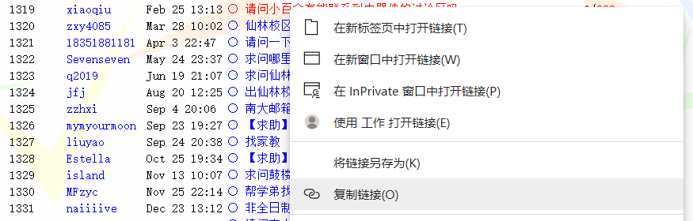
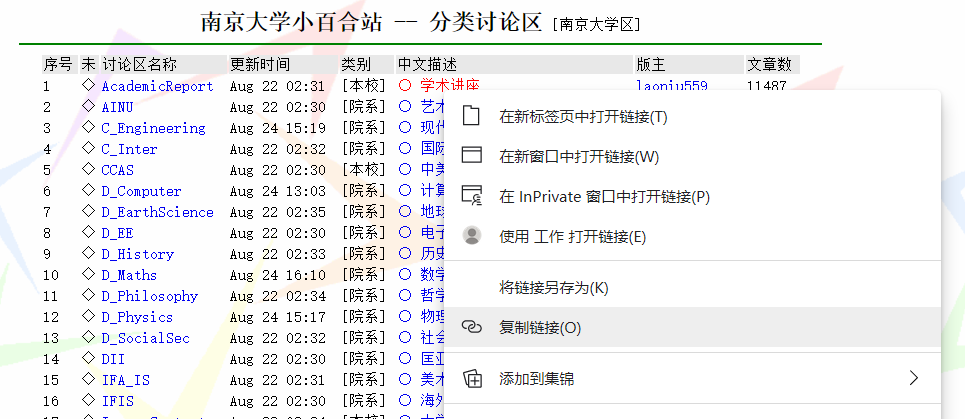
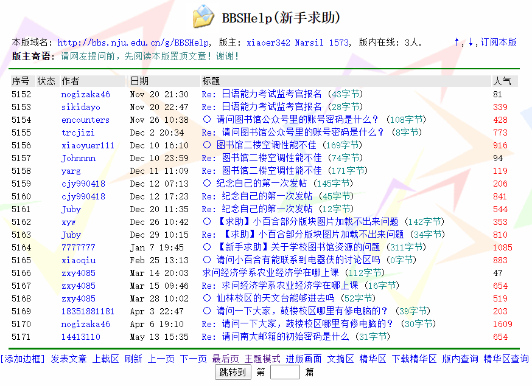

## 整体思路

小百合没有任何反扒措施，但是需要搞明白几个细节，后面会细说。

由于这个计划的整体数据量可能比较大，所以最好分为三步走：

1.  先爬取各版列表，之后获取各帖链接。最后爬取网页，注意异常判断和记录，时间间隔稍加控制防止土豆服务器想不开；

2.  在本地的帖子另作一个格式解析脚本，将帖子内容的数据格式化为易读的`csv`等格式；

3.  单独使用处理好的数据进行各类可视化和分析。

其中，前两步的产物我均已经备份在了 GitHub 上，欢迎fork。项目地址为：

<https://github.com/LadderOperator/LilyBBS_DATA>

### 所需工具

**爬取阶段**：爬虫使用Python编写，主要使用入门的两个模块：`requests`获取网页和`beautifulsoup4`简单获取帖子内容。

**处理阶段**：需要稍微熟悉一下正则表达式。对于帖子正文像`beautifulsoup4`是比较无力的，这时候正则表达式就比较方便。
实——即

**分析阶段**：使用`matplotlib`、`numpy`、`pandas`等等，为了做词频统计还用了`collections`与`jieba`

### 小百合的特殊机制

前面的东西都不是关键，其实对于爬取小百合的任务而言只需要明白两个问题：

-   小百合帖子的真实完整链接

-   小百合讨论版的真实完整链接和部分参数

#### 帖子链接

首先是小百合帖子的真实完整链接，这个问题也导致很多人手机等设备看小百合帖子的时候试图直接分享到空间时总是失败（表现为一点开就是主页而不是帖子）。

在浏览帖子的时候地址栏一直都会是：`http://bbs.nju.edu.cn/vd48031/main.html?`这样的东西，一些分享会直接复制这个，所以是分享不了的。真正的链接应该是类似：`http://bbs.nju.edu.cn/vd48031/bbstcon?board=V_Suggestions&file=M.1163184717.A`这种，讨论区以`board`标记，帖子文件以`file`标记。

如果你在帖子左上方复制**本篇全文**的链接或者在讨论版的列表内复制标题的链接，就会是完整链接。

文件名是不是连续的？可能是，但我没有证实------即便确实是连续的，也不容易获取规律。由于索引到具体一篇文章必须需要讨论区和文章文件名两个参数，因此你想直接通过变文件名的数字来直达某类文章几乎不可能。

那就只有从讨论区列表来获取了。

#### 讨论版链接

讨论版的链接也有上面类似的问题，实际上真实的地址为：`http://bbs.nju.edu.cn/vd48031/bbsdoc?board=BBSHelp`这种，即`board`参数标记了讨论区列表。

但除此之外，还有`start`参数决定当前列表从ID序号为多少的帖子开始，以及`type`参数决定列表显示模式。在网址加上`type=tdoc`，则会显示为**一般模式**，此模式下回复主题帖的帖子也会在列表内单独列出，若要爬取所有帖子建议加上；

若仅需要主题帖此参数不加，点开主题帖回复会以堆楼的形式展现，为**主题模式**，类似百度贴吧（校长信箱即为这种）。

比如，`http://bbs.nju.edu.cn/vd48031/bbsdoc?board=BBSHelp&start=5151&type=tdoc`为新手求助版面自`5151`号帖子开始以一般模式显示。

### 数据处理&分析

这个就见仁见智了。我的方案是：

1.  正则表达式将关键内容"洗出来"

2.  读取文件后按照`年-月-日`的结构构造一个较大的嵌套字典，以便后面处理

3.  为了方便调整，全程采用`Jupyter`边写边调

不细说。

## 后记

### 这些数据可以拿来做什么？

可用于数据分析。至于怎么分析，全看你的想法了。

### 我为什么要做这一个工作？

很简单，因为我对小百合上**似曾相识的疑问和无视**、对学校个别部门院系**顽固不化地将"发送到小百合"当作完成信息传递任务的最后一步**、对一个**丰富多彩的校园公共平台倒坍冷寂**感到遗憾。

众所周知，小百合曾经是高校论坛中的先锋，也是南大学子的情怀。然而数十年以来，兄弟高校的论坛与时俱进发生了改变，小百合却仍然固步自封，甚至中断了外网访问。

小百合，曾经百花齐放的网络天地，如今却急剧萎缩，靠着院系或单位发布通知公告和官方信息、校长信箱的问题沟通来维持最后的一丝气息。**无论是教职工还是学生，你必须要承认，小百合已然没落；如今的时代里，我们需要的是更加易用、更加活跃的论坛。**

有人说，论坛已死。我个人不认同这种说法，论坛仍然有必要存在；或者至少应当从论坛分离个别职能，还一个单纯的校园公共平台。

我将小百合的这部分数据爬取保存，并且做了些简单机械的粗活累活，主要目的有三。

1.  保持**记忆**，保持**记录**。对这些数据的挖掘，你或许可以发现这个学校里曾发生过什么。

2.  给未来所有关于"进化小百合"的建议以**数据事实支撑**。

3.  为未知而潜在的小百合数据丢失提前进行部分**备份归档**（主要为2020年7月5日以前）。

## 声明

由于帖子的内容与格式有时会出现无法预期的问题且数目较大，**本人不担保处理过的数据完全正确**（我做了几个抽样检查，目测没有大问题）。如果你发现自动处理的数据和原始的帖子有出入，请直接在项目`Issues`内反馈。

