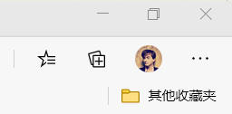
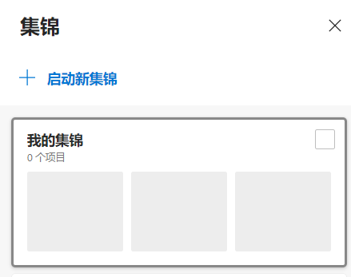
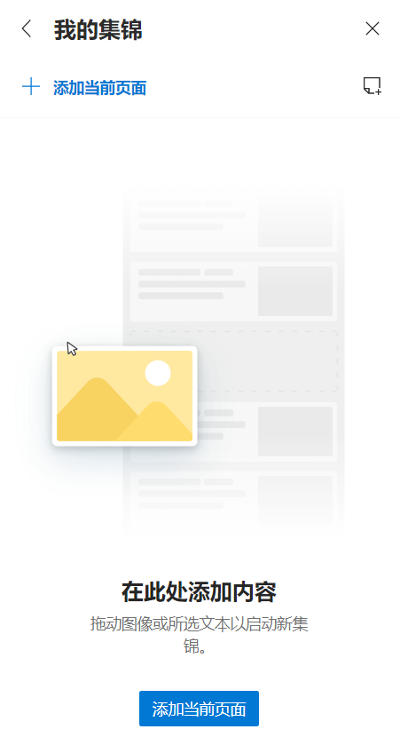
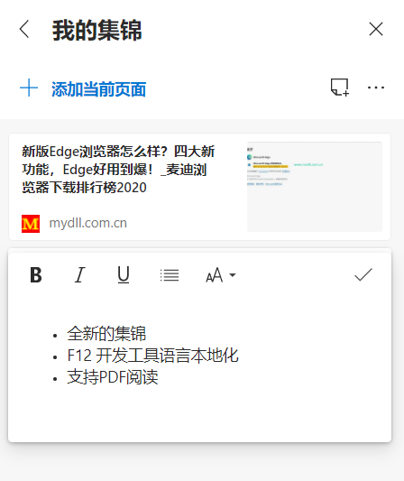
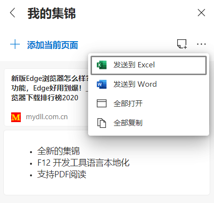
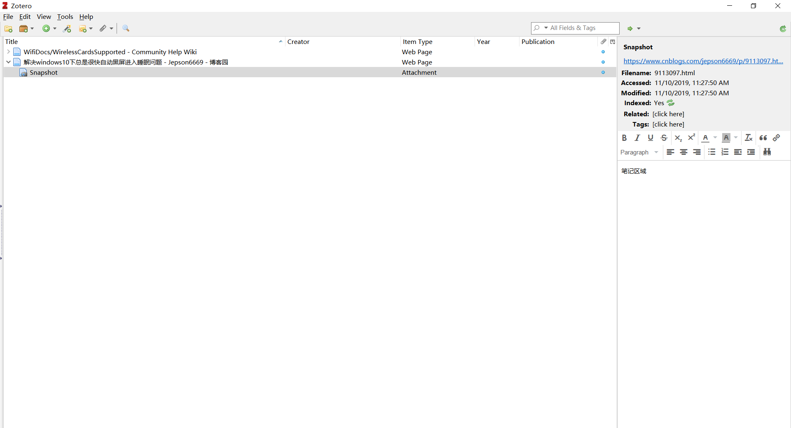

> 大家可能发现了，我最近特别吹新版Edge浏览器，即使旧版里丝滑的 PDF阅读功能还没有回来，我也要吹。其他的功能我暂且不说，比如什么插件安装完全踩在Google身上啊，什么数据能够正常同步啊，什么安全隐私保护啊......这些都不需要提。我想介绍的，是使得Edge成为一款实打实生产力工具的功能——"集锦"。~~你的下一个浏览器，何必是Chrome？~~

## 1

平常我们浏览很多网页，经常希望顺手将页面整理下来，或者写个小便签建立自己的知识库。但是这方面的工具，专注于做这个事情的并不是非常多，但又有很多软件可以"曲线救国"——理论上说，你只需要一个记事本记录网址和关键信息，就可以达到这个目的。

就我个人的尝试而言，我曾经试过：

-   Markdown + VS Code 整理

-   Word 复制粘贴

-   Zotero Connector *（有机会我会单独介绍）*

-   旧 Edge 的稍后阅读 *（这个之后据说新 Edge 里要重新上线了）*

-   浏览器收藏夹

-   为知笔记等的剪藏插件

但现在，我认为我找到了最佳的方案：新版 Edge 的"集锦"。

"集锦"默认在账户头像旁边，看起来有个"+"号。

到这里其实就可以结束了，我觉得你们自己试试就知道了。

## 2

"集锦"到底"优雅"在何处值得我这么吹？先来看看怎么用吧。

在希望收藏的网站点开按钮后，侧栏会弹出"集锦"的面板。你可以 **「启动新集锦」**，这相当于开了一个分组——

点开分组，你可以重命名它，也可以添加当前页面，还可以添加笔记：

比如添加完毕后：

之后，你可以点击右上的三个小点，将内容分享或者导出：

比如 **「发送到 Word」**，会直接用在线文档方式呈现你的集锦内容，你可以自行下载下来保存。

**所有的操作简单易懂，不需要其他程序只需要一个浏览器，而且能够导出进一步整理**。下面我会借这一个功能说开，谈谈我对于"优雅"功能的简单理解。

## 3

我对于一个软件、一套系统的使用是否足够"优雅"，是有三条简单原则的。在我看来，当我专注于某件事情的时候，那就应该注意力全在一处——频繁跳出会导致注意力分散，乃至浪费时间 *（这也是我做教学立方辅助工具来改作业的原因）*。

这就是第一个原则：**尽可能少切换**。

第二个原则比较好理解，就是**易于上手**。

更重要的是第三个原则，即**复杂性的匹配程度**。换句俗语，叫做"杀鸡焉用宰牛刀"。这有点像搭积木一样，越基础的积木块才越能自由的去组合，而不必要的功能会浪费资源甚至导致意想不到的麻烦——因此某些杀毒软件的"电脑门诊"，它们不能算得上丁点的"优雅"。

我之前试过的方案里， Word 和 Markdown + VSCode 的方法就严重违反了第一个原则。当你在不同程序间不停切换，除非你已经熟稔`Alt`+`Tab`这种操作或者有"钞能力"去买个扩展屏幕，否则这对于大多数人来说都很耗费心力。

而收藏夹、"稍后阅读"和各类剪藏工具甚至不能满足基本需求——他们几乎只能达到一个"收藏"的目的，而不允许再为收藏的内容做进一步的笔记。"稍后阅读"倒是可以保存视图，但它实质上仅仅延续了"阅读"的过程，我们所关心的还有第二步——"整理"。

最后一个被放弃的方案是 Zotero ，这是个非常强大的类似 EndNote 的软件。Zotero 的长项是文献整理，同时也能整理网页，还能进行更加精致的笔记和归档：

我有一段时间都是用它的，但"阅读"步骤和"整理"步骤仍然会被分离在浏览器和 Zotero 上。而 Zotero 的功能对于我们的需求而言也过于庞杂。因此，无论是第一个原则还是第三个原则，它都不能算合适。

## 4

到这里你可能会觉得有点刁钻——磨刀不误砍柴工，我们从头推演一遍我们实际的需求：

首先，我们在网上广泛**检索**；然后，**阅读**后发现一个网站可能有用；我们可能想要做一些摘抄或者总结等**整理**性的工作，并把网站**长期收藏**起来，便于后期**进一步整理**。而我们希望这一切**尽可能全部在浏览器内完成**。

这下清楚了吗？我们再回味一下，究竟是哪几个具体的需求：

-   可以长期收藏

-   支持简单的笔记

-   后期仍然需要进一步加工整理

-   不离开浏览器

按照如上的需求来看，确实特别刁钻，但也使得方向无比清晰。上述需求可以有很多种解释，其中最简单的一种应该就是：基于浏览器，至少可以收藏网址，支持添加最简单的笔记，支持导出成某种常用格式。

其中，基于浏览器这一条，我们的选择也只有两条出路：浏览器插件和浏览器原生功能。我相信插件一定有类似的，但比起原生的功能支持，还是麻烦了一些——

毫无疑问，新 Edge 的这个功能绝对称得上"优雅"。

## 5

这样的思考似乎没有意义，因为并不是所有的软件都可以找到这样一个漂亮的解决方案。事实上，上面都在用一个用户的角度去思考，甚至可以说刁难开发者。但如果你本身是开发者呢？

虽然我不能算一个开发者，但我确实从这种换位的思维方式中收益良多。开发者比起用户至少有一个优势，即能够去改造用户无法改造的软件本身。因此这是一种打磨自己作品的试金石。

这也不是说用户就彻底没辙了——我始终认为，一个能够讲清楚自己需求并且善于沟通的用户，绝对抵得上那些居高临下的"产品经理"。

**开发软件是这样，规则建设也应当是这样。**

