> 南大Box云盘上线已有两三年，其[功能迭代](https://cicam.nju.edu.cn/zh/%E6%9B%B4%E6%96%B0%E8%AF%B4%E6%98%8E)至今，已经满足了我个人对网盘的几乎所有想象。这个服务方便强大且易用但知名度不太高，以至于连物理学院的新生都不知道其存在；有感于这样的窘境，作为使用了也有个两三年，经常跟别人安利它的忠实用户，我觉得是时候为这个服务写一篇文章了。
> 
> ~~💡注意：此云盘并非学校信息化建设中心提供，而是人工微结构科学与技术协同创新中心提供的，由于中心资源有限，不在云盘服务提供范围的同学是无法使用的。具体服务范围请参看[云盘简介](https://cicam.nju.edu.cn/zh/netdisk)~~
> 
> **💡：自2020年11月起，Box云盘已经对全校开放。快去试试吧！**
> 
> 云盘常见问题解答：[点此阅读](https://doc.nju.edu.cn/books/17e62/page/1d7f7)

本文略长，请根据目录翻阅😀。

## 在网盘时代迷路

我们正处在一个网盘如雨后春了——当时也是一个**被利益争夺严重撕裂**的时代。

回想多年以前，115和当时的华为掀起了网盘时代的浪潮；百度与360给新用户塞上当时大多数人没什么概念的TB 级网盘空间，吸引了一大波用户；腾讯的微云也在 QQ 端悄然上线并集成......

然而，随着运营成本的增大和不当内容整改的需要，一系列网盘宣布关闭：115、新浪微盘、360云盘、网易网盘......百度网盘苟延残喘至今，也离不开令人发指的速度限制和莫名其妙的十秒和谐。

时至今日，上面有些网盘复活了------当然，重生的网盘也没有了原先的自由。关于国内网盘的发展历史，有篇文章[《国内网盘市场11年，我们薅过的羊毛都还在吗？》](https://mp.weixin.qq.com/s/QSSYS9MdXqteDm3S5h53zg)可以读读。

当然，网盘也不仅仅有国内的服务，Google Drive、OneDrive、iCloud *（尽管中国区数据托管在云上贵州）*、Dropbox，乃至小众一些但校园网竟然可以高速下载的 MEGA......可惜，它们大多数因为网络原因或政策，大多数网络环境下用起来并非那么流畅。

如今的网盘选择，可能**更多地在被移动端所分割**------你是什么品牌用户，就用什么网盘。比如下表：

  设备品牌 |  集成的网盘
  ---------- |--------------
  苹果     |  iCloud
  微软     |  OneDrive
  谷歌     |  Google Drive
  小米     |  小米云服务
  华为     |  华为云空间
  OPPO     |  OPPO云服务
  ......   |  ......

但也有不方便的地方，那就是网盘作为一个具有延迟的稳定传输文件的工具时，**各家之间数据和服务并不互通、甚至限制访客下载**的问题。于是大家寻找一个更加稳定、用户庞大的产品来达成统一，这可能也是很多人不得不使用百度网盘的原因之一。

所幸，在南大里，有这么一个服务能够让我直接抛弃它们。**那就是南大Box云盘。**

## 南大云盘是什么

> 一言以蔽之，高配版坚果云。

网址：<https://box.nju.edu.cn/>，使用南大统一身份认证可以登录。毕业后因为统一身份认证收回，就不能使用了，所以还没毕业的时候还是要充分利用起来啊。

南大Box云盘 *（以下简称Box）*，实际上是基于开源企业云盘 [Seafile](https://www.seafile.com/home/) 所开发的私有云，因此 Seafile 拓展丰富的功能、跨平台的特性它都有。无论是挂载盘客户端 *（作为一块电脑上的硬盘没有单独界面）*、桌面同步客户端 *（有个单独的界面可以操作）*、移动端 *（手机平板）*、服务器端，你总能找到对应的版本。这些都可以在[下载页](https://www.seafile.com/download/)找到。

最初了解到 Box 的原因我也已经忘记，可能是当初申请唐仲英楼门禁时的意外发现，也可能是看见了这个域名但没见过比较好奇------总之不是别人告诉我的。

**在文章开头的服务范围内**，容量分配目前是这样 *（截至2020年5月31日）*：

> 教职工、博士后、人事代理：500GB\
> 博士生、硕士生、本科生：200GB

## 南大云盘能干什么

为了比较直观地来介绍云盘的功能，我将以桌面同步客户端为例子进行介绍我是怎么使用的。这并没有解锁Box的全部特性，未来或许也有更多实用的功能。

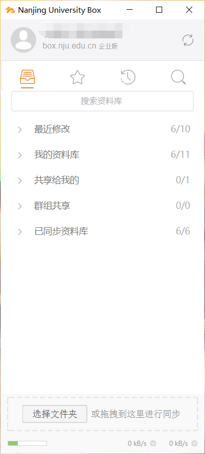

### 基本上传下载

这是每个网盘都逃不掉的灵魂三问：

-   容量多大要不要钱？

-   上传下载速度快不快？

-   限制上传下载量吗？

在南大云盘里，答案是：至少 `200G` 绝对够用，上传下载几乎满速，没有其他限制。

在鼓楼校园网宿舍环境下测试，上传下载的峰值可以大约 `11 M/s` 即 `100M`带宽，稳定均值也在 `8 M/s`左右；在个别部署了千兆网线的院系办公室速度可能还能再快一些。

至于在家里等非校园网环境，这个网盘速度几乎也能跑满自家带宽，夫复何求！

除此之外，文件的保存均是加密的，即便是管理员也看不见你文件的内容（但如果你共享出去了是看得见你的文件名字的，所以千万别搞奇怪的东西）。

### 文件预览

这个不消细说。文件预览基本涵盖了常见图片和音视频 *（也就是可以在线播放看视频）*，并且可以预览和编辑 Office 文档、文本文档 *（含 Markdown）*。PDF 的预览也支持，基本的预览功能比较完善。

### 文档历史（版本管理）

这个功能程序员们应该最熟悉不过，可以回溯到文件之前的版本。

对于写论文的情况这个可能非常有用，相当于误删保存导致论文丢失的情况上了个保险。

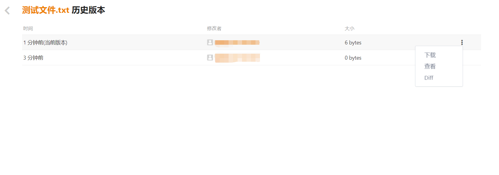

此外文档历史也支持喜闻乐见的修改内容比对或者叫 `diff`，这样也能清晰地展现一个文档的"历史发展"。

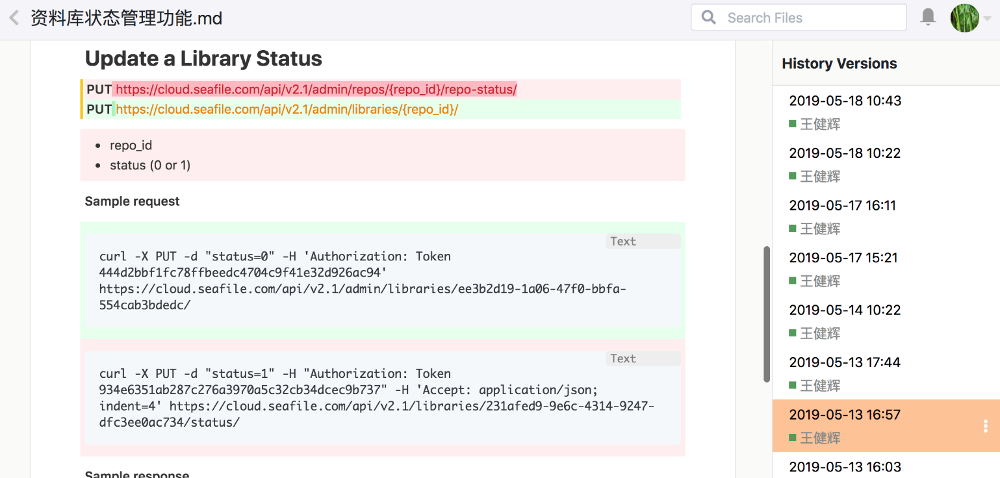

### 基础共享

这个几乎是所有网盘的一大核心功能，在校园里则更是刚需。尽管我们已经拥有了[紫荆站](https://zijingbt.njuftp.org)或者自建 FTP ，但紫荆站仍然需要用爱发电的上传员和自觉辅种的高素质用户（注：紫荆站已关闭，🕯），FTP 也需要一台服务器和维护的人员。况且，在下面的一些应用场景内，制作种子或自建 FTP 就显得门槛太高了：

-   临时共享文件，随后会删除

-   团队协作传递制作素材，比如社团剪视频等大项目

-   私人的资源分享不希望太多人看见

-   一些软件资源出于学术目的或教学需要，必须要给其他人一个稳定的下载地址

-   QQ 群等塞满文件，不易查找，无法生成链接嵌入到一些公告通知内

............

总之，网盘的分享功能在校园里仍然有着巨大的需求。

一般我们认为的共享连接是这样的：有一个分享链接，点开后可以转存到自己的账户下，如果要直接下载可能要求我们登录或下载客户端。

但在 Box 里，这并不是问题。Box 分享的文件链接有两种模式，均支持简单的文件预览：

-   内部链接：点开有一个链接，可以选择下载，也**可以评论甚至编辑**，相当于**文档协作**

-   下载链接：点开会跳转到一个下载页面选择是否下载，如果勾选了"直接下载"则会提供一个点击立即下载的链接

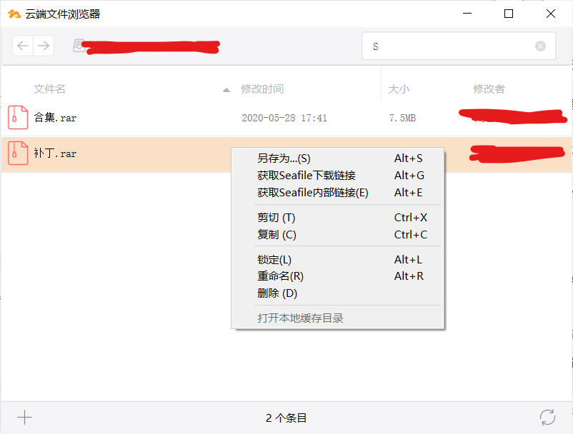

云盘里的共享文件方式有许多，除了传统的下载链接外，对于文件夹还有直接分享给指定账户或群组的功能。

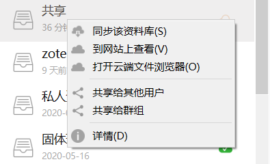

分享的同时也能分配权限。

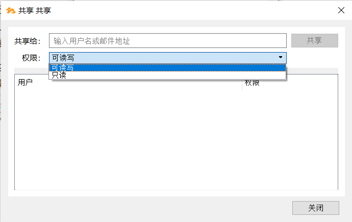

这样的共享功能十分方便，用于课题组的公用资料共享等也是非常好用的。值得一提的是，Box 还支持在网盘内自建共享的知识库，并用 Markdown 的形式编辑。时至今日你可能并没有看见有几家网盘做到预览 `.md`，也就是Markdown ，非常令人遗憾。

### 进阶共享

上面是一些非常基本的网盘共享功能，但是对于 Seafile 来说它还有一些进阶的设置，使得他的使用场景更加丰富。

在 **网页端** 打开 Box，点击文件夹的"共享"：

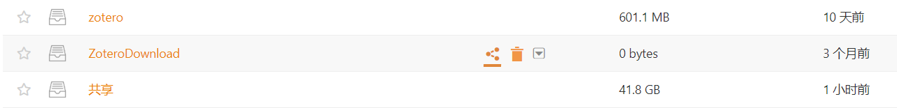

你会发现上面没有提到的设置：

-   共享链接：像上一部分文件的共享方式一样共享文件夹，能够自由选择其中的文件下载或打包全部下载，并且控制密码、时效、权限

-   上传链接：生成一个链接 *（同样可以有密码和时效）*，打开后可以上传文件和文件夹，并且看不见其他人的上传内容

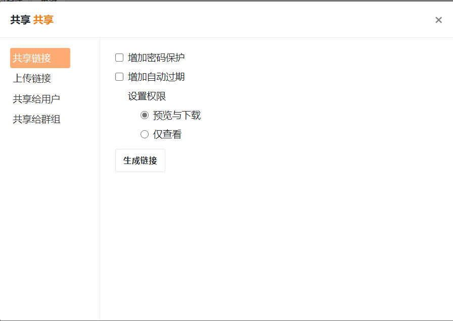

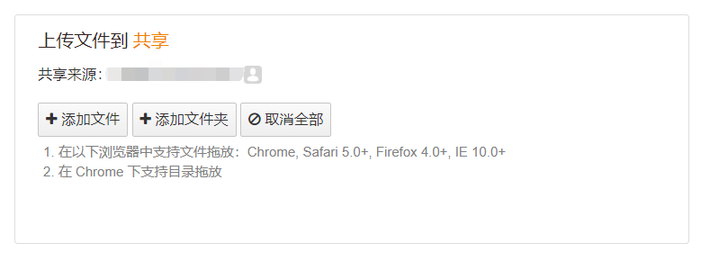

这个功能对于老师收作业或者社团收内训作业 *（是的我干过）* 而言是个利器，十分方便。

### WebDAV

这个功能多数人可能根本没注意过。国内网盘支持这个的，可能只有坚果云一家。但 Box 也是支持的！

它类似于在一些应用软件内，允许把数据**直接同步**到支持 WebDAV 的第三方服务去，无论是什么平台。

这么说比较模糊，我下面举一些具体例子。

比如，Zotero 是知名的开源文献管理软件，潜力巨大，并且有各种插件支持。大家都知道另一款软件 EndNote 是有登录账户同步文献库和文献 PDF 的功能的，但其实 Zotero 也有，只是官方的在线服务免费只有 `300 MB`。好在，Zotero 还给了另一个选择：WebDAV。

先在Box新建一个叫做`zotero`的资料库，然后通过账户设置，

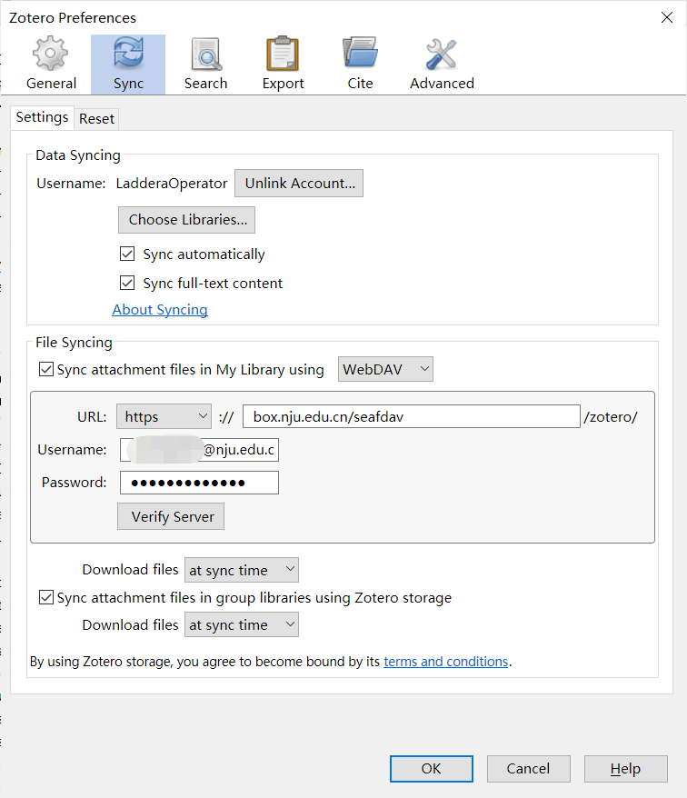

你可以直接将文献库连同文件一块备份到 Box 内：

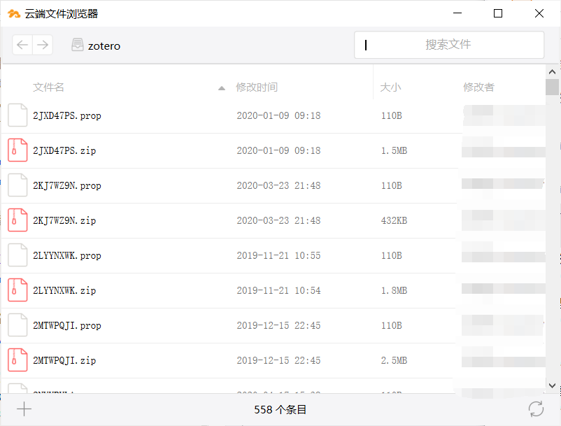

除了 Zotero 还有这些你可能听过或用过的软件都[支持WebDAV](https://cicam.nju.edu.cn/zh/webdav)，可以与 Box 配合使用：

  软件           |       平台
  ---------------------| ----------------------
  笔记软件 Notability |  iOS / iPadOS
  国产文档软件 WPS    |  全平台
  PDF软件 PDF Expert |   macOS / iOS / iPadOS
  ......             |   ......

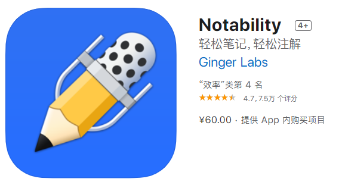

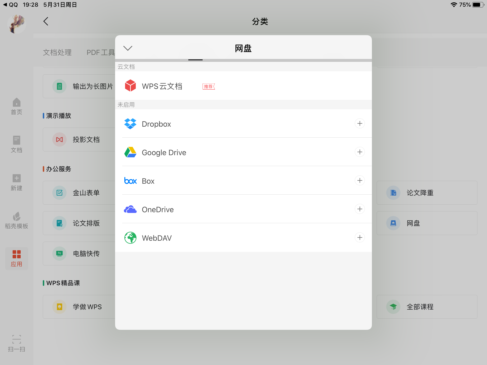

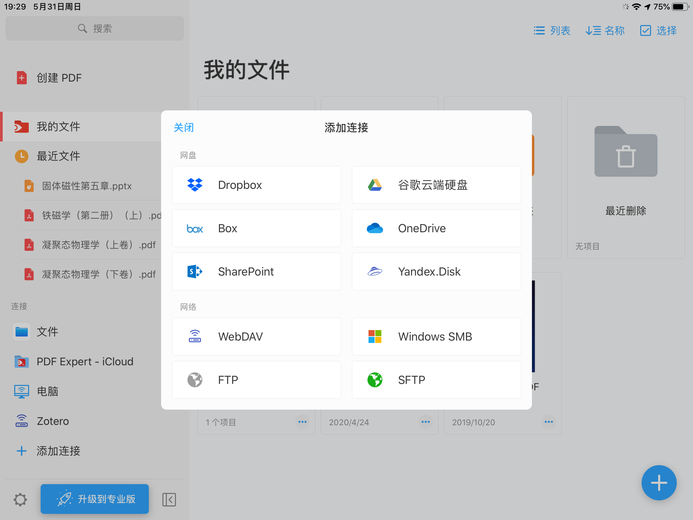

更多可以随便抓一篇[关于坚果云的 WebDAV 的介绍](https://sspai.com/post/60540)，把坚果云换成南大 Box 即可。

此外，这也意味着你完全可以**自己基于 WebDAV 来开发一个属于自己的应用**。

关于这个功能，具体使用方法根据[官网的WebDAV说明](https://cicam.nju.edu.cn/zh/webdav)，

> 用户名：南京大学统一身份认证的用户名\@nju.edu.cn\
> 如工资号为0102003，用户名填写0102003\@nju.edu.cn\
> 密码：南京大学统一身份认证的密码\

### 其他

这个 Box云盘还与高性能计算集群集成、支持高安全级别的两步验证。这就是说，人工微结构科学与技术协同创新中心的计算集群数据，你完全可以用它来实现保存、同步更新和分享。

## 畅想

说实话，我一直觉得这种算是"基础设施"的服务不应该只给个别院系使用，尽管我已经是受益者了。纵观其他学校，[清华](https://cloud.tsinghua.edu.cn)、[北大](https://pan.pku.edu.cn)、[东南](https://pan.seu.edu.cn)、[浙大](https://pan.zju.edu.cn)等友校的网络中心或类似校级机构早已经在行动，将这种基础服务下放到了全校师生。

而南大网盘至今还是有限开放，并且主要由一个**院系**实验室中心维护着。同样的服务还有[南大Git](https://git.nju.edu.cn)和[南大镜像](https://mirrors.nju.edu.cn)，不过他们是全校开放的。顺便提一句，我知道不少同学因为没有 Box 的权限，直接拿 南大Git 来做一个带文档历史的小网盘，实属无奈之举。

我一直在想，如果这个网盘可以普及开来，并且深入校内各种应用的集成就好了。比如像百度网盘一样，把其他相关应用的数据直接占用这个进行保存，具体一点可以是各种电子凭证、身份凭证、重要文档，或者用于托管校内的博客，乃至重新打造更加活跃、现代、丰富的校内 BBS 也未尝不可。这样，**"南大Box云盘"完全可以作为一种基础服务普惠所有师生**。

不过，这种校园私有云还需要留个后路。当初我从本科生升到研究生的时候，是直接通过分享文件的方式，直接分享给研究生新帐户的，但毕业了要怎么办？若增加一个**到期提醒，通过邮件通知给限定时间进行下载转移可能更加人性化一些**。
> 自2021年起，eScience还推出了毕业/离职资料库转移服务，可以让一年内无法登录的帐户内资料库转移到一个指定账户，算是后悔药。

~~**当然这都是学校部门要考虑的。**~~ 学校部门选择自己去校外买一个残废Office365以及它附带的残废OneDrive，实在可惜。

我希望我的一番介绍可以让这个优秀的服务能充分发挥价值；也希望大家知道有这样的好东西，为它没有相应地普及开来而惋惜，能够在用过它之后轻叹一句"这么好的东西怎么没几个人用"，然后一起支持它的发展。

