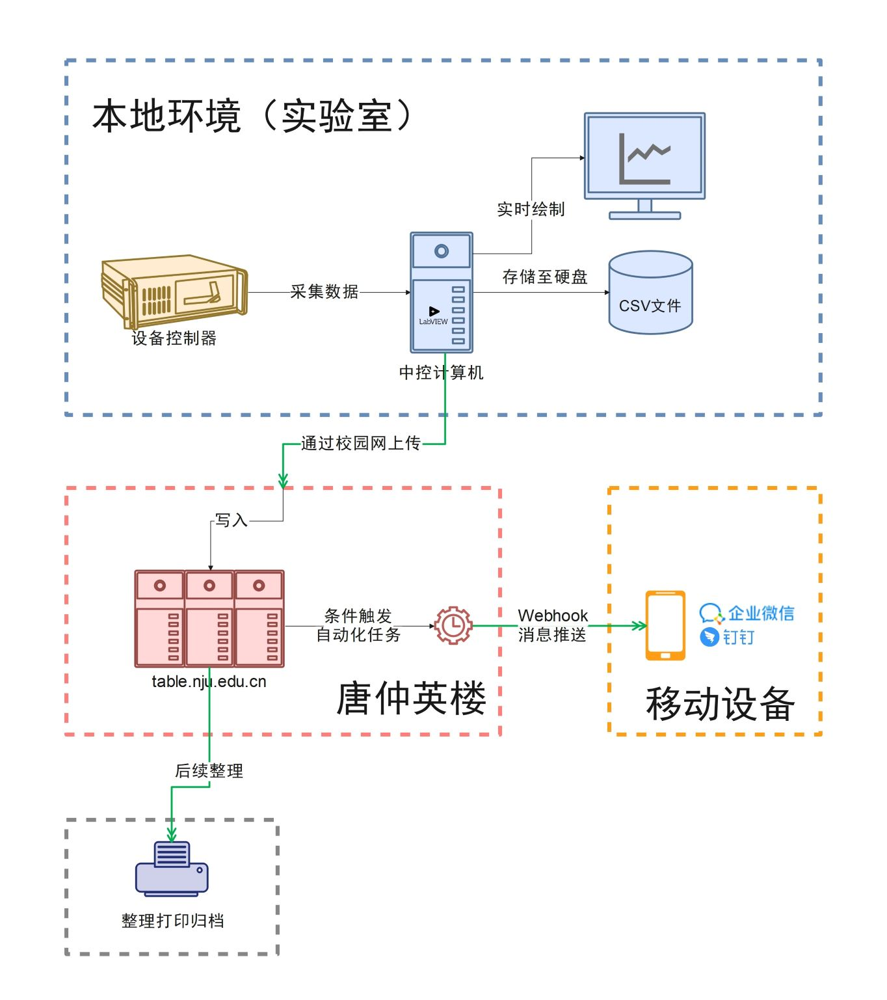
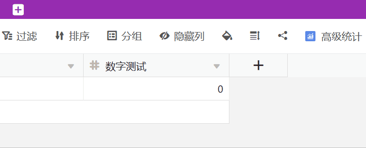

如果你有一台需要日常维持超高真空或低温之类的设备，你前一夜回去的时候还无比正常，第二天来到实验室时却**发现“未知的神秘力量”把这平静美好打破得稀碎**，你一定会感到郁闷。

而更加绝望的是，这样的事情不是一次发生，你却始终摸不着头脑，甚至不知道怎么跟工程师解释到底发生了什么。

作为一种解决方法，直接买个摄像头来监测，似乎不失为一个好主意。然而你会发现，除非怼着很近拍摄，否则摄像头面对一些老式的设备面板只能糊成一团看个轮廓。


很不幸，开头的悲剧笔者遭遇的次数实在太多了。

为了彻底掌握这一不确定性，捕捉到夜深人静时的“神秘力量”，笔者最终选定了一套方案，本文便是对这一实践的总结文章。

## 需求分析

事实上，摄像头方案不能算没用，但是代价太大了。用摄像头调整位置，再把图像识别出来，不仅要求足够的清晰度，还需要一定的算力——我们一般把这种行为称为“曲线救国”。只是，**这个方案就像如同健康码分明是个二维码你非要截图看时间和颜色、核酸检测明明有数据接口你非要截图还逼着别人肉眼/程序识别一样**，选择了最麻烦但也最没必要的路子。

**这与我们的“数字化”或“自动化”愿景是相悖的。**

因此，我们需要**其他更低代价的数据获取方式**。

此外，我们还需要解决下列问题：

+ 出现异常情况可以进行预警，以便及时获知
+ 本地有直观的实时监测
+ 不仅要能看实时的数据，也要能看历史的数据

一般来说，这些需求全部实现，可以考虑如下的方案：

+ 直观的实时监测：Qt（含C++和Python方案）、LabVIEW、C#、VB
+ 历史数据存储：数据库，或者简单点本地文件如Excel或CSV，如果是LabVIEW还可选TDMS
+ 预警系统：需要云端服务器，或者干脆直接本地Webhook发送请求到企业微信或者钉钉

但是实验室在校内，校内存在一个不稳定因素：**校内访问校外网络可能会因为意外（比如，我网费没了）突然断开**，导致数据或Webhook发送失败；而且还需要额外再写预警系统的逻辑，当然是能偷懒则偷懒啊！

于是本地LabVIEW加云端协同表格（table.nju.edu.cn），即南大本地版SeaTable，作为便捷的校内云端数据库与自动化服务，就成了我的首选。

整理一下思路，大致如下图：



## 方案实行

### 通讯与仪器控制

万幸，目前实验室使用的 Varian XGS-600 离子规控制器有串口可编程的选项。


#### 确认通讯方式

其实许多设备后面，都可能有这样一个串口，也可能是其他类似的并口、Ethernet或者USB接口……总之就是用来连接计算机通讯的。
> 歪一个题。**拿到实验室的仪器设备，和拿到我们家用个人设备，甚至和打开一个新的软件其实没什么根本区别**，其关键在于：一看外观，了解接口或按钮；二看手册或说明书目录，了解能干什么；三看关键章节，了解怎么操作。只是可惜，我觉得现在能做到这个基本要求的人越来越少了。这里歪一下算点一下，我已有计划日后有机会分享一些这方面的个人经验。


可编程，可编程等于为所欲为——当然，你得说设备听得懂的指令。有的读者可能知道[SCPI](https://baike.baidu.com/item/SCPI/1002712)，即**可编程仪器标准命令**，但这里的控制器并未使用此标准。这也凸显了说明书的重要性。
> 值得一提的是，很多设备并非所有说明塞在一本手册里，而是分为操作手册、维护手册、编程手册等等多份文件。如果你手头有设备看起来可以控制，但是找不到资料，那么你应该去仪器官网找一找，或者直接问销售代理询问。**是不是越来越像家用设备了？所以说，方法本质是一样的。**


通过对应的 RS232 串口通讯线 *（笔者实验室的方案是通过一张 PCIe 串口转接卡在中控计算机扩展了8个 RS232 9针母头）*，计算机就可以与设备通信，方式是多样的，例如通过[PyVISA](https://pyvisa.readthedocs.io/en/latest/)使用Python来进行。
> VISA，即虚拟仪器软件架构，相当于是把多种仪器类型与网络机制通过一层软件上的抽象，实现兼容。这样可以和五花八门的仪器通讯而不需要太折腾底层实现。下文的“VI”即虚拟仪器。


不过，考虑到快速构建直观的图形界面，最终还是选择了LabVIEW方案。

#### 什么是LabVIEW

[LabVIEW](https://baike.baidu.com/item/LabVIEW/4165214)是个什么东西？可能非专业领域不少人没有听说过这个玩意儿。

LabVIEW是一种图形化的编程语言，因为其数据流的特性更符合工程师的思维方式，构建应用快速简单，所以在很多测控、自动化领域颇受欢迎。
> 当然，这是一款商业软件，如果介意还是得用PyVISA。LabVIEW也有[社区版](https://www.ni.com/zh-cn/shop/labview/select-edition/labview-community-edition.html "LabVIEW社区版")，感兴趣可以自己下载了玩一玩，官方的帮助和在线文档非常详尽。

图形化的编程语言，很多人可能只知道Scratch那一种“积木”一样的语言，大多出现在儿童编程玩具作为一种编程教育的语言存在：


LabVIEW的图形化与之截然不同，其代码（后面板）更加类似一种电路的形式，数据流在接线中**天然并行地**从左至右游走在框（代表一种结构）和图标（代表一种模块或端子）之间：
> 这里有一个笑话：LabVIEW编程总有人嫌屏幕太小，而LabVIEW不支持缩放。于是新手总问大佬，画不下怎么办。极具幽默感的回答是，“再买块屏幕，配个轨迹球鼠标”；官方一些的回答是，“那一定是你结构设计问题（意思相当于编程习惯差，不懂模块化）”。


此外，所有的输入输出都直接对应界面（前面板）的控件，


上图类似于：

```Python
import random

while !StopButton.clicked():
    data_list = []
    for i in range(10):
        _ = []
        for j in range(10):
            _.append(random.random())
        data_list.append(_)
    IntensityGraph.draw(data_list)
    IntensityChart.update(data_list)
    sleep(0.25)
```

但是由于LabVIEW中，数据流向是天然并行的，在LabVIEW中的等待250毫秒没有数据线连接，因此执行并不一定是这个顺序，而是`for`循环和`sleep`在两个进程中同时执行，等待阻塞结束再同时到达`while`的下一个循环。

#### 封装控制设备的驱动

在LabVIEW中有一个附加驱动，叫做[NI-VISA](https://www.ni.com/zh-cn/support/documentation/supplemental/06/ni-visa-overview.html)。这个驱动提供了大量用于仪器控制的编程接口，使用时一般是遵从**打开设备-写入指令-读取返回-关闭设备**的逻辑，得益于图形化编程的特性你甚至可以立马理解它：


而这关键的第一步，即打开设备（VISA Open），就需要我们知道并配置一些配置参数：


> 这里涉及到编码等等有非常多的坑，如果遇到问题建议向厂家询问更具体的信息。我基本是用[NI-MAX](https://knowledge.ni.com/KnowledgeArticleDetails?id=kA00Z000000kFPXSA2&l=zh-CN)中自带的一个串口测试硬测试的。


那么，下面就很简单了：我们把前面的那些指令，全部“封装”成一个个小模块（或者说，子VI），就可以实现设备控制。如下就是读取全部气压数据的指令`#000F`的驱动封装。


### 设置协同表格的自动化预警

数据存储毫无疑问可以在本地进行，但是云端预警的逻辑该如何实现？

其实这一步是最简单的，我们只需要通过**自动化规则**，在新增记录做个判断即可。


在协同表格里，有一个**第三方集成**的功能，可以将消息发送至邮箱、企业微信、钉钉。


这里，企业微信、钉钉机器人账户本质上就是 Webhook。


通过查阅企业微信的[群机器人配置说明](https://developer.work.weixin.qq.com/document/path/91770 "企业微信群机器人配置说明")，按照其格式去写，我们就能按照我们想要的样式排版来推送消息。由于协同表格的自动化支持Markdown格式和列引用（`{列名}`），可以将触发该条自动化的数据自动填入发送，

```markdown
气压预警

>**STM**：<font color={cSTM}>{STM} mBar</font>
>**PREP**：<font color={cPREP}>{PREP} mBar</font>

```

其中`{cSTM}`和`{cPREP}`是根据`{STM}`和`{PREP}`计算的颜色参数，在表格中通过公式列实现：


除了条件触发，也可以实现定时报告之类的。推送通知的效果大概类似下图：


### 将数据从本地上传至云端

现在，已经解决了数据采集的逻辑和自动预警的逻辑，那么剩下来的就是**如何让数据从本地发送到协同表格**了。

协同表格，也就是SeaTable的另一特性就显得很重要了——它足够开放，有[多种编程方式](https://www.seatable.cn/help/ "SeaTable使用帮助")：不仅可以在网页端通过Python或JavaScript脚本功能实现自动化，也可以从外部API进行访问。


这里我直接采用的是最偷懒的[Python脚本](https://seatable.github.io/seatable-scripts-cn/python/ "SeaTable Python 脚本编程")方式，打包成了一个独立的EXE可执行文件。之前为了实现其他程序的自动上报，我已经[写了这么一个程序](https://git.nju.edu.cn/escience/seatable-reporter "SeaTable Reporter")，同时支持命令行方式和默认配置文件方式。这个程序最核心的就是这三行：

```python
# 访问表格
base = Base(api_token, server_url)
base.auth()
# 追加数据
base.append_row(table_name, row_data)
```

通过LabVIEW可以直接通过外部调用来实现上传。

为了使用方便，进一步贯彻 **“虚拟仪器”** 的概念，我们不妨也认为协同表格也是一个虚拟的仪器——于是，把`seatable-reporter.exe`“包装”成一个子VI：


>其实这里有更好的实现方案，即基于[SeaTable Web API](https://docs.seatable.cn/published/seatable-api/home.md)，结合LabVIEW的[HTTP客户端VI](https://www.ni.com/docs/zh-CN/bundle/labview/page/lvcomm/http_client.html "LabVIEW HTTP客户端VI")来制作更加干净的VI。当然，没这么干就是因为我太懒了……

在主程序中，只要向此模块输入想要提交的一行数据和对应服务器参数即可（兴致所至，我还顺手做了个图标，嗯）：


## 最终效果

### 阶段成果

上述的整个实践已经连续运行了一年左右，最终效果就是实现了这样一个监控程序：

+ 支持保存配置，一次配置任何人都运行
+ 本地采集数据实时显示数据，并展示绘制最近一段时间的数据变化
+ （可选开启）本地CSV文件存档，没用TDMS格式是因为希望可以通用一些
+ （可选开启）云端SeaTable存档


整套LabVIEW源代码全部开源在`https://git.nju.edu.cn/ldm/waveformarraytools`。

### 方案运行情况

总的来说，这套方案一年来运行效果很不错，及时报告了几次意外情况。

其中一次是2022年国庆节唐仲英楼的供电出现波动（一瞬间停电来电，这事儿我估计很多实验室的朋友都还心有余悸），导致部分设备宕机，数据突然中止上报，也算是一种异常的预警吧！


后来实验室配备了一台UPS也支持串口通信，官方软件能够设置调用外部程序。通过扩展接入SeaTable Reporter，也以类似的方案实现了供电异常预警。所以目前该方案已经接入了温度、气压、UPS三项。


在云端记录数据有一个便捷的地方，就是可以利用SeaTable的视图将烘烤的记录单独拎出来归档、分析、备注、打印：


抑或是在**统计**或**高级统计插件**功能查看日均的数据变化（可惜目前不能精确到小时，不过看长期变化已经足够了）：


但美中不足的是，SeaTable啊SeaTable，有一个小问题已经一整年了没有解决，可能是使用场景过于小众？SeaTable的**数据类型列竟然不能很好地支持科学计数法**，以至于输入`0.00000000000000000000000001`这样的数自动归为`0`，而`100000000000000000000000`却能变为`1e+23`，再点一下甚至`e`和`+`被当作非法输入给纠正了，这对于真空系统这类数据记录可太要命了……



于是，读者估计也能发现，上文中多次出现“log”——没错，我的应对方法，就是对所有数据取了对数。

----

总结一下，本文通过LabVIEW本地数据采集+云端SeaTable自动化的方式，实现了一个简易的实验室运行状态检测系统。这和之前的那篇文章《[使用Box云盘（Seafile API）实现实验室数据单向备份](https://ladderoperator.top/post/seafile_uploader/)》类似，本质也是利用现有服务对实验室的信息化需求进行整合。

未来，会有属于实验室的傻瓜式“智能家居”吗？