## 一、问题背景

不久前，某个群里有人问到这个问题，大概是在WSxM之类的软件里，标尺出现了一个奇怪单位：

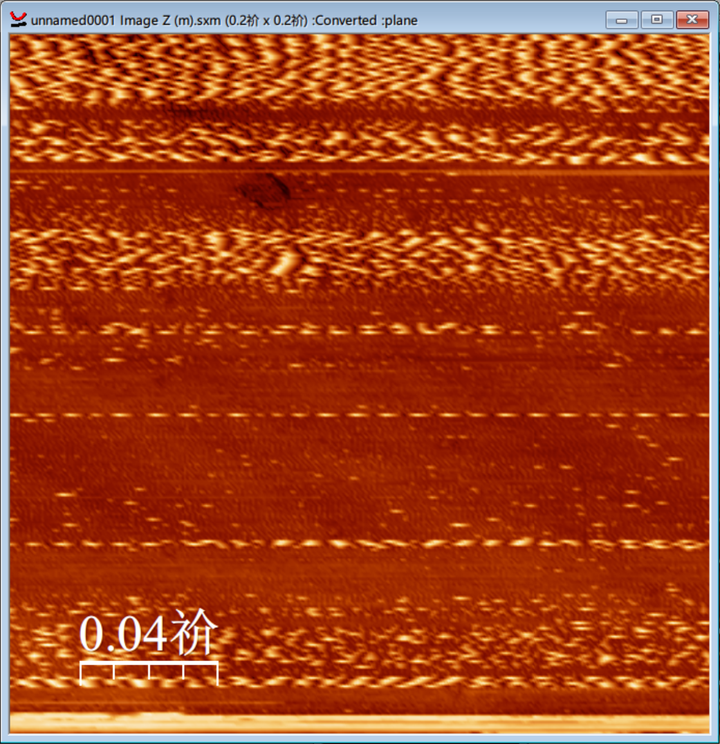


对自己的数据比较熟悉的朋友可能会明白，这个“祄”指的是微米。但为什么会发生这样的事情呢？

**有经验的读者能一下猜到，这肯定是编码出问题了。**

事实上，除了上图的位置，WSxM内其他各处也存在类似的问题：

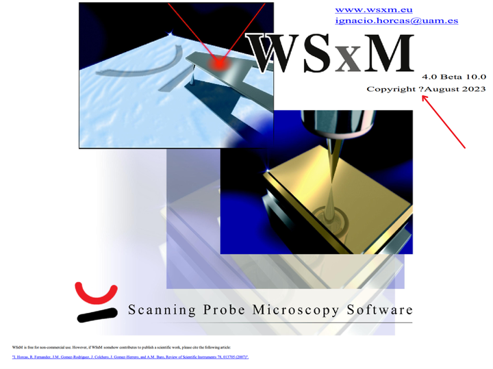


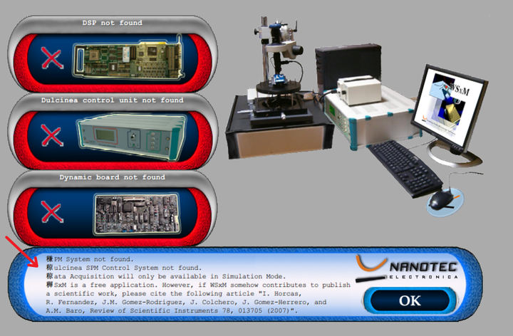


虽然我更喜欢用Gwyddion不存在这个问题，但是这个问题还是多少引起了我的兴趣。

## 二、尝试使用Locale Emulator

在互联网上搜所类似“WSxM”“incorrect/wrong display”“strange character”“non-latin”之类的关键词，发现外网几乎没人提到过这个问题，但是在中文或日文网页却能找到一些相关的提问（可惜没什么人回复他们）。

这个时候一个合理的猜测是，开发者本人肯定没有发现这种问题，所以我们如果可以复原开发者本人的系统设置，或许就能知道正确显示的内容。

“祄”字是一个相对比较好猜测的切入点。借助乱码恢复工具：

[乱码恢复,中文乱码恢复,乱码修复,utf8乱码,gbk乱码,汉字乱码](https://wrtools.top/coderepair.php)

我们来看看这个乱码原本是什么。

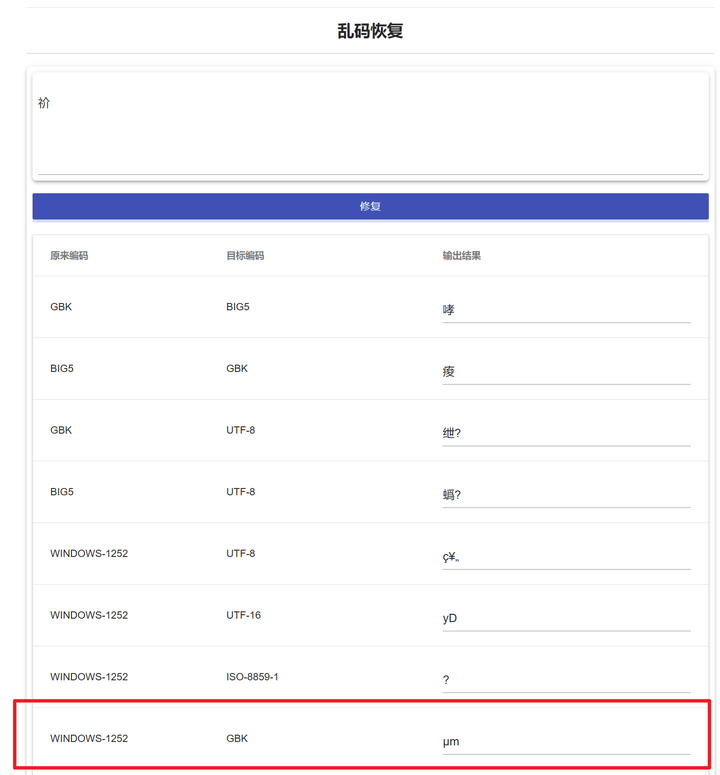

我们发现，Windows-1252转GBK的尝试给出了有意义的结果。

> **Windows-1252** or **CP-1252** ([code page](https://en.wikipedia.org/wiki/Code_page) 1252) is a single-byte [character encoding](https://en.wikipedia.org/wiki/Character_encoding) of the [Latin alphabet](https://en.wikipedia.org/wiki/Latin_alphabet) that was used by default in [Microsoft Windows](https://en.wikipedia.org/wiki/Microsoft_Windows) for English and many [Romance](https://en.wikipedia.org/wiki/Romance_languages) and [Germanic](https://en.wikipedia.org/wiki/Germanic_languages) languages including Spanish, Portuguese, French, and German (though missing uppercase [ẞ](https://en.wikipedia.org/wiki/ẞ)). This character-encoding scheme is used throughout the [Americas](https://en.wikipedia.org/wiki/Americas), [Western Europe](https://en.wikipedia.org/wiki/Western_Europe), [Oceania](https://en.wikipedia.org/wiki/Oceania), and much of [Africa](https://en.wikipedia.org/wiki/Africa).——[Windows-1252 Wikipedia](https://en.wikipedia.org/wiki/Windows-1252)


这个字符编码广泛用于西欧各国。与之相对的，国内简体中文版Windows系统的设置可以在注册表内查看：

```text
HKEY_LOCAL_MACHINE\SYSTEM\CurrentControlSet\Control\Nls\CodePage
```

在这一项下我们可以看到，国内使用的ANSI和OEM的Code Page均为936

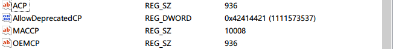


这个时候不得不来介绍一个神器：[Locale Emulator](https://github.com/xupefei/Locale-Emulator)。虽然这个软件已经停止维护，但在目前的Windows10/11系统上仍然可以使用。通过LE，我们可以猜测性地设置预置配置，例如，WSxM作者位于马德里自治大学，我们尝试西班牙语（西班牙语）的设置——很奇怪，使用均为Windows-1252的英语（英国）、西班牙语（西班牙）的设置，都没办法用LE的方法正常显示。

需要注意，Code Page和Locale并非一对一的关系，而是多对一的关系。我没有找见官方具体的文档，但下面的这个回答给了参考：[Default code page for each language version of Windows](https://stackoverflow.com/questions/3864240/default-code-page-for-each-language-version-of-windows)

> 此处，我怀疑是不同语言对应的默认字体也存在问题，除此之外想不到其他合理解释。

奇妙的是，当我们选择按理说对希腊字符“µ”支持更好的希腊语（此时Code Page是Windows-1253）的时候，真正的界面就正确了：

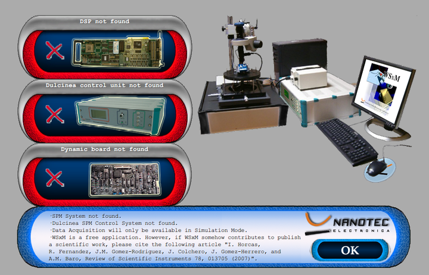

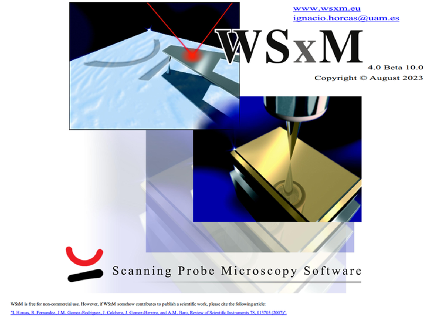

但是很不幸，当你尝试打开任何一个文件时，软件都会立即崩溃——毕竟他现在在一个非常别扭的模拟Locale运行，你很难保证他能正常使用。

## 三、复现乱码

虽然没有办法完美运行起来，但是我们找到了一种可能的解释：**作者某种西欧语言的Windows系统下开发的这个软件，没有为非英语母语者单独做过测试。这么多年来，是否有人邮件反馈亦不知；加之软件都比较小众，大多数用户都在化学材料天坑里也不会讨论这个问题，可能把标尺去了就将就用用了。如果你原生是英语的Windows系统（例如进口设备自带的那种），这个问题可能就遇不到；但如果是非英语的系统，这个问题就很容易碰见。**

那么，“祄”和“µm”是怎么联系上的呢？

还是回到Windows-125x本身。我们直接翻阅各种ANSI的Code Page可以知道，几乎所有的Code Page都把前128个位置00-7F预留给ASCII字符了，因此无论你是英语系统还是中文系统，前边ASCII字符这部分大家的读取几乎都没出过问题（有时候你会看见一堆乱码中只有数字英文之类的显示正常，也是这个原因）。

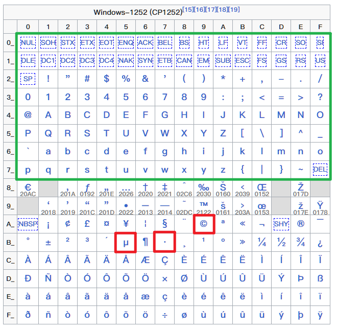

上图为 Windows-1253 Code Page Layout，红色标出为上边例子里面原始的字符。然而，上述的Windows-125x均为单字节符号，我们在简体中文Windows系统上的CP936对应的却基本上（但不完全）是GBK字符集与编码方案[^ 1]。GBK分为单字节和双字节，与其他编码类似，对前128个ASCII码（单字节）位置做了兼容，但是其后的都是双字节字符；不在128个标准ASCII码范围的“µ”（单字节，十六进制：B5）符号和我们一般输入的“μ”（双字节，十六进制：A6CC）是不一样的。

> 如果你有爬虫的经验，可能对网页里突然出现的emoji和混在里头的“©”符号之类导致编码错误头疼不已——这是另一个典型的例子。

**系统在显示文字时，读取到第一个字节“µ”（B5）后认为是一个GBK中的汉字，遂往后读取第二位，把第二位的“m”（6D，标准ASCII）字符当作这个汉字的第二个字节，最后拼在一起，出现了一个怪异的“祄”字。**

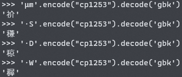

通过 Python 测试发现确实如此，控制台是UTF-8所以均能显示。

于是，我们直接复制粘贴原来的字符组合，通过一次编码转换，能够像上图一样完全复现这些乱码。

## 四、解决方案？

读者看到这里可能最想知道这个问题怎么解决。笔者经过一番检索，对Windows的这种管理机制和历史包袱导致的问题感到非常悲观。在这种情况下，常规的兼容性设置打开也是没有用的。

但作为讨论，下面仍然有几个思路可以尝试：

### ① 维护一个纯英文的系统

从当前使用者的角度来说，其实真正完美解决的方法无非只有一个：**专门维护一个纯拉丁语字符的Windows系统，或者重装或者虚拟机，来彻底避免此问题。**

### ② 实验性的UTF-8支持

可能读者在其他地方有查到说，开启实验性的Windows UTF-8 支持，就可以解决大多数由于编码问题带来的乱码。

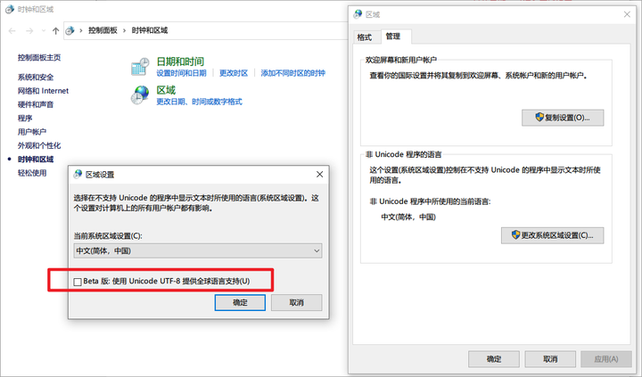

事实上，此功能确实可以让WSxM暂时显示正常——这是因为通过系统的实验性功能支持，让同时包含（但不是原封不动，这个功能应当还做了额外的编码规定使得恰当的映射也能对上正确的字符）上边冲突的Windows-125x和GBK的Unicode来解决这个问题。

**然而，此功能无论是从理论上还是个人经验上都多少有点问题。**尤其是一些新机设置使用中文Windows用户名的用户出现某些软件、环境识别中文出错时，不愿意新建英文账户或重装系统，但又怕改注册表自己不熟练，只能选择开启实验性功能来临时应急。这么做的结果可能是在Windows本身的混乱编码问题下又增加了一层混乱。一些老软件、冷门软件的处理有问题，也会导致出现乱码路径或文件名，颇有拆东墙补西墙的意味。**（当然你也可以试试反过来——在实验性UTF-8开启后，用上文提到的LE解决一些非Unicode编码的问题，但我没试过）**

关于这个问题有一些讨论供参考：

[在 Windows11 中是否应该勾选Beta版：使用 Unicode UTF-8 提供全球语言支持？](https://www.zhihu.com/question/536400200)

我个人的建议是，别开。如果这是一台实验室非个人PC，与其折腾这个，不如直接用英文系统。

除非，有一天这个选项可以原生或有第三方实现只针对单个进程设置。有一种说法[^2]，这个选项本质上是修改了注册表内的 ACP、MACCP、OEMCP 三个键值为 65001，作为一个虚拟的Code Page来触发。不知道能否通过 Locale Emulator 的伪造注册表值机制来实现这样的模拟，如果可以的话，非全局的UTF-8支持未尝不是一种解决方法。

### ③ 更新/修改程序

更新/修改程序有很多种方案。最可行的有：

1. 还在维护：看看最新版本
2. 能联系到作者/公司：邮件反馈，尤其是如果你花钱了还在服务期，更好
3. 代码开源：自己改代码相关实现
4. 以上都没有：没加壳就二进制替换掉对应的出现位置

需要注意的是，例如WSxM这样强调了LICENSE的闭源软件可能不允许你去明着干第4条：

```text
3. RESTRICTIONS.  
Except as otherwise expressly permitted in this Agreement, or in another 
Licensor agreement to which Licensee is a party, Licensee 
may not: 
	(i) Modify or create any derivative works of the Product or 
	    documentation, including translation or localization; 
	(ii) Decompile, disassemble, reverse engineer, or any other 
	    attempt to derive the source code of the Product (except to 
	    the extent applicable laws specifically prohibit such 
	    restriction); 
	(iii) Redistribute, encumber, sell, rent, lease, sublicense, or any 
	      other transfer rights to the Product;
	(iv) Remove or alter any trademark, logo, copyright or other 
	      proprietary notices, legends, symbols or labels in the 
	      Product; 
	(v) Publish any results of benchmark tests run on the Product
	     to a third party without Licensor's prior written consent;
```

这也是我早期压根没考虑这个软件而是选择Gwyddion的原因之一。既封闭又不勤快维护还年代久远的软件确实是没有什么死磕它的必要——唯一的良心在于，作者至少还有个邮件地址留了下来。

但作为一个Demo，我只尝试做一些演示性的修改（我绝对在24小时内删除它）。既然知道了正确显示应当有的编码，我们通过[HxD](https://link.zhihu.com/?target=https%3A//mh-nexus.de/en/hxd/)之类的直接搜索十六进制数据并替换，理论上是可以让它稍微好看点的。

首先，我们复制一份 WSxM.exe 主程序，在HxD中打开：

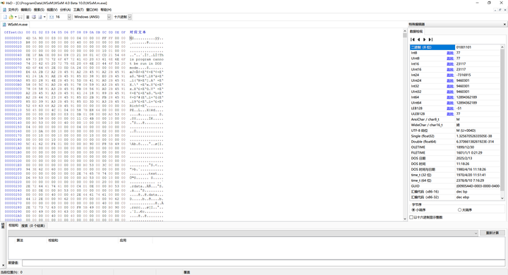

查看之前的Windows-125x所涉及的单字节字符，除了标准ASCII码的部分，就是我们要尝试替换掉、根据经验软件中可能用到但不被GBK支持的字符。需要注意的是，这样不通过反编译了解结构的话，我们不清楚二进制文件的组成，替换必须要查看上下文进行，否则可能会破坏其他代码的部分。

修正可以单对单暂代，或者借助空格扩充等等。

单对单修正：

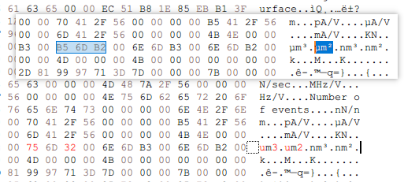

借助空格扩充的例子：

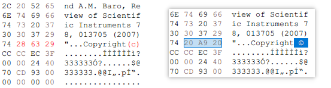

右边这种明显是单位可以改，左侧大概率不是字符串：

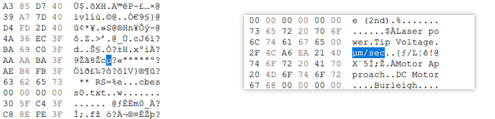

最终你可以得到一个修改完的二进制文件，运行后至少在你需要的部分显示正常：

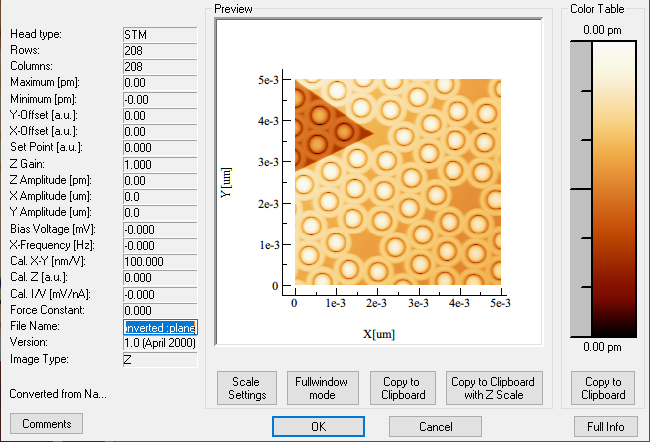

在ISO 2955标准中，“u”已经被采纳在有限字符集中代替“μ”。当然，在你看不见的地方仍然有一堆这些问题——

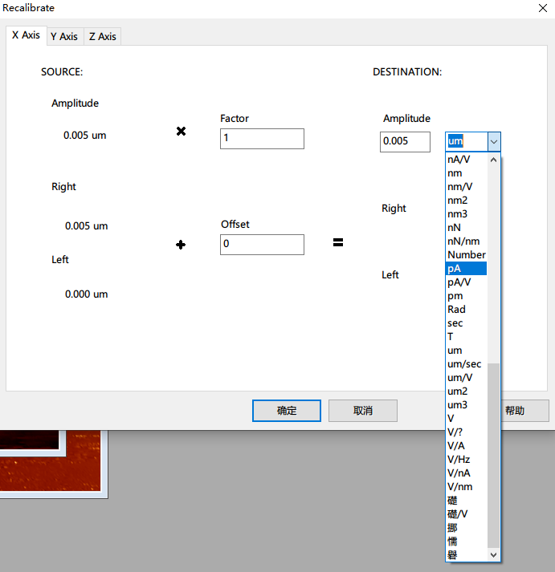

放弃吧，少年！

此外，WSxM 的设计一定存在某些混乱的API，因为当你切换（未修改的 WSxM 主程序）到 Data Aquisition 模式的时候会惊奇的发现 Lever设置里的 μm 他居然是正常的：

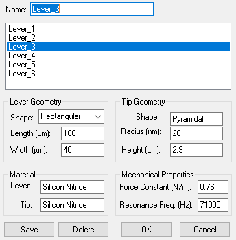

可以说，只从处理图像的角度而言，此文几乎都是一个 WSxM 的劝退贴了。

------

所以综合下来，个人最简易的方法还是：对进口设备必须配套特定软件的，直接全英文系统能避免这些麻烦。或者软件选择上不要太依靠互联网上一些过时的教程。我也用过不少软件，都是些有年头但长期更新的项目，几乎没有怎么见过此类问题。而设计符合规范的软件，即便也是好多年前的版本，他们也从不出现此类问题（比如我们实验室早很多年随机购入的SPIP）。

> 全文最大感受：万国码/Unicode 是神，Windows 真是历史包袱太重了。

## 参考

[^1 ]: [汉字内码扩展规范 ](https://zh.wikipedia.org/wiki/%E6%B1%89%E5%AD%97%E5%86%85%E7%A0%81%E6%89%A9%E5%B1%95%E8%A7%84%E8%8C%83)

[^2 ]:[What does "Beta: Use Unicode UTF-8 for worldwide language support" actually do?](https://stackoverflow.com/questions/56419639/what-does-beta-use-unicode-utf-8-for-worldwide-language-support-actually-do)
