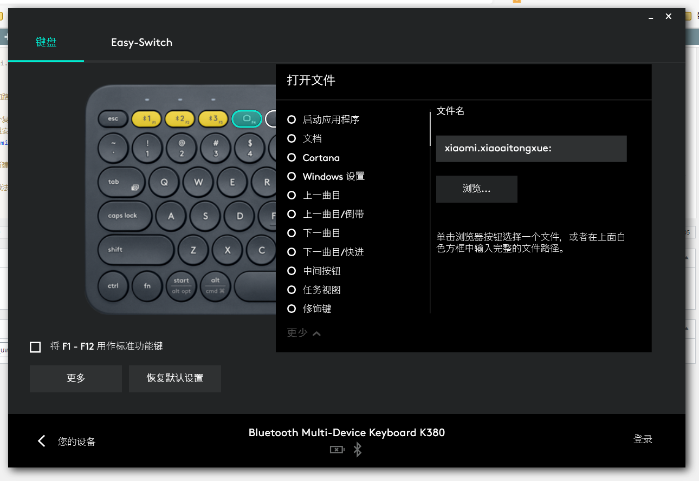

## Win10小爱同学UWP版下载

直接去微软商店是搜索不到的，下载链接：

    https://www.microsoft.com/zh-cn/p/%E5%B0%8F%E7%88%B1%E5%90%8C%E5%AD%A6/9mw76kfhnz0c

这个随便百度就有，安装过程此处不赘述。

## 通过URI Scheme唤起

看了网上一堆教程，都是找到快捷方式后绑定快捷键的。个人觉得不算很好的办法，因为 UWP 的安装路径不是传统 Windows 应用那样"稳定"的。

因此，我直接搜了下注册表，找到这么一条类似 URI Scheme 的东西：

    xiaomi.xiaoaitongxue:

这个和路径无关，是类似`ms-settings:`一样的。

把这个复制粘贴到资源管理器的地址栏可以直接唤起小爱同学。如果你是Windows10电脑正在访问本页面，且安装完了小爱同学，你可以试试点击这个：[点击此处呼出小爱同学UWP](xiaomi.xiaoaitongxue:)。正常应该直接蹦出来了。

或者新建快捷方式，把路径/网址填写成这串，再设置快捷键也可以。

我的做法是把我罗技键盘自定义键位在 Logitech Options 里面设置为"打开文件"，路径设为这个就行了。

## 进一步猜想

既然有了这个 Scheme

那很可能后面也有某种参数，使得`xiaomi.xiaoaitongxue:xxx`可以直接打开小爱并处于语音状态。当然这个是猜测，目前还未发现这个参数究竟是啥。

