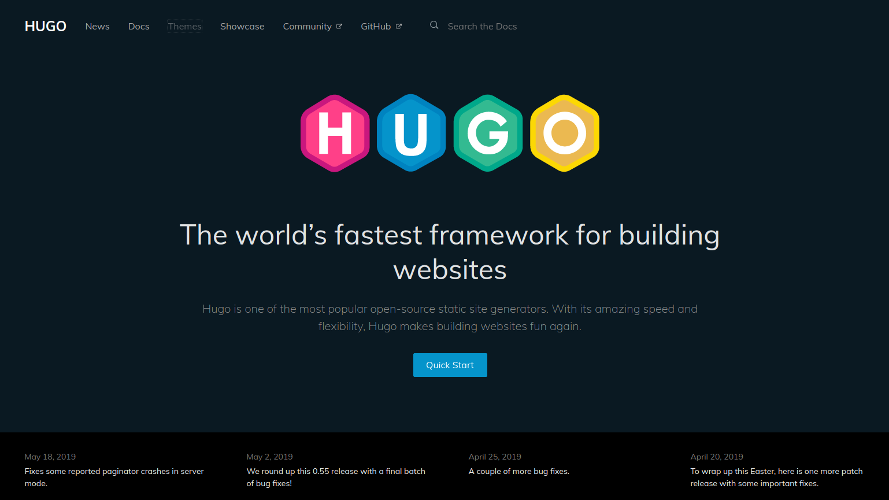

由于某次 Wordpress 差点崩没了的经历，细思恐极，觉得文章应该有个比较好的备份模式。故 *（花了快半年）* 决定切换到 Hugo！

这也是我的第一篇 Hugo 文章~

# 不要靠近 Wordpress

不要靠近 wordpress，会变得不幸。

# 烂活：爬取旧站点

我能怎么办，我也很无奈啊。

#  Docker + Hugo + Caddy = ?

试试就逝世。

# （近似）复刻我的主题

挖坑！