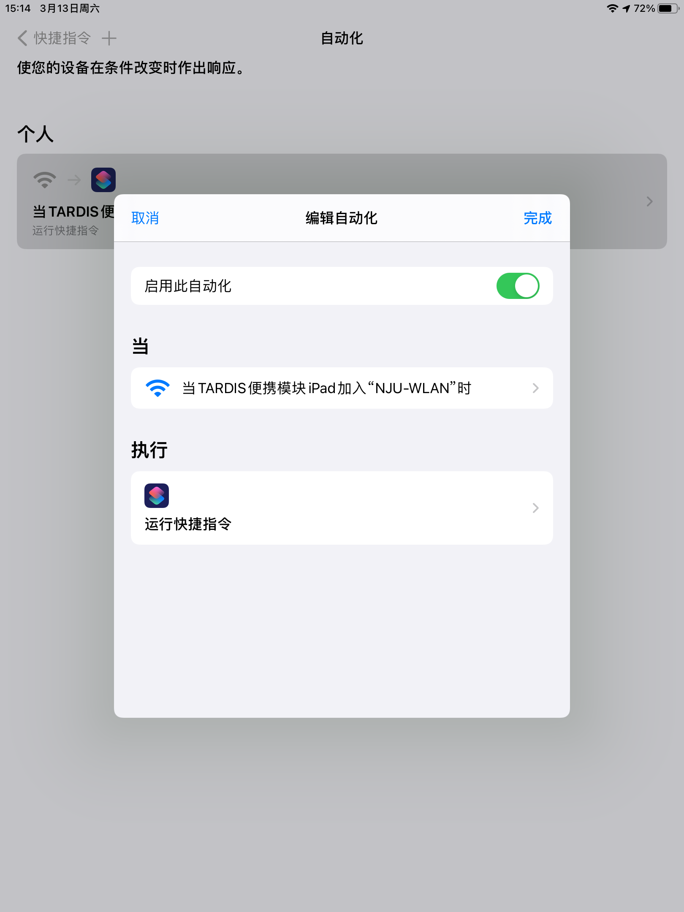

## 简介

**快捷指令（捷径）**

是苹果自iOS13起新加入的原生应用，其实是苹果收购了著名应用 Workflow，更名后免费开放给大家的。

这个应用是做什么的呢？简单来说，快捷指令提供给你类似"积木"一样的iOS/iPadOS的系统、应用功能，**你可以通过自己的设计、拼凑来组合出自己想要的功能**。

尽管经过设计的封装和抽象，这些"积木"模块已经相当直观、简单，你说这是"编程"仍然毫无问题。

毕竟，编程英文叫"Programming"，其实侧重在思考处理问题的流程上，而非狭义的"Coding"——**换句话说，并非只有写代码才能叫"编程"，如果你能为解决一个问题思考出清晰明确的执行步骤，我认为这就已经是在"编程"了。**

所以说，尝试下自己去"编程"真的没有那么困难。

当然，我并非专业于此，深究各种"步骤"之优劣是编程艺术的一大问题，我所写这些诸位读者大可视作一种"外行"的交流。

## 制作自己的快捷指令

寻找一个别人制作的快捷指令很简单，只需要在搜索引擎直接搜索相关关键词即可。现在还出现了各种功能的快捷指令社区，供大家浏览下载自己所需要的功能。

而我这里更希望介绍一点我粗浅的理解，希望在此之前对此一窍不通的读者能够有一点启发去尝试尝试。

### 学会分析

首先，请回忆一下，我们做的绝大多数事情，都是这样一个结构：**输入信息——根据信息做相应动作——（可选）输出信息。**

比如，你去买奶茶，你要告诉店员**奶茶口味、温度、甜度**，店员获得这个信息之后你虽然看不懂他做什么，最后还是会给你一杯调制好的**奶茶**。

此时，**口味、温度、甜度**都是你向店员 **"输入"** 的信息，交易后店员自己的**制作流程**是 **"动作"** ，最后给你的**奶茶**是 **"输出"** 的产物。

当然，有时也不需要有什么信息输出，比如喝掉奶茶。此时，你向你自己**输入**的只有"奶茶"，你**执行**了"喝掉"的动作，你的目的就已经达成了，**不需要再"输出"**什么信息。

所以，你可以发现，**不需要知道交易细节、店员制作流程**，你只要去奶茶店向店员"输入"相应的"口味、甜度、温度"，店员一番动作后会给你一杯对应的奶茶。同时，你向自己"输入"这杯得到的奶茶，并执行"喝"的动作，就喝掉了它。

于是你发现你完成了"去奶茶店买杯奶茶喝"这种一句人话可以描述的任务。看起来上面的描述都是废话——对单独一件事可能确实有点废话，但如果这件事要重复很多次，这种思考很必要了。

### 回到快捷指令

**上面这样的分解和快捷指令的每块"积木"就是一致的。**

当你告诉快捷指令的每个模块它所需要的**正确格式** *（毕竟你不能告诉店员说甜度要37℃，他会觉得你脑子不太正常）* 的信息时，它便会**根据输入的信息去完成一个任务，或者完成一个任务并且反过来输出给你结果**。

以"从输入获取日期"为例，这里的输入可以是各种能提供文本的东西。只要你输入了这个格式的信息，这块"积木"就会自己处理并且告诉你这段文字里出现的日期——它是如何获取的？**不必知道这个细节，你只需要知道它能完成你想要的目的。**

因此，我们其实可以比较 **"结果主义"**一些去想：我要完成目标A，我要怎么一步步做过去？之前的例子就是如此：奶茶口味、甜度、温度→奶茶，奶茶→喝掉了。

快捷指令的"输入"非常多，可以**是指定的某些系统的信息**（比如当前电量），

也可以是**要求用户输入、选择的信息**，

甚至可以是**从共享表单处获取**的信息。

这就为快捷指令的灵活性提供了很好的基础。

## 个人分享

我其实自己做了一些快捷指令，大多数是我常用的场景，可以和大家分享一下。

iPhone或iPad中，复制对应的链接并在Safari打开可以安装，为了避免兼容问题**建议用中文系统并升级到最新版快捷指令应用**。

### 1. 登录校园网

这是一个经久不衰的功能，实现也非常简单。

    https://www.icloud.com/shortcuts/8c787931dd94466fa2bbea98287ddfca

添加时初始化，提示你配置此快捷指令，输入学号和密码。设置后，以后上校园网网可连接

NJU-WLAN 并直接点击"一键登录校园网"来直接登录，省去访问 `p.nju.edu.cn`的麻烦。

这个快捷指令也支持退出当前登录状态。

此外，配合快捷指令的"自动化"，可以设置连接至 NJU-WLAN 时自动运行这个快捷指令。

### 2. 获取课表并导入日历

为了方便管理，强烈建议先在系统的 **"日历"** App中新建一个比如叫"2021春课表"的日历，后续导入的日历输入此日历名字即可，**请务必记住你取的这个名字**。

研究生版：

    https://www.icloud.com/shortcuts/6bddb091cc2047af886e1e889ec9234f

本科生版：

    https://www.icloud.com/shortcuts/39ea66644c634e60b8e179f3aa3198a0

使用方法较为简单，Safari浏览器登录到你课表页面，在网页的 **"共享"表单**内找到这个快捷指令，按照提示使用即可。

快捷指令运行时，就需要输入你所输入的日历名字了。

> PS. 由于本身写入日历的速度一般，所以这个导入可能会导致需要一段时间，是正常的。由于课表的复杂性。

### 3. 其他

需要注意的是，前面所展示的两种用途均只使用系统原生 App 提供的"积木"，并未使用第三方软件。

下面这个把网页添加到 Microsoft Todo 来提醒自己查看的功能，其实已经可以被 Edge 浏览器的"集锦"这样的功能替代了，但仍可作为一个使用了第三方软件的简单可行例子。

其他一些小型快捷指令，我就不多展示了。

以上快捷指令的更新和反馈可以在我的博客`ladderoperator.top`中反馈，也可以在我的南大Git`https://git.nju.edu.cn/ladderoperator/MyShortcuts/-/issues`（有时打不开需要校园网，一般不用）中反馈。

## 结语

其实很多年前我也一直吐槽说苹果"封闭"，但现在看着看着觉得形势出现了很微妙的变化——

安卓阵营这里，即使有Tasker和快径这样的应用，也和iOS/iPadOS系统级别的支持难以比较，而且多数"积木"并不像快捷指令这样有丰富的"输入""输出"来**串成真正意义上的"工作流"**（Workflow）。

而苹果限制了如此久，实际上形成了开发者必须遵守的诸多规范。现在，它便能很便捷地、"半开放"地将各个App的功能打通，给用户一定自由去设计自己的工作流，掌控起来也比安卓千奇百怪的软件来的顺滑。

我觉得这是个很有意思的事情。

我看着手里的MIUI，看着小爱同学里的"小爱捷径"，看着手机管家里的"自动任务"和米家里的"智能场景"——也不知道他们什么时候能合成一体？看起来，这方面国内安卓厂商确实还有很长的路要走。

最后，还是建议大家有苹果设备的来探索探索快捷指令，试试乃至DIY新工具。

说真的，这不比铺天盖地的"万能Python教学班"恰饭广告来得实在？

