# 在Windows上使用Switch Joy-Con手柄

> 众所周知 *（我这个没有Switch的都知道）*，Joy-Con有两种使用方法——一是拆成**两个**简单小手柄，另一个是合成**一个**标准手柄。其实NS出的比较早，因此已经有不少教程如[《Play Any PC Game With Nintendo Switch JoyCons》](https://www.youtube.com/watch?v=p0awlrvWdAY "Play Any PC Game With Nintendo Switch JoyCons")。为了能和女朋友或室友愉快地玩耍我Steam上吃灰的那些双人游戏，我也特地研究了下如何在Windows下使用Joy-Con。

## 准备工作

要想实现在Windows上使用Joy-Con，其实你只需要下载：

-   [ViGEmBus](https://github.com/ViGEm/ViGEmBus/releases/)：Xoutput需要的一个Windows游戏控制器模拟器

-   [XOutput](https://xoutput.sourceforge.io/)：将过时游戏控制器的直接输入转换为Xbox 360的信号输入

但是上述的连接方法虽然可以得到信号，却并不能使得Joy-Con的指示灯稳定，因此还需要下面的两个软件：

-   [vJoy](http://vjoystick.sourceforge.net/site/index.php/download-a-install)：可桥接非游戏控制器的任何设备与需要游戏控制器的应用程序的设备驱动程序

-   [JoyCon-Driver](https://github.com/fossephate/JoyCon-Driver)：为vJoy增强对NS游戏控制器的模拟的驱动

以上软件其实均在GitHub可以找到（其中JoyCon-Driver比较大，实际上要用的`joycon-driver.exe`在仓库**源代码里的release目录下**）。

这篇推送基本相当于整理了一下内容。

## 开始配置

### 蓝牙连接

首先，需要电脑蓝牙分别连接两个手柄。长按下图的两个`Sync`键直到其指示灯滚动闪烁，Joy-Con开始进入配对模式，

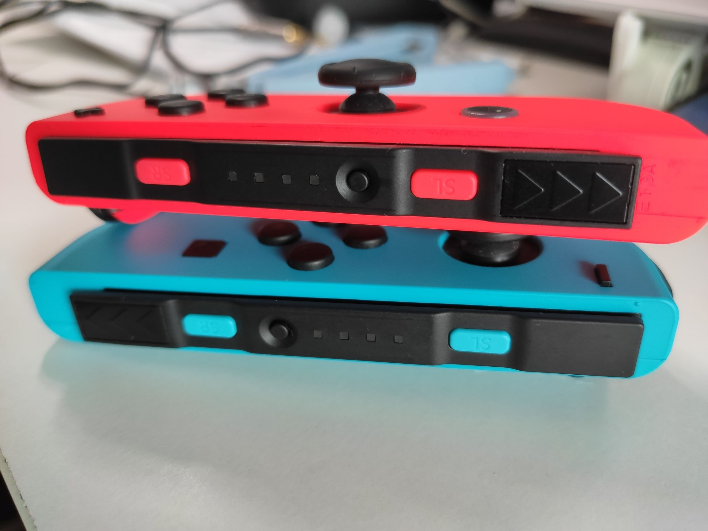

此刻打开Windows的蓝牙连接面板添加设备：

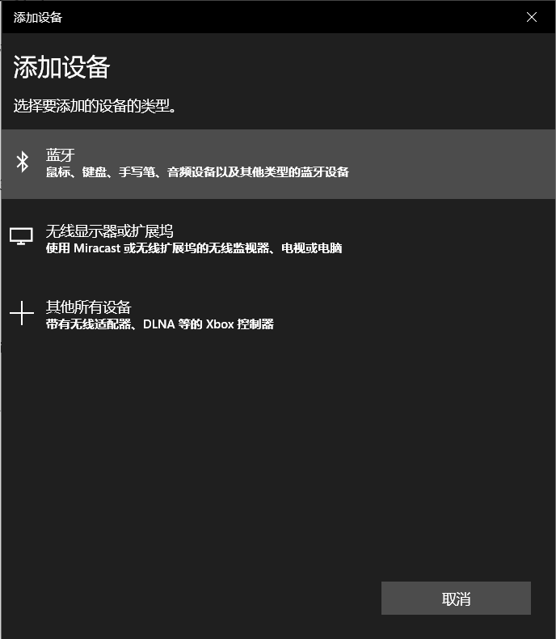

找到 Joy-Con 后分别连接`(L)`和`(R)`（即，左右手柄）。

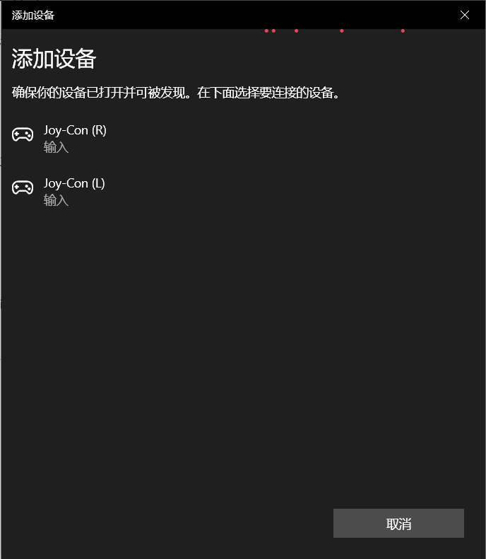

此时，手柄虽然已经显示连接，但可以看见`Sync`按键旁的四个小灯仍在闪烁，手柄仍然不能直接用。

### 开启vJoy

为了和Joy-Con建立可用的连接，打开安装好的vJoy中提供的**Configure vJoy**，可以看见界面如下：

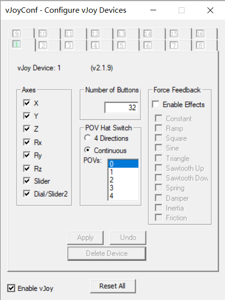

如果你打开只有1个设备，那你需要点击灰色的"2"号设备下面的**Add Device**，这样等会儿才能分别和两部分建立连接：

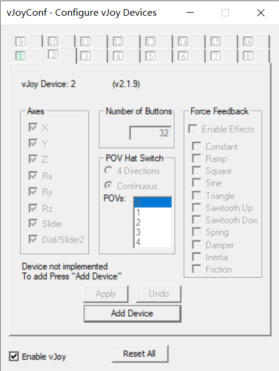

等到"2"的标签亮起，说明第二个虚拟设备添加成功。

到这里为止，我们只是添加了两个虚拟设备，尚未和Joy-Con真正建立联系。因此，下面就需要**JoyCon-Driver**登场了。

### 启动JoyCon-Driver

顾名思义这东西就是Joy-Con的驱动一类的软件，它的作用是将上一步的vJoy与Joy-Con建立连接。

由于JoyCon-Driver几乎已经停止开发，遗留了很多界面设计、更新机制的问题，在打开之前建议先如图设置一下`joycon-driver.exe`的**高DPI缩放**，这样打开的时候界面至少能看清楚一些：

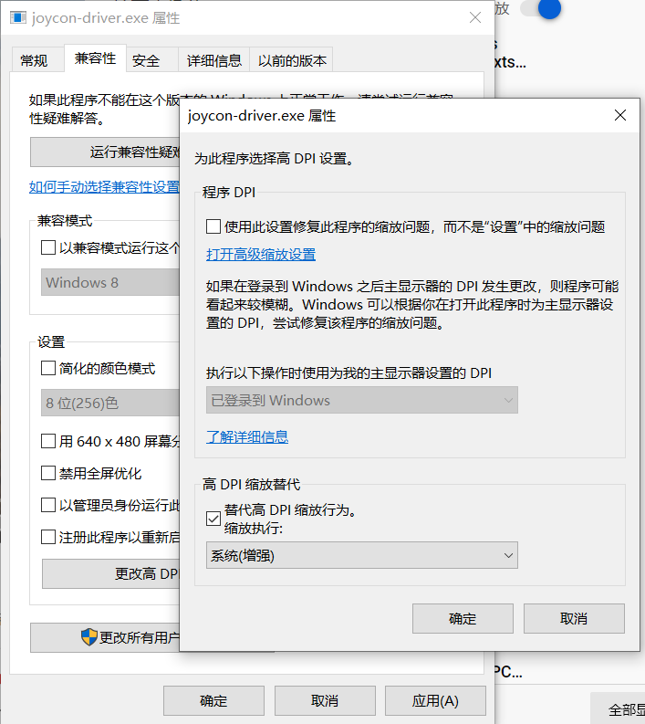

设置后打开`joycon-driver.exe`，可能界面卡一会儿，此时一定要耐心等待。之后提示你更新，**不要**点击"Check for update"，因为其指向的更新页面如今已经关闭了，实际上无法更新，而且若被人利用还会存在风险 *（有哪位大佬可以改一改这个版本就好了，虽然都不是致命问题）*。

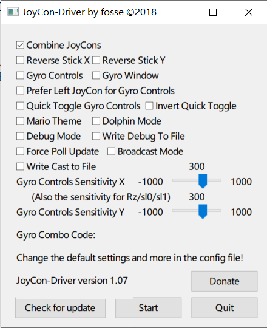

### 配置XOutput

在配置之前，先安装一个文章开头提到的ViGEmBus。

#### 双手柄模式

取消勾选`joycon-driver.exe`的 **"Combine JoyCons"**，其他配置几乎不用动，直接点 **Start**。后台服务启动，JoyCon~~身体一阵抖动，一切都索然无味了~~振动表示连接完毕。可以看见灯也不闪了。

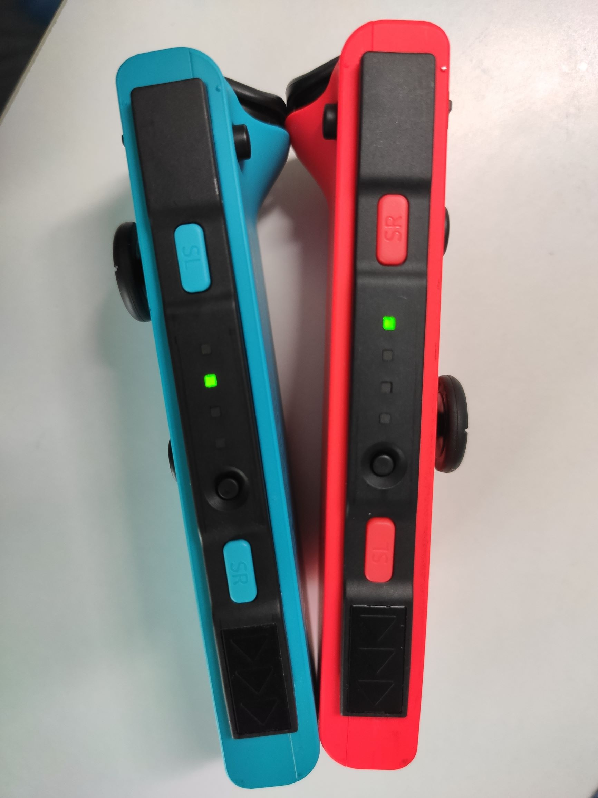

再打开`XOutput.exe`，建议把`Tools`--`Settings`如下设置：

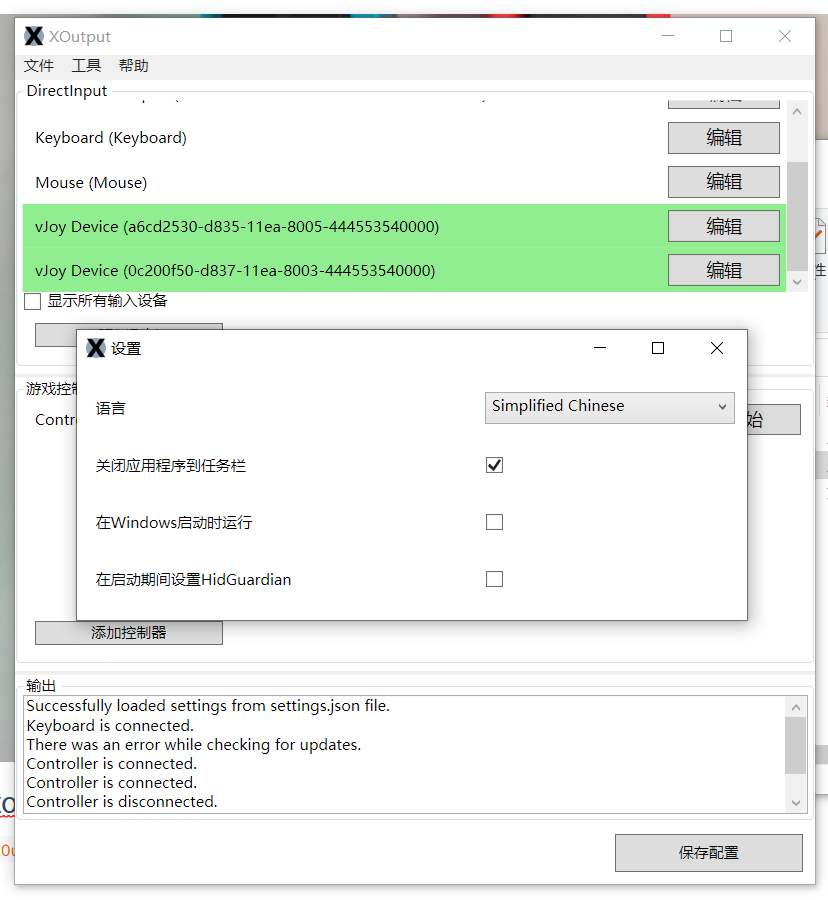

点击 **"添加控制器"**，会出现一个新的"Controller"，下面就是点击**编辑**。你可以在里面按照提示配置不同按键，修改控制器名字等，这个比较简单，界面一目了然：

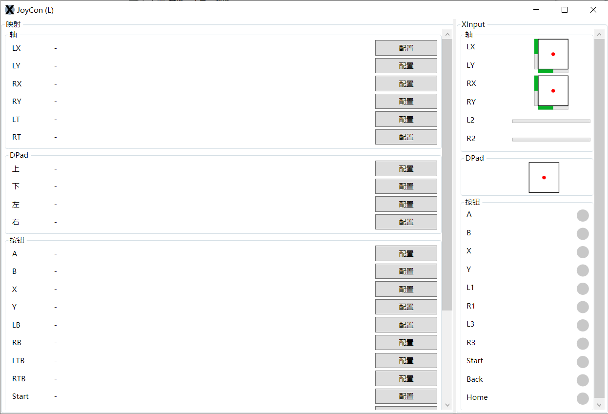

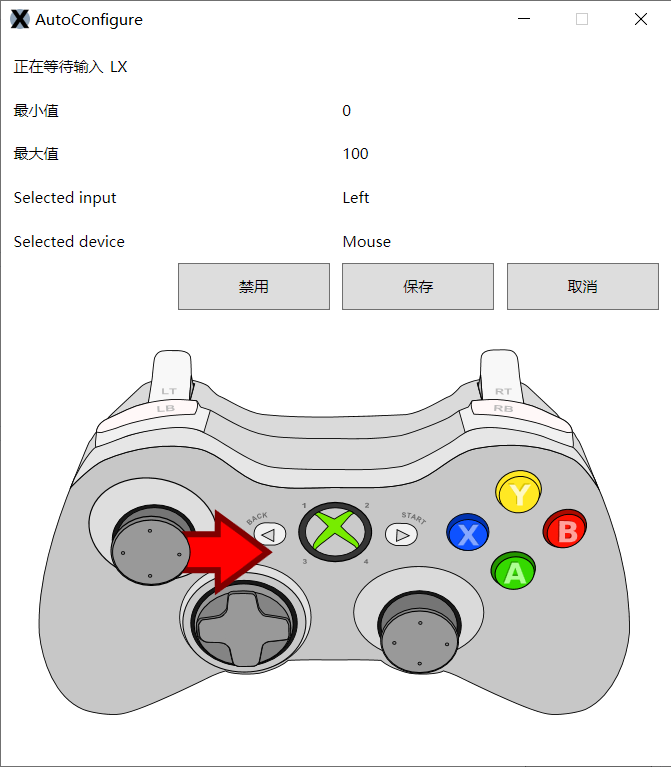

设置完毕后，点击 **"开始"**，即可使用。

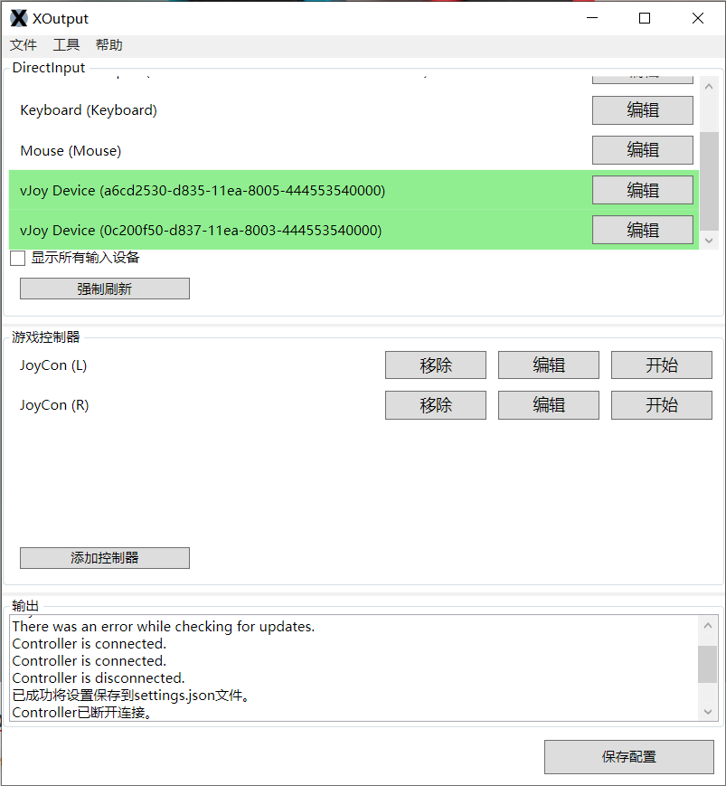

需要注意的是，这个模式下功能较少，因此只能玩一些简单的游戏。

#### 单手柄模式

开启JoyCon-Driver的 **"Combine JoyCons"**（不开可能会导致按键混乱）：

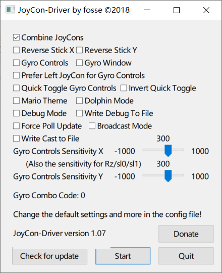

之后将Joy-Con合二为一，重复双手柄模式的设置方法，把两个部分视作整体一个个配置按键。

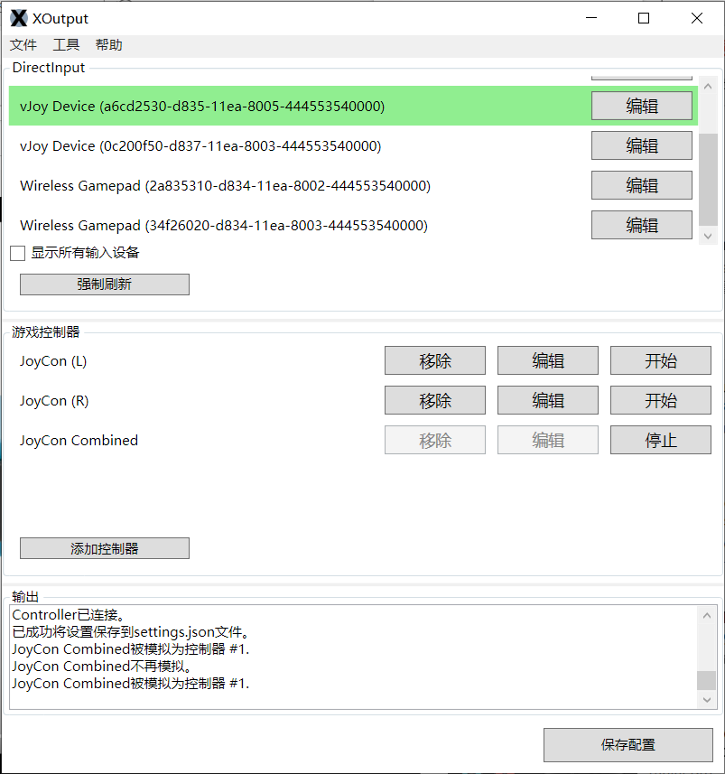

## 总结

最后别忘了**保存配置**，之后每次使用只需要先打开`joycon-driver.exe`，再运行XOutput即可。

总而言之这一通折腾用到了四个软件，大概是这么一个逻辑：JoyCon通过蓝牙直接向计算机输入信号，vJoy通过JoyCon-Driver与JoyCon建立稳定连接，将其模拟为一个游戏控制器，然后XOutput借助ViGEmBus再把这个游戏控制器的信号转换为Windows平台的Xbox 360信号。

实测单手柄模式有时候不太稳定，会有延迟，所以还是专门配一个手柄好了。相比之下双手柄两人玩玩小游戏还是不错的，《战斗方块剧场》啥的玩起来也没啥问题。

除了这个方法之外，大体的思路类似的还有如少数派上的[《将你的任天堂 Switch Joy-Con 变成电脑手柄》](https://sspai.com/post/43982)，也可以做到差不多的效果。

PS. 是不是有很多小窗口（还有黑黑的控制台窗口）丢在后面，最小化又觉得占地方？这种时候，可以试试之前我推荐的这个小神器：[《推荐 | 把程序最小化到托盘的小工具RBTray》](https://mp.weixin.qq.com/s/aCPJqzo_kvtEDLio49uwmw)

