> 《百合凋零》将是我目前最长的文章，我会拆开来分为多篇成一个系列。我志不在吸引关注，做此事只是为了抛砖引玉。因而我会一次性把文章同步推出不做"连续剧"，之后可能会有整理单独发一个总集目录。转发不可强求，但求有人搜索时，还能在偏僻的角落里发现这些文字。我并非专业人士，真正要明白图表背后的事实需要广泛的调研，因而本系列仅能作为抛砖引玉。若有心自己研究，我已在《百合凋零（附录）：一些随笔》中简单介绍了方法并共享了部分粗处理的数据，不妨参看。


## 序


**百合凋零，实为一件憾事。**


小百合BBS，在它的背后有[很多故事](https://zh.wikipedia.org/wiki/%E5%8D%97%E4%BA%AC%E5%A4%A7%E5%AD%A6%E5%B0%8F%E7%99%BE%E5%90%88BBS "小百合BBS-Wikipedia")------源起浪漫的爱情故事，也反映了时代变迁，诞生了[早期的互联网流行语](https://en.wikipedia.org/wiki/50_Cent_Party "五毛党-Wikipedia")，甚至可以说是中国互联网的一个缩影。这个一度成为中国最活跃的BBS之一的小站，经历了关闭复建、用户分裂等等风浪，最终以某种更加"正式"的名义，换回了经典的面貌迎来了二十一世纪初的又一段春天。


但我的出发点，与这些都无关，我也**无意追究这些过去的恩怨情仇，那是一个异常宏大的话题**。现在的小百合*（或许是第三个版本的）*于我而言是极其具体的，主要是三样东西的集合体：


-   兴趣或话题导向的线上校园**公共空间**


-   学校师生的**沟通平台**


-   各类信息发布的**布告栏**


二十一世纪将要过去五分之一。这么多年来，"小百合已凉"不仅仅是人们口中的传闻，更是在一次次访问中越来越冷清的氛围带来的实际体验。但奇怪的是，仍然有些还不愿意正视小百合出现问题的人，坚持试图让大家回到依赖小百合的时代，用这落后的BBS来接受和发布信息，也没有见得他们投入同样的热情来继续维护、来建设发展这个曾经"大红花的国度"。


或许该破旧立新了。**变化非一日之功，大家似乎都无力做此事。**等到一次又一次愤然提起，这朵美丽的"百合"在脑海浮现的却是一副枯萎的样子。作为有其他更重要任务的一个学生，**唯一能做的，似乎只有记录。**


话又说回来，**如今把回忆牢记在脑中竟然已经成了奢侈**。人人都更愿意，甚至是下意识地将无数珍贵而真实的信息飘散在社交媒体上，任由偏见和立场把自己切割为一个个抱团的群体，对于这些身边发生的事情亦无力去追求理智与真实。几日之后，风平浪静......


**我始终认为，若要改变一件事物，必须要从认识它先开始。**那就从第一步做起，先用数据和文字来记录来重新认识小百合吧。


## 摸鱼时间


与现在小百合一片死寂不同的是，十多年前小百合是难以想象的活跃。小百合成了摸鱼必备，也是校友回来看看学校情况的窗口。


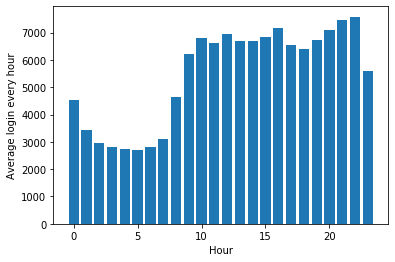
兀——翻


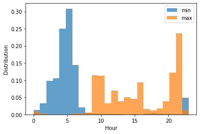


不难看出，摸鱼最佳时间段是：


-   早上刚开始工作/学习的时候（9点）

-   午饭的时候（12点）

-   下午快下班/下课的时候（16点）

-   晚上睡觉前（22点）


23点\~次日8点区间较少登入，算起来至少也有个8小时精致睡眠了。


## 衰落趋势


或许近几年入学的新生并不知道，曾经的小百合是允许公网访问的（但是实名制）。有公网的时候，活跃度能到什么程度呢？


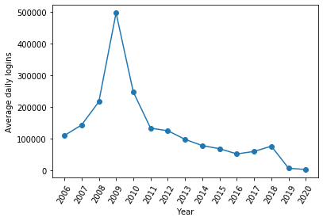


2009年，经历了指数级上升后的小百合日均登入数达到了一个峰值，随后便迅速降低。在2011年之后，下降趋近线性，与前几年的趋势完全不一样。2016年后，又经历了一次短暂的上升，**在2018年底关闭外网后瞬间陷入死寂**。


**2009年似乎是一个非常关键的节点，究竟发生了什么已不可考**（但从维基百科的资料来看似乎也不难猜测）。


2016\~2018年的趋势也一反较为缓和的衰退，颇有枯木逢春的意思。根据我自己的记忆，当时的某场讲座上曾透露小百合在那几年频繁遭受攻击盗号，来自公网的攻击也似乎是2018年后关闭外网访问的原因之一。


或许将近五年左右的变化趋势展现出来，会更加清晰一些：


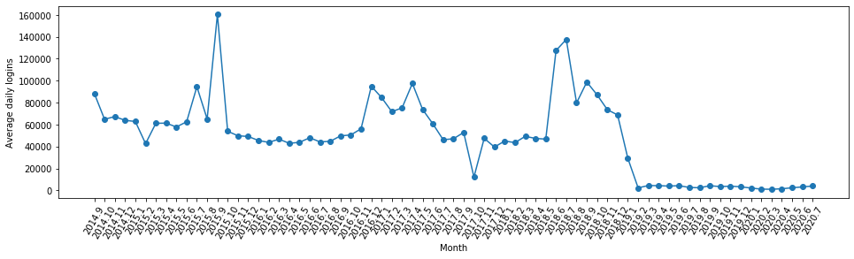


在2019年开始，每日登录数目便只有校内访问。这才是**剥离了公网访问后，在校人员访问的真实数据**，也是小百合上真实活跃度的反映。时间再拉近一些：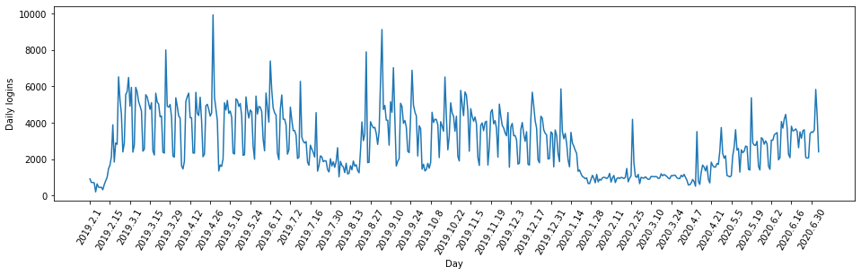


校内的日均登入基本符合工作日周期，且很好反映了寒暑假的情况。这份图表中有许多非常有意思的**尖峰**，比周围的更加突兀------翻看帖子可以知道，他们如实地反映了当天出现某个"引起关注的帖子"的情形。**因此如果根据尖峰去回溯，理论上我们可以梳理近年来引爆小百合的一些热门话题。**对比[官方统计资料](https://xxgk.nju.edu.cn/07/16/c159a1814/page.htm "本科生占全日制在校生总数的比例、教师数量及结构（截至2019年9月30日）")，只考虑本科生研究生共34936人，到2020年7月最高登录次数（算上重复）也只有4000次，约9%。


总的来说，这些数据透露出这样几条信息：


-   即便在繁华时期，**绝大多数BBS的活跃度也来自于公网**


-   来自校内的活跃度一直比较稳定，有与校历相关的波动趋势


-   2018年底关闭公网访问对BBS的活跃氛围造成了致命打击


同样是逐年变化的趋势，另外一份数据却看起来与上面的规律相违背。下面是每年的日均注册数与日均发帖（含回复）数趋势变化：


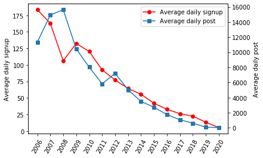


单看起来很正常，小百合的注册数与帖子文章发表相当一致地减弱；但对比来看很奇怪，但整体没有如同登入数那样夸张的峰值。若我们考虑这样一个情形：**日常登录的次数里总有一定比例是为了发帖**，那么前后的数据可以简单定义出另一个指标：

$$

日均发帖意愿\eta=\frac{日均发帖数目}{日均登录次数}

$$

这很容易看出，小百合从2006年开始就已经在经历一个发帖意愿下降到最低谷的过程：


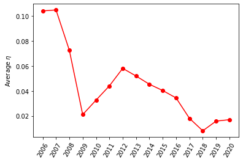


2019年之后，没有了公网"路人"，**仅校内的发帖意愿小于0.02，较低于开放公网时的最低谷**。种种迹象表明，2012年似乎也是一个隐藏的转折点，但是限于资料我并未查到有什么标志性事件。


将日均发帖数与日均注册账号数继续放大来看，我们同样可以看见**符合校历与工作日的规律**，且每月日均注册变化图中，开学秋季学期和春季学期的峰值一主一次，十分真实。


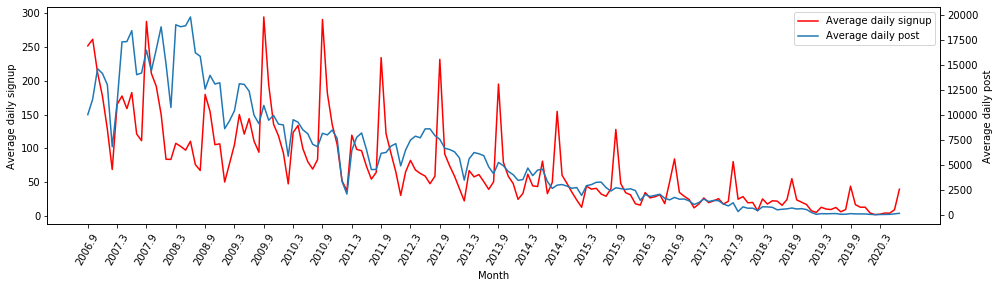


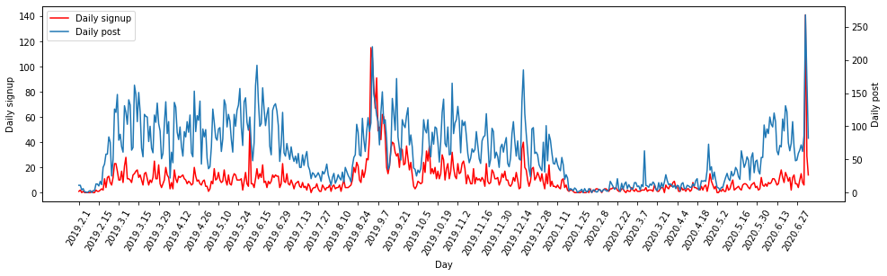


此外，根据图表我们可以估计出自外网关闭之后小百合的新注册数目已经衰减至20以下，只有在开学季、个别特殊事件的时候才会引发大量注册。保守估计下，本科加研究生新生约9000人，做一个简单算术可以估算：理想情况下大家自发注册小百合帐号，直到一个月的注册人数也不过$20 \times 30
\div 9000 \approx 6.7\%$，可想而知在现实情况下只会更加糟糕。


## 十大热门


上面我们简单整理了每日登入数、每日注册数、每日发帖数，从三个角度来一窥小百合的活跃度变化情况。


下面我们来针对十大热门和讨论版进行一些比较娱乐向的分析。看到这里你可以先猜一猜：**从2006年到2020年，上十大次数最多的讨论版是哪一个？**


我先对小百合十大热门做个简单介绍，顺便给上面的问题留个空间

*（再给推送凑个字数）*。小百合的十大热门，每天同一个讨论版**最多上2次**，每隔一段时间更新后，在当天结束时会有自动记录发帖到BBS的状态统计版面。其[具体算法](http://bbs.nju.edu.cn/vd48031/bbscon?board=sysop&file=M.1208182903.A&num=2029 "walter8529：能够再提供一次十大代码")（2008年，之后可能会有改动）如下：


``` C

#include "/home/bbs/src/include/bbs.h"

struct TOP10 {

        char board[24];

        char title[80];

        char owner[13];

        int time;

        int posts;

} top10[10];


struct BUF {

        char title[50];

        char owner[13];

        char is_head;

        int time;

} buf[20000];


/*笔者注：此处省略*/


int main() {

        struct boardheader board;

        FILE *fp;

        chdir(BBSHOME);

        load_no_top10();
块——校
        load_no_top10_key();

        fp=fopen(".BOARDS", "r");

        if(fp==0) exit(0);

        while(1) {

                if(fread(&board, sizeof(struct boardheader), 1, fp)==0) break;


                if(board.filename[0]<=' ') continue;

                if(board.level!=0 && board.level!=PERM_NOZAP) continue;

                if(is_no_top10(board.filename)) continue;

                count_board(board.filename);

        }

        show_result();


        show_result_file();

}


/*笔者注：此处省略*/


int count_board(char *board) {

        FILE *fp;

        struct fileheader x;

        char dir[256];

        int cmp_buf(), i, t, t0=time(0)-86400;

        int total=0;

        sprintf(dir, "boards/%s/.DIR", board);

        fp=fopen(dir, "r");

        if(fp==0) return;

        bzero(buf, sizeof(struct BUF)*20000);

        while(1) {

                if(fread(&x, sizeof(struct fileheader), 1, fp)==0) break;

                t=atoi(x.filename+2);

                if(t= p->posts) return;

        if(is_no_top10_title(p->title)) return;

        if(is_no_top10_size(p)) return;

        top10[9]=*p;

        strcpy(old_board, p->board);

        qsort(top10, 10, sizeof(struct TOP10), cmp_top10);

        for(i=0; i<10; i++) {

                if(!strcmp(top10[i].board, old_board)) s++;

                if(s==3) {

                        for(j=i; j<9; j++) top10[j]=top10[j+1];

                        top10[9]=tmp;

                        break;

                }

        }

}


/*笔者注：此处省略*/

```


好，下面揭晓答案：


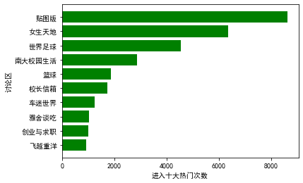


**贴图版**是历史最多次上十大的讨论版。你猜对了吗？


借助[微词云](https://www.weiciyun.com/)，将这十个板块提炼出有意义的关键词后依次绘制词云：


那么，**上热门十大最多的人**又是谁？


| 用户ID       | 上榜次数 | 主要帖子类别      |
| ------------ | -------- | ----------------- |
| Lineker      | 921      | 论坛活动/体育竞赛 |
| HigherQM2007 | 246      | 体育竞赛/物理     |
| enzozidane   | 190      | 体育竞赛          |
| kaoya2010    | 165      | 美女/金融         |
| greater      | 149      | 体育竞赛          |
| fcmozart     | 143      | 体育竞赛          |
| tts8607      | 136      | 杂文八卦          |
| chemyh       | 113      | 化院研会          |
| regulus      | 107      | 体育竞赛          |
| Merlin       | 106      | 生活/旅游         |


因此十大热门常客之首ID为 **\@Lineker**，且远超过第二近三倍的次数。可以看到体育迷（主要是球迷）占据了此榜单的大多数。这里有一则轶闻：历史第二名 **\@HigherQM2007**的真实身份物理学院的同学不陌生，是"科学相声大师"、高等量子力学老师李俊。传说当年他教授的通识课《科学启蒙》在结课时会让大家给他去小百合顶帖上十大热门，加上本人上课颇有魅力，也不难理解他能成为历史第二名。


## 讨论版活跃情况


通过对每日讨论版统计的各讨论版浏览人数占比分析，借助[Bar chart race generator](https://fabdevgit.github.io/barchartrace/)生成的竞赛图，我偷懒没有自己生成而是直接录了个屏（可能略有掉帧）。视频时长约10分钟，覆盖2006年4月19日至2020年7月5日的内容。其中，由于后期校长信箱似乎并不参与统计，所以在最后的一段内容中校长信箱突然消失。


        视频链接：https://pan.baidu.com/s/1bihgsViGOIFeaNd9Zp1asA 
        提取码：lily

单独将校长信箱拎出来，可以绘制校长信箱近年的平均访问占比与平均浏览时间。


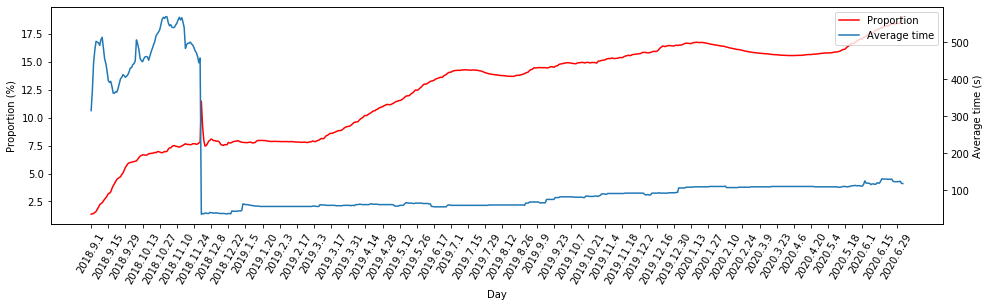


2018年底，即公网关闭之后，校长信箱的浏览量占比仍然在显著提高，真实反映了在"内网时代"大家对反映各类问题的需求在快速增长。


同时，公网的关闭给平均浏览时间带来了断崖式下跌。平均浏览时间从原先的5\~8分钟降低至两分钟以内，可能是由于公网关闭后显露了真实的校内浏览情况。校内的师生浏览校长信箱的时间在缓慢增加，但是仍然与之前的时长不可比。根据目前的估算，人均浏览校长信箱是2分钟左右。


这能否传达给我们一些详细的信息？下一篇，我将对校长信箱单独进行深入分析。


## 结语


对于小百合的整体活跃情况分析，上文已经展示的差不多了。从中我们大概能整理出这样几个结论：


-   小百合的活跃度和学校校历周期有很强的关系


-   小百合在公网开放时期的活跃度和话题绝大多数来自于非在校人士（校友）


-   小百合上通过校长信箱进行沟通的趋势在增加


-   通过小百合发布校内信息，有效传达的校内群体是极其有限的


-   小百合在关闭公网访问前就已经在衰退，而2018年底的封闭是致命一击


但我知道大多数人关心的，包括引发我这次写作的原因，集中在了其中一个特殊的版块——校长信箱。


本系列的第二篇将对这个问题进行讨论。

