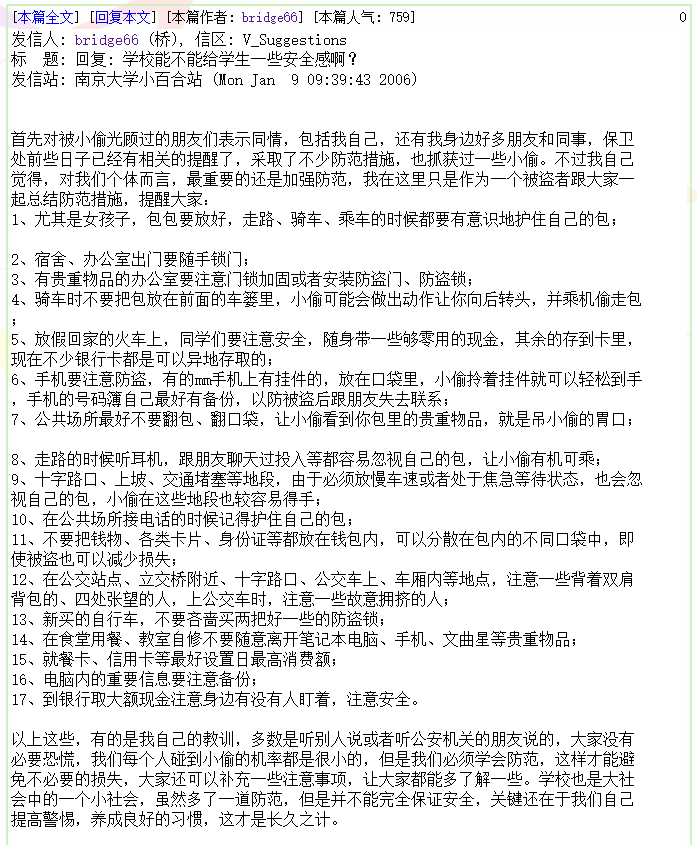

> 《百合凋零》将是我目前最长的文章，我会拆开来分为多篇成一个系列。我志不在吸引关注，做此事只是为了抛砖引玉。因而我会一次性把文章同步推出不做"连续剧"，之后可能会有整理单独发一个总集目录。转发不可强求，但求有人搜索时，还能在偏僻的角落里发现这些文字。
> 我并非专业人士，真正要明白图表背后的事实需要广泛的调研，因而本系列仅能作为抛砖引玉。若有心自己研究，我已在《百合凋零（附录）：一些随笔》中简单介绍了方法并共享了部分粗处理的数据，不妨参看。

校长信箱，乃是百合的一处特殊讨论版。

校长信箱的历史有据可查能够[追溯到2000年的5月](http://bbs.nju.edu.cn/vd48031/bbstcon?board=V_Suggestions&file=M.959269442.A "[公告]成立校长信箱版")，彼时校长信箱还叫做"Suggestions"而非"V_Suggestions"。据最初的公告，校长信箱当时是由论坛里的学生自发组织并定期送达有关责任部门的，与现在的形式也有显著区别：

> 上次网友和站长聊天提到希望加强和学校的交流的问题。
>
> 为此，我们站务人员和学校有关负责老师进行了联系，我们向学校表达了网友们的意见，校方对此表示理解和支持,我们提出建立意见和建议版，并将其中的文章定期送到学校有关责任部门，也期望有关部门能及时反馈,我们能够起到一个广大学生老师教职员工与学校有关部门之间的一个桥梁的作用。
>
> 鉴于此，特开辟校长信箱版,版主为SYSOP，希望大家能本着为我们南京大学创建高水平大学献计献策的态度和精神提各种意见和建议.相关的意见和建议我们将定期送往学校责任部门，并及时提供反馈信息。
>
> ------bigeye

尽管小百合在2006年之前的很多内容早已散失，有一部分内容还是以合集或复原的内容放置在校长信箱的最后几页：

就仿佛是有心人故意为之，时刻提醒校长信箱未来需要坚守的初心。

下面，我们简单地回顾十几年来校长信箱地变化。我不会做太多评论，我相信读者看完会有自己的感受。

## 校长信箱活跃度

回到近年校长信箱活跃占比日变化与平均停留时间的曲线图，可以发现如今**小百合登录流量的17%以上已经是校长信箱了**。时至2020年，通过校长信箱反映问题成了公网封闭之后小百合的一大重要职能。

如果把时间轴再往前延伸，我们会发现其实**在2018年底公网封闭之前，校长信箱在整个BBS的活跃度比重也在逐年上升**。可以关注到，除了少数时候形成了尖峰，**2016年至2018年间存在不自然的一段5\~7分钟的浏览时长**，远远高于校长信箱其余时候的均值。这与之前小百合在那2016\~2018年间出现了某种情况的传闻似乎相印证，但仍然不可考证。

对校长信箱目前存档的主题帖子（仅发帖一楼）进行统计，会发现存在缺失：

缺失意味着在2020年部分日期的校长信箱帖子是找不到的。进一步看：

可以发现除了极少留存，**2010年9月至2018年10月的帖子均已消失**，且小百合相应管理并未作出解释和公告。当然，这也可能是服务器转移造成的数据丢失。可惜的是，这会对整体分析造成很大困难；所幸在早期（2006\~2009）和近期（2019\~2020）仍然有留存且时间间隔有10年之久，之后的分析从对比的角度应当能有比较有趣的现象。

此外，近期曾有传闻特别是新生间传闻，认为校长信箱关版是为了随时给热点事件禁言------**为了禁言而关版这个纯属主观臆断**。从上面的表格可以看出，校长信箱在每年1、2、7、8月份总是无新帖子，这个假期关版的传统其实是2006年开始的。这样的指控反而足够警示我们有关校长信箱的不满已经开始脱离事实和信箱设立初心，有走向情绪发泄、人云亦云的倾向。

我们较为关注的是近期的信息，因此进一步观察近年的情况。

近年来，校长信箱的日均发帖数目已经达到了5\~10篇；根据之前小百合整体日发表文章数目的统计，校长信箱估计约占一天小百合总发帖数的10%。同样的，这一数据的尖峰也隐藏着各种而各样的信息，我们能不能进一步分析这些话题量陡增的日子，来回溯校长信箱曾经有哪些大家热议的话题？下文将进一步讨论。

综合来看，**小百合整体在公网关闭后处于衰落态势，但是校长信箱的活跃度却在逆势上涨**。忽略文章质量，大家参与批评反映、建言献策的意识逐渐增强，对与学校的沟通也愈加渴望。

## 校长信箱热点问题

上文提到，尖峰的背后可能隐藏着某些信息。

但是，我们需要意识到另一个趋势，或者说在本文内作为一个假设：**大家主动发主题帖引起话题的意愿一般很低，而更愿意在别人发帖的基础上顶帖、盖楼，即评论回复**。发帖的数量并不能给我们带来清晰的趋势，因此我们对**每天的帖子平均阅读数和平均回复数**进行统计，试图寻找其中的规律。

在上图中，平均回复数目较多的帖子和平均阅读量较多的帖子各自用红色和蓝色标记，形成了非常清楚的峰线。从保守的角度进行估计，不妨认为**平均回复数目较多且平均阅读量较多的那一天为存在一热点话题的日期**。当两种比较明显的峰线进行重合的时候，往往说明了那一天校长信箱的某些帖子引起了师生关注。这些日期我在此文没有进行逐一考证，如果有感兴趣的人可以一个个去对上号，想必会引起很多"回忆"。

除了统计数字，我们还可以对不同月份的主题关键词进行统计，来获得当月的重点关键词。前文提到的2016\~2018年校长信箱帖子消失给这个想法带来了困难，但我们仍然可以**通过每天上十大热门的校长信箱帖子标题来试图一窥究竟**。

在这一思路下，也为了唤起我自己进入南大以来的回忆，我利用从2015年9月起上十大热门的校长信箱帖子标题统计了关键词：

  | 年月    | 关键词                                                     | 较大影响事件                                                             |
  | ------- | ---------------------------------------------------------- | ------------------------------------------------------------------------ |
  | 2015.9  | 严重/恳请/关注/网络/博士生                                 | 不可考                                                                   |
  | 2015.10 | 食堂/社团/东西/回来/组团                                   | 不可考                                                                   |
  | 2015.11 | 网络/图书馆                                                | 不可考                                                                   |
  | 2015.12 | 苏宁/说明/体育馆/无助/留学生                               | 苏宁发布会占用体育馆引发不满                                             |
  | 2016.1  | ------                                                     | 不可考                                                                   |
  | 2016.2  | ------                                                     | 不可考                                                                   |
  | 2016.3  | 图书馆/自行车/宿舍                                         | 不可考                                                                   |
  | 2016.4  | 装修                                                       | 不可考                                                                   |
  | 2016.5  | ------                                                     | 不可考                                                                   |
  | 2016.6  | 精斑                                                       | 仙林教学楼校园变态性骚扰事件                                             |
  | 2016.7  | 校友                                                       | 不可考                                                                   |
  | 2016.8  | ------                                                     | 不可考                                                                   |
  | 2016.9  | 国家/助学金/研究生/教务处/6000                             | 研究生国家助学金缺发引争议                                               |
  | 2016.10 | 路灯/宿舍/开放/奖学金/财务                                 | 不可考                                                                   |
  | 2016.11 | 宿舍/操场/突然/开放/联培                                   | 不可考                                                                   |
  | 2016.12 | 厕所/成员/成绩/体育/改建                                   | 不可考                                                                   |
  | 2017.1  | 中心                                                       | 不可考                                                                   |
  | 2017.2  | ------                                                     | 不可考                                                                   |
  | 2017.3  | 实现/图书馆/校园网/大学生/尽快                             | 不可考                                                                   |
  | 2017.4  | 自行车/危险/教学楼/报销/校外                               | 不可考                                                                   |
  | 2017.5  | 停车/违停/组团/保卫处/投诉                                 | 学生在校内长期违规停放机动车的争论                                       |
  | 2017.6  | 宿舍/组团/采集/电梯/通风                                   | 不可考                                                                   |
  | 2017.7  | 浴室/补助/财务处/改造/博士                                 | 不可考                                                                   |
  | 2017.8  | ------                                                     | 不可考                                                                   |
  | 2017.9  | 财务/规定/疑问     不可考                                  |
  | 2017.10 | 组团/网络/网站                                             | 不可考                                                                   |
  | 2017.11 | 网球场/询问/财务处/南园/校医院                             | 不可考                                                                   |
  | 2017.12 | 宿舍/停车/请教/规定/收费                                   | 不可考                                                                   |
  | 2018.1  | 科研/寒假/校内/扫雪/斯篮搏      v 斯篮搏体育馆引发集体不满 |
  | 2018.2  | ------                                                     | 不可考                                                                   |
  | 2018.3  | 毕业/专职/科研/投诉/门卫                                   | 不可考                                                                   |
  | 2018.4  | 震惊/校园卡/筋斗云/研究生/浴室                             | 学校禁用筋斗云电动车                                                     |
  | 2018.5  | 门禁/拆除/校门/六舍/中心                                   | 鼓楼校区门禁是否应该拆除引发争论                                         |
  | 2018.6  | 组团/财务处/开放/咨询/态度                                 | 不可考                                                                   |
  | 2018.7  | ------                                                     | 不可考                                                                   |
  | 2018.8  | ------                                                     | 不可考                                                                   |
  | 2018.9  | 保卫处/施工/筋斗云/进入/规定                               | 不可考                                                                   |
  | 2018.10 | 门禁/图书馆/道路/自信/反对                                 | 鼓楼校区门禁是否应该拆除引发争论（续）                                   |
  | 2018.11 | 门禁/南园/变态/收费/流浪狗                                 | 鼓楼校区接连发生门禁、流浪狗、变态事件，保卫处成众矢之的                 |
  | 2018.12 | 图书馆/校园网/宿舍/关注/教学楼                             | 不可考                                                                   |
  | 2019.1  | 教学楼/网球场                                              | 不可考                                                                   |
  | 2019.2  | ------                                                     | 不可考                                                                   |
  | 2019.3  | 图书馆/宿舍/宿舍楼/系统/呼吁                               | 不可考                                                                   |
  | 2019.4  | 组团/施工/噪音/图书馆/工地                                 | 不可考                                                                   |
  | 2019.5  | 组团/施工/投诉/工地/宿舍                                   | 不可考                                                                   |
  | 2019.6  | 宿舍/特权/操场/童车                                        | 不可考                                                                   |
  | 2019.7  | ------                                                     | 不可考                                                                   |
  | 2019.8  | 宿舍                                                       | 仙林校区更换饮水机事件                                                   |
  | 2019.9  | 图书馆/噪音/校车/小巴/投诉                                 | 学校使用观光车取代原先的校车                                             |
  | 2019.10 | 宿舍/饮水机/图书馆/关注/噪音                               | 仙林校区更换饮水机事件（续）、句容人才房事件                             |
  | 2019.11 | 组团/图书馆/人脸识别/博士/年限                             | 调整博士毕业年限                                                         |
  | 2019.12 | 图书馆/开放/闸机/安全隐患/组团                             | 仙林图书馆疑似计划面向社会开放事件                                       |
  | 2020.1  | 图书馆/请求/寒假                                           | 不可考                                                                   |
  | 2020.2  | ------                                                     | 不可考                                                                   |
  | 2020.3  | ------                                                     | 不可考                                                                   |
  | 2020.4  | ------                                                     | 不可考                                                                   |
  | 2020.5  | 疫情/管控/组团/施工/返校                                   | 返校同学因疫情期间僵硬封闭式管理而不满，未返校同学因学校无返校消息而不满 |
  | 2020.6  | 宿舍/不合理/预约/返校/本校                                 | 疫情期间诸多措施引发不满                                                 |
  | 2020.7  | 搬迁/宿舍/质疑                                             | 仙林校区部分未毕业学生被要求强制搬宿舍                                   |

鉴于标题受到字数和表达的限制，结果并不详细（其实还有很事件并未反映在这里，例如[宋小岳事件](https://mp.weixin.qq.com/s/HOMWgs-iXb--x2iI18fCiw)、[学代会事件](https://mp.weixin.qq.com/s/_uIgvfdkPzIM87DdaMV3rg)、[梁莹事件](https://mp.weixin.qq.com/s/N-Tj4bYB-KZW3QzYRpR-ig)、[沈阳事件](https://mp.weixin.qq.com/s/k1up10TVqe6gTdTRQLTqUw)、某社团违规上十佳事件等），但是仍然可以从中整理出一些内容。**除了日常吐槽的食堂和校园网，个别月份出现一些不常见的关键词，通过翻阅当时的帖子可以逐个总结出当时的热点问题。**

这种分析方法可以用于建设属于NJU的记忆墙。每年毕业总有些校友会离开南大，但是有些事情仍然在很多人心中处于"不了了之"的状态，**如果缺乏反馈的长期跟踪、通报机制，那么破碎的事实将会随着时间流逝而成为固有印象，加深偏见**。（事实上在我的了解里，很多事情从两方角度的实际情况看是纯属理解不同造成的误会，不少事情也是有后文但无人关注还以为不了了之的。但是偏偏很多人，老师和学生都有，缺失了沟通的能力，一边是有人情绪激动，一边是要么沉默回避要么僵硬敷衍，殊不知**无言是最大轻蔑，时代早已不复当年**；而事情过去没几天便又遗忘了，下一次历史重演才想起来"旧账"。）

校长信箱不完全是反馈不足、不满的渠道，它也是很重要的建议渠道。事实上，校长信箱的历史发帖中有许多想法是**回看起来超前的**。下表汇总了部分几年前学生的建议，这些帖子也来自十大热门：

  | 时间       | 发帖人     | 标题                                             |
  | ---------- | ---------- | ------------------------------------------------ |
  | 2015/9/14  | Guwu       | 很多外校友人参观我仙林校区觉得能有一个大湖就好了 |
  | 2015/10/4  | nxw        | 四组团流浪狗成灾                                 |
  | 2015/10/19 | fighterZY  | 求学校就直饮水机问题有所作为                     |
  | 2015/10/23 | riottoski  | 建议学校购买正版软件使用权限                     |
  | 2015/10/26 | hugh1011   | 强烈建议学校在校区配备AED                        |
  | 2015/10/27 | lcyl       | 求解决学生宿舍作息不同导致的和睦问题？           |
  | 2015/11/20 | favorlee   | 【建议】仙林校区大小道路该有个名字了             |
  | 2015/11/23 | zhiyan     | 建议：每年的银杏黄叶分开扫                       |
  | 2016/3/29  | jerrylee   | 音乐节留下的垃圾谁来处理                         |
  | 2016/6/2   | 131010022  | 也来吐槽下仙林缺少可以读书讨论的地方             |
  | 2016/6/30  | greendaisy | 【建议】校园里设几个废旧电池回收点行么？         |
  | 2016/7/2   | Solomans   | 关于校友卡                                       |
  | 2016/9/25  | Ches       | 请求制定校区内音量标准                           |
  | 2016/10/7  | ppchem666  | 强烈建议仙林校区增设电动车充电桩！               |
  | 2016/10/14 | MaxFOrder  | 仙林校区能否开放一些区域供同学们自己栽种花草     |
  | 2016/10/23 | aslee      | 南园6舍厕所太差求翻新（重口、慎入！！）          |
  | 2016/10/27 | guaaaa     | 【投诉】学校菜鸟驿站做的十万伙集代取快递乱收费   |
  | 2016/11/11 | lqmumu     | 各院系图书馆应该互相开放借阅                     |
  | 2016/11/20 | qur        | 【回复】校内演出限制1.2米以下儿童入场            |
  | 2016/12/13 | 66821750   | 教室里的监控依旧形同虚设？                       |
  | 2017/3/6   | weinan1997 | 校园网能否尽快实现多设备同时连入                 |
  | 2017/3/21  | njunic     | 【通知】校园网多线程连接启用（含攻略）           |
  | 2017/3/29  | shangtong  | 请管理一下鼓楼操场的广场舞                       |
  | 2017/4/24  | guzhujun   | 学校为何不开放共享单车进校？                     |
  | 2017/5/28  | weinihou   | 建议成立应对热点事件的长效机制                   |
  | 2017/6/17  | Proverb    | 建议学校采集新生作息时间信息安排宿舍             |
  | 2018/6/1   | f4greg     | 仙林校区的"组团"能否分别取些好听的名字？         |
  | ......     | ......     | ......                                           |

如果对南大各类新闻公告有关注的话，应该能对其中不少问题自行上网检索到对应的新闻。例如：

-   2016年5月18日：[南大学子"点睛"校园为学校道路、景观名出谋划策](http://js.ifeng.com/a/20160519/4567440_0.shtml)*（得瑟一下，学校有条湖当年还真是误打误撞最后用了我的命名）*

-   2018年12月11日：[南京大学2018年公共空间设计大赛决赛圆满举办](https://tuanwei.nju.edu.cn/37/27/c26265a407335/page.htm)

-   2020年6月19日：["救命神器"AED上岗建设"安"心校园实验环境](https://news.nju.edu.cn/zhxw/20200624/i99731.html)

-   2020年6月22日：[从2020年开始，南大为每位毕业生发放"NJU校友卡"](https://mp.weixin.qq.com/s/Rc8T4eMw576iZR6W-1ImfQ)

等等 。

这些建议，短的可能很快就得到实施，长的需要四五年才最终落实甚至至今没有动静。这意味着那些曾经的校友离开后，后人所提的不少建议其实是**重复、仍未得到落实的**，比如南园六舍的翻新、热点事件的长效机制；也意味着我们现在觉得理所当然司空见惯的很多设计，其实来自于几年以前一些认真的前辈提出的可行建议与学校部门的支持落实，比如AED、公共空间等，尽管有时候等待的时间也太长了。

## 校长信箱变了吗？

前文提到，由于部分时段的帖子数据缺失，我们可能很难对校长信箱做一个整体的分析。幸而十多年前与近一年半的数据仍然存在，因此我们可以做一些简单对比。

如果问谁是校长信箱最活跃的部门，多数人的直觉应该不会离开后勤部门和信息化中心（网络中心）。然而近年的统计给出了一个很容易被忽视的部门：**基建处**。

  | ID         | 次数 | 身份         |
  | ---------- | ---- | ------------ |
  | jijian     | 102  | 基建处       |
  | xxw        | 98   | 保卫处       |
  | ITServices | 64   | 信息化       |
  | toya       | 60   | 图书馆       |
  | 20016772   | 59   | 水电中心     |
  | ndyyyzxx   | 49   | 南大医院     |
  | fangchan   | 48   | 房产处       |
  | yhk819     | 32   | 提问学生     |
  | njunic     | 32   | 信息化       |
  | gra        | 28   | 研究生院     |
  | onlymemory | 28   | 教务处       |
  | jyzx       | 23   | 就业中心     |
  | wl2009     | 22   | 膳食中心     |
  | f4greg     | 20   | 提问学生     |
  | ljh1966    | 19   | 十一食堂     |
  | xiaoguoguo | 19   | 仙林学生公寓 |
  | xygl       | 18   | 后勤绿化     |
  | MaxFOrder  | 18   | 提问学生     |
  | hxsw       | 15   | 浴室         |
  | dwqy       | 15   | 学工处       |
  | njudpe     | 13   | 体育部       |
  | qsj0718    | 13   | 提问学生     |
  | N1         | 13   | 提问学生     |
  | mca1985    | 12   | 一食堂       |
  | wzxl       | 12   | 二食堂       |
  | starbuck   | 12   | 后勤物业     |
  | yanluo     | 11   | 提问学生     |
  | Will05     | 11   | 提问学生     |
  | kanjinling | 10   | 校长办公室   |
  | tongxueli  | 10   | 提问学生     |

细看基建处的帖子，多数是施工的公告与回复对施工噪音的投诉，这与近年来南大的建设工程较为密集可能有不小关系。

此外，有几个食堂上榜了------考虑到食堂一般不会主动发布公告，这些回应以回复为主。食堂的回复多也意味着对应的投诉数目较多，侧面反映了这几个食堂的口碑（偶尔有失物寻回的感谢信）。

但是**不能说靠前的单位就是投诉多所以回应多的部门**。有些学校部门并不是逢帖必回，因而此排行也可能是反映了回复积极性，此处也不进一步分开说。

值得注意的是，有几位学生的建议帖数目很多，也能够进入这个榜单。

与此相比较，十几年前的情况是怎么样呢？下表为2006年至2010年的情况：

  ID           次数   身份

  ------------ ------ --------------------

  Mumu         120    校长办公室

  jintan       79     房产处

  xxw          65     保卫处

  lishengnan   64     解答版务

  sqh          50     后勤集团

  ndyyyzxx     41     南大医院

  notreal      40     教务处

  maoshiba     32     房产处

  njunic       32     信息化（网络中心）

  mifengwang   27     业余摄影老师

  xuxiaobo     20     后勤集团

  sszx         16     膳食中心

  bridge66     11     解答版务

  yika1985     11     解答版务

  nieyongjun   11     解答版务

  sumer        9      解答版务

  wangyuyan    9      信息化（网络中心）

  lanxin999    9      疑似版务

  SHSJ         9      疑似版务

  wkpope       8      教务处

可以看到，校长办公室居于榜首，并且除了常见的各部门回复还有一些版务在参与解答。

将两表对比，我们发现有两个趋势：

-   十多年后，校长办公室的活跃度降低，各个部门活跃度显著提高，并且**细分**出了非常具体的食堂等部门，有专人回复

-   十多年后，版务已不再帮助解答，只有师生提问、建议，**原先校方、版务、师生的三方格局退化为校方、师生两方**

在具体的回复上，风格也有区别。以2003年非典期间残留的帖子与2020年新冠肺炎期间的帖子对比，可以发现当时版务的回复风格与今日学校部门截然不同：

两种风格的差异与身份有关，学校部门的回复即使在2003年也与现今没有太大区别。因此相较于十年以前，校长信箱其实缺失了一种很重要的声音：**沟通学校和师生的、有人情味的桥梁**。

部门的细化可能只需要安排几个人关注校长信箱，这样确实会带来效率的提高，但缺少如原先版务那样详细、亲和的回复方式，很容易出现"要我怎么和你解释呢？"这样极端而不自知的回复。**耐心地解释回复并非不可能**，但这需要一些认真。下面这样的回复（不一定完全认同）如今已经销声匿迹：

从个人主观的感受来说，这是一个身边人，大家可能更加愿意听一个能够理解自己心情、与自己有类似经历的人的耐心回复而不是被僵化的官方语气。

## 结语

综合上述分析，我们可以知道这样一些事实：

-   校长信箱在公网封闭之前就已经开始越来越受到关注，在公网封闭之后占到不容忽视的成分，说明沟通平台的需求在增长

-   校长信箱的帖子缺失了近8年的数据，是一件非常遗憾的事情

-   校长信箱的热门帖子记录了部分校内的重要事件，通过对异常活跃的日子进行整理，或许可以复原南大那些值得反思的记忆时间线

-   校长信箱的部分建议很有前瞻性，之后学校也有一些落实，所需时间长短不一

-   十多年来，校长信箱从原先校方、师生、版务的三方退化为校方和师生，整体越来越缺少亲和的回复

这一部分的最后，想请读者一起阅读一下当年版务 **\@fwrq** 毕业时的一段话：

我想若有幸让一些人看见这一段，定会不胜唏嘘。

