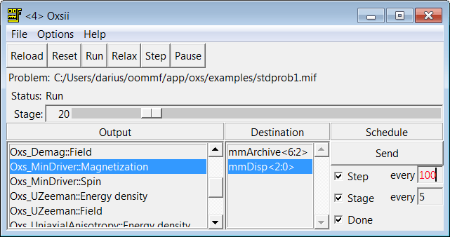
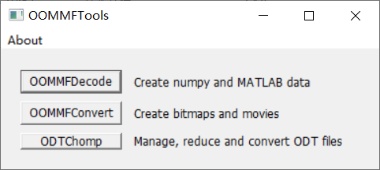
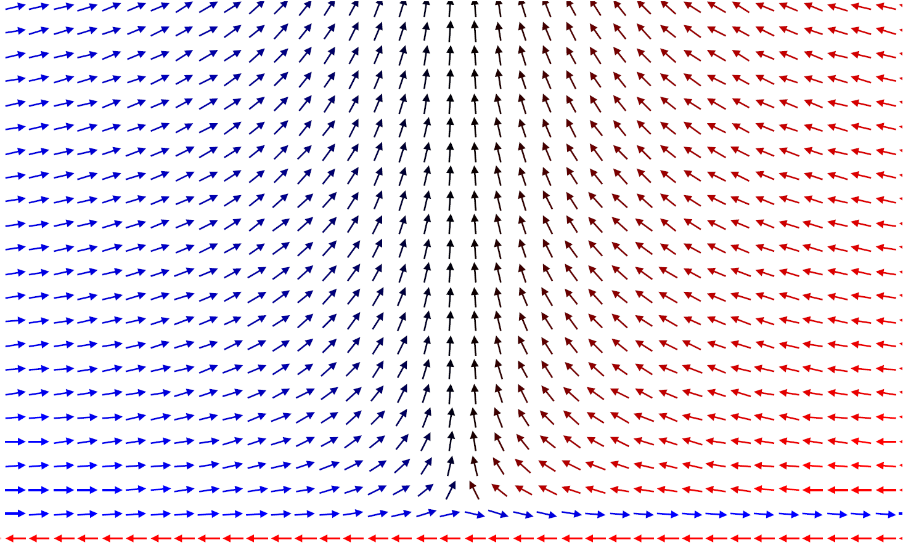

前段时间为了补充课题数值计算验证，特地去学了OOMMF软件的使用，期间折腾了不少，特地整理一下。


## 官方README


我先翻译一下官方的README，会加一些自己的补充。


### 介绍


The Object Oriented MicroMagnetic

Framework *（OOMMF）* 是一个诞生于美国国家标准与技术研究院信息技术实验室 *（ITL/NIST）* 数学与计算科学分部 *（MCSD）* ，旨在发展便携、易于拓展的公有微磁学程序与工具的项目。其发行的代码构成一个功能齐全的微磁学封装，具有其他程序员可以扩展的附加功能，以便OOMMF项目之外的开发人员可以在OOMMF基础上构建。


OOMMF由C++编写，交互界面由Tcl/Tk编写，目标系统囊括各种类Unix、Windows、Mac OS X平台。


OOMMF项目主要的贡献者是Mike Donahue与Don Porter。


### 环境依赖


在你开始使用OOMMF之前，你必须要在你的计算机上先安装Tcl/Tk。Tcl/Tk Core可以在[Tcl Developer eXchange](http://www.tcl.tk/)上免费下载 *（笔者注：推荐直接上ActiveTcl，所有平台都支持，[下载链接](https://www.activestate.com/activetcl)）* 。我们推荐使用最新发行的Tcl/Tk。最近的Tcl/Tk版本在不同的计算平台上和OOMMF都兼容，不过我们发现安装其他类似的应该也可以。需要指出一些例外，比如8.6.2、8.6.3、8.5.16和8.5.17版本的Tcl应当避开，因为他们含有I/O漏洞，会干扰OOMMF在文件系统内稳定地记录输出。OOMMF不支持任何alpha或beta版本的Tcl/Tk。


### 快速安装


#### Windows


大多数Windows平台的OOMMF使用者会下载一个预先编译好的可执行文件，其与Tcl/Tk

8.6.x是兼容的。在 *（笔者注：OOMMF压缩包目录下）* CMD *（笔者注：或者PowerShell）* 敲入以下命令：


``` cmd

unzip oommfxxx.zip ::不一定用unzip，你手动解压也行，xxx是版本号

cd oommf

tclsh86 oommf.tcl pimake upgrade ::这是升级

tclsh86 oommf.tcl

```

上面这是使用。实际上，等你装完ActiveTcl，双击tcl文件会默认用其打开。

#### 类Unix/Mac OS X


大多数类Unix或Mac OS X平台的OOMMF使用者，按照下方命令可以升级、构建、运行你的OOMMF安装：


``` bash

gunzip -c oommfxxx.tar.gz | tar xvf -

cd oommf #也不一定用gunzip，手动解压亦可，xxx是版本号

oommf.tcl pimake distclean #清理

oommf.tcl pimake upgrade

oommf.tcl pimake

oommf.tcl

```


如果以上都没用，在[OOMMF User's Guide](https://math.nist.gov/oommf/doc/userguide20a2/userguide/)里面阅读更多详细的指导。


### 更多信息


懒得翻译了，直接看官网吧：[The Object Oriented MicroMagnetic Framework (OOMMF) project at ITL/NIST](http://math.nist.gov/oommf)


## 求解器


OOMMF内其实有两个求解器：2D Micromagnetic Solver和OOMMF eXtensible Solver *（Osx 3D Solver）*，两者都有图形模式和命令行模式，但不同的是后者支持3D计算且比起前一个灵活多了。但是后者需要稍微学习一下Tcl语言。


由于我主要关注其拓展性 *（与其他软件结合，比如Python分析数据）* ，且3D求解器可以向下兼容2D的问题求解，于是个人更推荐用OOMMF eXtensible Solver，而不是2D Micromagnetic Solver。~~这样更有Coding的感觉。~~


### MIF文件


这相当于计算的初始化文件，所有计算的体系、要求输出的内容，均可在这里定义。


在Osx 3D Solver里，引入了MIF 2.x的文件格式，下面会提到的用例即MIF

2.1格式。需要注意，MIF 2.x格式与 MIF 1.x不兼容。


### 图形模式：Osxii


Osx 3D Solver有交互界面的求解器，可以载入`.mif`文件后，设定不同的导出物理量。长这样：





`Output`对应不同物理量的输出，其实这里是"标准Oxs_Ext子类 *（[Standard Oxs_Ext Child Classes](https://math.nist.gov/oommf/doc/userguide20a2/userguide/Standard_Oxs_Ext_Child_Clas.html "Standard Oxs_Ext Child Classes")）* "，而`Destination`对应于OOMMF里打开的的输出窗口 *（画图之类的）* 。


### 命令行模式：Boxsi


Osx 3D Solver的命令行求解器。这个非常方便，可以集成到其他程序里，一行命令即可计算出目标文件：


``` bash

tclsh oommf.tcl boxsi [standard options] \ 

    [-exitondone <0|1>] [-kill tags] \

    [-logfile logname] [-loglevel level] \

    [-nice <0|1>] [-nocrccheck <0|1>] \

    [-numanodes nodes] [-outdir dir] \ 

    [-parameters params] [-pause <0|1>] \

    [-regression_test flag] \ 

    [-regression_testname basename] \

    [-restart <0|1|2>] [-restartfiledir dir] \

    [-threads count] miffile

```


`miffile`即是`*.mif`文件。


## 一个简单的算例


### MIF 2.1文件的编写


个人感觉，直接看手册云里雾里，最好有个清晰的例子来计算。在OOMMF的文件夹里其实有不少sample，下面也提供一个我自己写过的脚本，比较完整。


下面是一个算例，是之前一个课题里自己写的，文章也已经发表。


``` tcl

# MIF 2.1

# 2-fold domain wall simulation


#设置常数

set PI [expr {4*atan(1.)}] 

set MU0 [expr {4*$PI*1e-7}]


RandomSeed 1 #随机种子


#设置体系的一些参数

#Set some paramaters

Parameter cellSize      5e-10

Parameter totalWidth    2500e-10

Parameter stepWidth     [expr {$totalWidth/2}]

Parameter totalHeight   1500e-10

Parameter subHeight     5e-10

Parameter stepHeight    5e-10 

Parameter J0            2.5e-22

Parameter K0            3.2e-24 


#划分区域，Oxs_MultiAtlas类允许划分多区域，命名为sys2D

#Divide regions

Specify Oxs_MultiAtlas:sys2D [subst {


    #设定单个区域，Oxs_BoxAtlas类设定单个“箱子”

    atlas { Oxs_BoxAtlas:layersFM {

        name layersFM

        xrange {$cellSize 

                [expr {$totalWidth-$cellSize}]}

        yrange {[expr {$stepHeight+$subHeight}]

                $totalHeight}

        zrange {0 $cellSize}

        }

    }

    atlas { Oxs_BoxAtlas:leftStepFM {

        name leftStepFM

        xrange {0 $stepWidth}

        yrange {$subHeight

                [expr {$stepHeight+$subHeight}]}

        zrange {0 $cellSize}

        }

    }

    atlas { Oxs_BoxAtlas:rightStepAFM {

        name rightStepAFM

        xrange {$stepWidth $totalWidth}

        yrange {$subHeight 

                [expr {$stepHeight+$subHeight}]}

        zrange {0 $cellSize}

        }

    }

    atlas { Oxs_BoxAtlas:leftEdgeFM {

        name leftEdgeFM

        xrange {0 $cellSize}

        yrange {[expr {$stepHeight+$subHeight}] 

                $totalHeight}

        zrange {0 $cellSize}

        }

    }

    atlas { Oxs_BoxAtlas:rightEdgeFM {

        name rightEdgeFM

        xrange {[expr {$totalWidth-$cellSize}]

                $totalWidth}

        yrange {[expr {$stepHeight+$subHeight}]

                $totalHeight}

        zrange {0 $cellSize}

        }

    }

    atlas { Oxs_BoxAtlas:subAFM {

        name subAFM

        xrange {0 $totalWidth}

        yrange {0 $subHeight}

        zrange {0 $cellSize}

        }

    }

}]


#划分离散网格以供计算，这里是矩形

#Set meshgrid

Specify Oxs_RectangularMesh:myMesh [subst {

  cellsize {$cellSize $cellSize $cellSize}

  atlas :sys2D

}]


#设置单易轴情况下各项各向异性能

#Set uniaxialAnisotropy

Specify Oxs_UniaxialAnisotropy [subst {

  K1  [expr {$K0/($cellSize)**3}]

  axis { Oxs_UniformVectorField {

    norm 1

    vector {1 0 0}

  }  }

}]


#设定不同区块之间和其内部的交换常数，考虑6个（上下左右前后）近邻

#Exchange energy between FM and AFM 

Specify Oxs_Exchange6Ngbr:exchDef [subst {

    default_A [expr {$J0/$cellSize}]

    atlas :sys2D

    A {

        layersFM layersFM [expr {$J0/$cellSize}]

        leftStepFM leftEdgeFM [expr {$J0/$cellSize}]

        rightStepAFM rightStepAFM [expr {$J0/$cellSize}]

        leftEdgeFM leftEdgeFM [expr {$J0/$cellSize}]

        rightEdgeFM rightEdgeFM [expr {$J0/$cellSize}]

        subAFM subAFM [expr {$J0/$cellSize}]


        leftEdgeFM layersFM [expr {$J0/$cellSize}]

        leftEdgeFM leftStepFM [expr {$J0/$cellSize}]

        leftEdgeFM subAFM [expr {$J0/$cellSize}]


        rightEdgeFM layersFM [expr {$J0/$cellSize}]

        rightEdgeFM rightStepAFM [expr {-$J0/$cellSize}]

        rightEdgeFM subAFM [expr {-$J0/$cellSize}]


        layersFM rightStepAFM [expr {-$J0/$cellSize}]

        layersFM leftStepFM [expr {$J0/$cellSize}]


        subAFM rightStepAFM [expr {-$J0/$cellSize}]

        subAFM leftStepFM [expr {-$J0/$cellSize}]

    }

}]


#设置退磁化场

Specify Oxs_Demag {}


#设置计算的演化方式，这里是计算能量最小化使用的Oxs_CGEvolve类

Specify Oxs_CGEvolve {

    fixed_spins {

        :sys2D

        leftEdgeFM rightEdgeFM subAFM

    }

}


#对应地，能量最小化的驱动Oxs_MinDriver类

Specify Oxs_MinDriver [subst {

    evolver Oxs_CGEvolve

    stopping_mxHxm 0.05

    mesh :myMesh

    Ms { 1e5 }

    m0 { Oxs_AtlasVectorField {

        atlas :sys2D

        values {

            layersFM        { 0.0   1.0  0.0}

            leftEdgeFM      { 1.0   0.0  0.0}

            leftStepFM      { 1.0   0.0  0.0}

            rightEdgeFM     {-1.0   0.0  0.0}

            rightStepAFM    { 1.0   0.0  0.0}

            subAFM          {-1.0   0.0  0.0}

        }

        norm 1.0

    }}

}]


#选择输出到mmArchive程序，打个tag叫archive

#这个程序会把数据按照omf文件输出

Destination archive mmArchive


#计划输出的物理属性，以及目标程序的tag，在什么时候输出

Schedule Oxs_MinDriver::Spin archive Done

```


### 数据文件的处理


输出的`.omf`文件里是以二进制保存的，一般可以由OOMMF里对应的程序读取 *（上面例子是mmArchive）* ，但是为了用其他软件处理，我们得转换格式。


当然你也可以自己写，我在这里推荐一个工具：[OOMMFTools](http://web.mit.edu/daigohji/projects/OOMMFTools/ "OOMMFTools")。





确实这东西也有一定年头了，但架不住好用啊。它可以将OOMMF数据文件转换成numpy和MATLAB支持的数据，也可以绘制位图或渲染成视频。


你也可以基于他的源代码进行改进，集成到自己的软件里，都是python应该不难。至于基于它后面有没有其他工具，我没找，GitHub可能有。


上边算例的计算结果：





### 更简单的方式


在检索OOMMF教程的时候，感觉中文互联网的教程几乎都在关注OOMMF本身。个人觉得可以关注一个很有意思的新项目 *（而且还在更新，看起来很有潜力）* ，那就是[JOOMMF](https://joommf.github.io/)，由University of Southampton的Marijan Beg、Ryan A. Pepper and Hans Fangohr开发，目的是为了将OOMMF和现在广泛使用的Python与Jupyter Notebook集成提升易用性。该项目的[原型程序OOMMFC](http://oommfc.readthedocs.io/)2016年已经做出来了，有兴趣可以看看。


## 结语


其实重点要看三个东西：


-   Tcl语言入门

-   文档（Osx 3D Solver和MIF 2.x）

-   例子（自带或其他人的例子）


慢慢看，有编程基础一周不到就能学会最基本的内容了。


## 参考内容


1. Chen, X. *et al.* General nature of the step-induced frustration at ferromagnetic/antiferromagnetic interfaces: Topological origin and quantitative understanding. *New Journal of Physics* **21**, 123045 (2019).
   
2. M. J. Donahue & D. G. Porter. *OOMMF user's guide, Version 1.0*. (1999).

