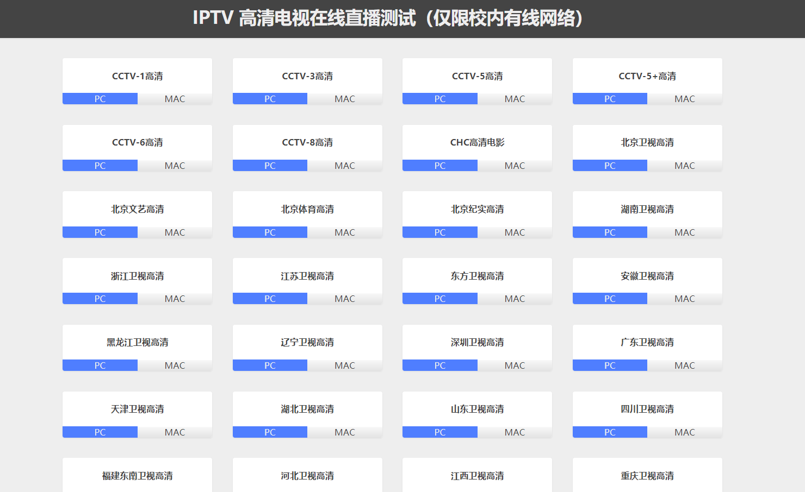
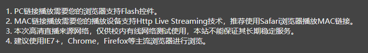
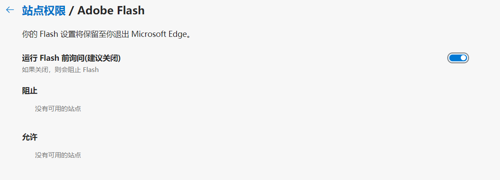
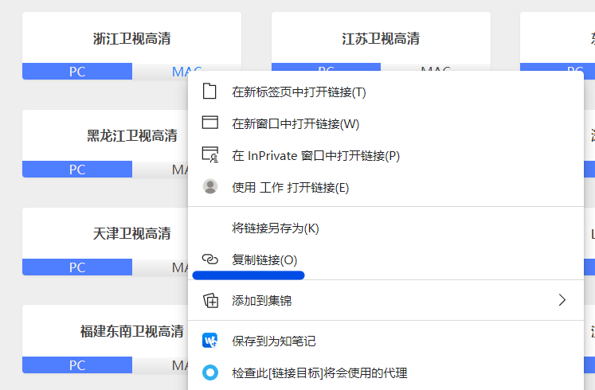
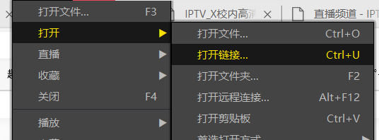
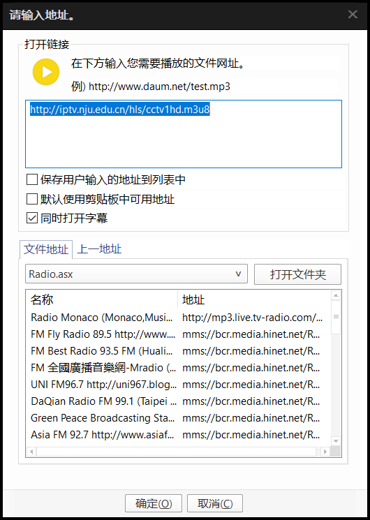
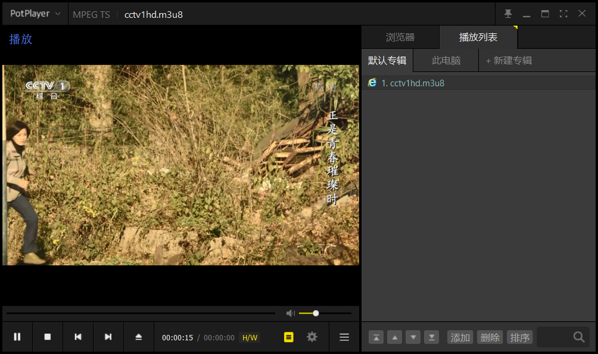
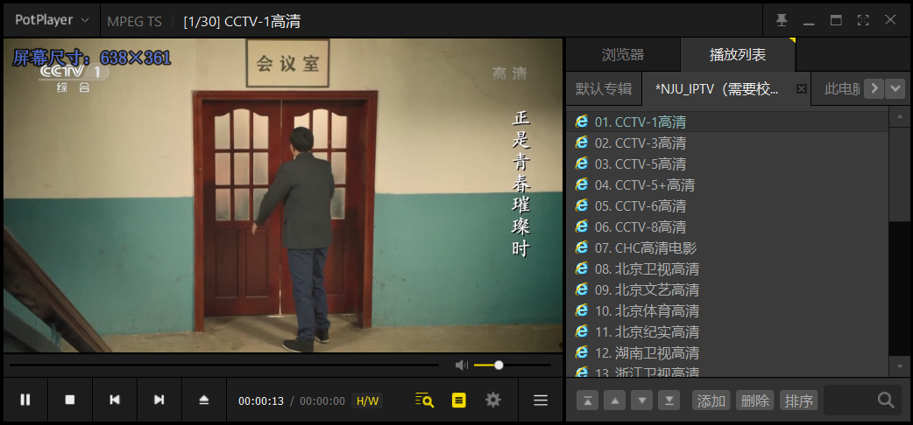

> 本篇带来一个简单的小技巧：**校园网下如何使用PotPlayer播放高清电视台直播源**。超级偷懒请自行安装PotPlayer，下滑到末尾，复制内容后新建一个`.dpl`文件粘贴进去保存，在南大校园网下用PotPlayer打开。


可能大家都不熟悉学校的**IPTV**测试站，通过它我们可以在校园网下看部分高清直播电视节目。这个网站在诸多信息化资源中很冷门，但是**给本选择困难症省去了去B站等地方纠结看啥视频的麻烦；更别说某些电视台独播剧，在网络点播不得不充会员等更新之类的了......**


## 简介


`http://iptv.nju.edu.cn`，是一个南大校内访问的高清电视直播测试网站

*（这个"测试"我至今没理解，毕竟从我本科入学就在"测试"了）*，内有部分电视台高清直播源

*（近几年好像少了一些）*。





有啥用？顾名思义当然就是看电视......如果你想**延续一下小时候在家偷偷开着电视机当背景音写作业的氛围**，那也不错。





网站对PC（大概是指的Windows）和MAC（其实包括iOS等苹果系）分别有播放设置。其中，PC播放需要调用Flash，但众所周知Flash现在已经是[主流浏览器人人喊打](https://tech.sina.com.cn/d/2020-05-18/doc-iircuyvi3720971.shtml "Flash被集体宣判死刑！主流浏览器将在年底放弃支持")的东西了，遇上很麻烦。





而且即使开启了Flash，目前点开PC你也可能会蹦出来

**"正在加载播放器...若长时间无响应，说明播放器不支持您当前使用的浏览器。请尝试更换其他浏览器观看。"**

而无法播放。


MAC的播放是基于[Http Live

Streaming技术](https://tech.sina.com.cn/d/2020-05-18/doc-iircuyvi3720971.shtml "Http Live Streaming")点播的，你也可以看见实际上它指向了一个`.m3u8`的链接。


那么有人要问了，我想看，**但我买不起苹果**，咋办？别着急，下面神器出马。


## PotPlayer播放IPTV


事实上能完成这个任务的播放器很多很多，例如[胡萝卜周的推送](https://mp.weixin.qq.com/s/_EwLmdrAXf6Let0mjDSDQA)。


虽然我们可能大多数情况下在用Windows访问，但是我们在此刻需要把鼠标移至"MAC"按钮上，**右键→"复制链接"**：





接着，打开PotPlayer，找到 **"打开链接"** 或者直接快捷键`Ctrl+U`：





把刚才的连接 **粘贴** 进去：





点击 **确定** 完成：





好了，你就可以开始欣赏电视节目了------


**但你想换台了，怎么办？**


再来一遍好像也没那么方便......


## 通过DPL文件导入


敏感一些的朋友应该已经明白了关键在于这个链接的`.m3u8`。那么剩下的问题就很简单：**这个网页结构特别规整，无论你是用什么都可以很简单地将链接收集起来**，JavaScript直接在控制台敲代码、Python写个可以复用的脚本......这些都自由发挥了。


Anyway，我们假设你已经获取了页面的所有链接，你只需要借助一下PotPlayer的`.dpl`播放列表文件，将链接置入其中便可。


创建一个`.dpl`文件，格式如下：


``` plain

DAUMPLAYLIST

playname=当前播放源

topindex=17

saveplaypos=0

序号*file*节目播放源

序号*title*节目标题

```


其中前4行其实不是很重要，具体参数意义也懒得了解了。关键还是在于后面两行一组的列表。


我自己整理了一个版本，可以复制下方内容，新建一个`.dpl`文件粘贴进去保存，在南大校园网下用PotPlayer打开就可以使用了。


``` plain

DAUMPLAYLIST

playname=http://iptv.nju.edu.cn/hls/cctv1hd.m3u8

topindex=0

saveplaypos=0

1*file*http://iptv.nju.edu.cn/hls/cctv1hd.m3u8

1*title*CCTV-1高清

2*file*http://iptv.nju.edu.cn/hls/cctv3hd.m3u8

2*title*CCTV-3高清

3*file*http://iptv.nju.edu.cn/hls/cctv5hd.m3u8

3*title*CCTV-5高清

4*file*http://iptv.nju.edu.cn/hls/cctv5phd.m3u8

4*title*CCTV-5+高清

5*file*http://iptv.nju.edu.cn/hls/cctv6hd.m3u8

5*title*CCTV-6高清

6*file*http://iptv.nju.edu.cn/hls/cctv8hd.m3u8

6*title*CCTV-8高清

7*file*http://iptv.nju.edu.cn/hls/chchd.m3u8

7*title*CHC高清电影

8*file*http://iptv.nju.edu.cn/hls/btv1hd.m3u8

8*title*北京卫视高清

9*file*http://iptv.nju.edu.cn/hls/btv2hd.m3u8

9*title*北京文艺高清

10*file*http://iptv.nju.edu.cn/hls/btv6hd.m3u8

10*title*北京体育高清

11*file*http://iptv.nju.edu.cn/hls/btv11hd.m3u8

11*title*北京纪实高清

12*file*http://iptv.nju.edu.cn/hls/hunanhd.m3u8

12*title*湖南卫视高清

13*file*http://iptv.nju.edu.cn/hls/zjhd.m3u8

13*title*浙江卫视高清

14*file*http://iptv.nju.edu.cn/hls/jshd.m3u8

14*title*江苏卫视高清

15*file*http://iptv.nju.edu.cn/hls/dfhd.m3u8

15*title*东方卫视高清

16*file*http://iptv.nju.edu.cn/hls/ahhd.m3u8

16*title*安徽卫视高清

17*file*http://iptv.nju.edu.cn/hls/hljhd.m3u8

17*title*黑龙江卫视高清

18*file*http://iptv.nju.edu.cn/hls/lnhd.m3u8

18*title*辽宁卫视高清

19*file*http://iptv.nju.edu.cn/hls/szhd.m3u8

19*title*深圳卫视高清

20*file*http://iptv.nju.edu.cn/hls/gdhd.m3u8

20*title*广东卫视高清

21*file*http://iptv.nju.edu.cn/hls/tjhd.m3u8

21*title*天津卫视高清

22*file*http://iptv.nju.edu.cn/hls/hbhd.m3u8

22*title*湖北卫视高清

23*file*http://iptv.nju.edu.cn/hls/sdhd.m3u8

23*title*山东卫视高清

24*file*http://iptv.nju.edu.cn/hls/schd.m3u8

24*title*四川卫视高清

25*file*http://iptv.nju.edu.cn/hls/dnhd.m3u8

25*title*福建东南卫视高清

26*file*http://iptv.nju.edu.cn/hls/hebhd.m3u8

26*title*河北卫视高清

27*file*http://iptv.nju.edu.cn/hls/jxhd.m3u8

27*title*江西卫视高清

28*file*http://iptv.nju.edu.cn/hls/cqhd.m3u8

28*title*重庆卫视高清

29*file*http://iptv.nju.edu.cn/hls/docuchina.m3u8

29*title*上海纪实高清

30*file*http://iptv.nju.edu.cn/hls/gedocu.m3u8

30*title*金鹰纪实高清

```





## 结语


通过PotPlayer或类似软件这样处理`.m3u8`的优点是我们可以彻底抛弃浏览器，并且不再受到Windows下Flash播放器的干扰，在校园网下收看高清电视节目直播。


这个时代电视已经式微，我们对接受信息的巨大选择权一方面为我们开拓了不少新的认知，一方面也让我们找到了自己最喜欢、最熟悉的固定模式。多样性的涌现促使小圈子越分越多，换一批人，便是另一个话题；人与圈子的关系更甚于人与人的交往。


而世界上没有相同的人。人们摇着个性的旗帜愈加卖力地呐喊，就愈会发现完全相同频率的人或许不存在。人与人之间永远存在本质上的不同，而这不同甚至是无法理解的。这或许是面对丰富信息，满怀希望去寻觅知音的人看来最为悲伤的事情。


我有一个小愿望：挑一个休假的周末，买一个西瓜用水泡着。那天必须要很热，要把空调开着，然后点开一个永远不会结束的电视直播。我的双手与键鼠必须要短暂分别，我的大脑彻底放弃选择的权利；瓜切两半，一人一个勺子挖着吃，电视里不管放什么，无论是欢笑还是吐槽，至少我们的话题都还是确切的同一个。

