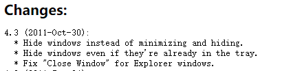

> 没错，这周就发一个摸鱼时发的内容也摸鱼小推送，因为DDL赶不完了。

这是一款Windows下极其容易被忽略的小工具，但是它的功能简单而实用。虽然已经有很长的年头了，但在 Windows10 上（甚至Windows11）它仍然工作良好。

## 它能做什么

它的功能简单到只需要一行字解释：**右键一些典型的程序最小化可以让这个程序直接最小化到系统托盘。**

这里需要解释一下，"典型"的程序指的是

**调用了Windows原生的最小化、最大化、关闭**

的程序，因此有一部分程序用不了这个。

具体的例子是，这种软件就没有问题：

而这种看起来就是软件自己重新设计的不可以：

如果无法分辨出来，那就以实际效果为准。

这个功能可以用来干什么？有一些软件制作时根本没考虑最小化到托盘，都可以用这个方法来补足。比如Thunder Bird *（旧版可以用FireTray插件，但是随着版本更新这些插件出现了大量不兼容）* ，或者 Zotero *（特别是 Zotero Connector 需要 Zotero后台运行，但是又不想看到界面的情况下）*，乃至资源管理器或网页或PDF都可以这么干......

## 它要怎么用

首先当然是去官网下载：

<http://rbtray.sourceforge.net/>

下载完解压，找到并直接运行`RBTray.exe`就可以了。可能你看不见任何界面或反应，因为这个软件自动在后台运行了，在这之后你只需要**右键** 窗口的"最小化"。

没了，是的，这就没了。

## 设为开机启动

不过 RBTray 并不会开机自动启动，所以你得设置一个自动启动。

简单的方法是这样：

1.  右键`RBTray.exe`，然后创建快捷方式

2.  快捷键 `Win` +`R` 打开"运行"，输入：`%USERPROFILE%\AppData\Roaming\Microsoft\Windows\Start Menu\Programs\Startup`，回车打开

3.  粘贴之前的快捷方式，完毕

