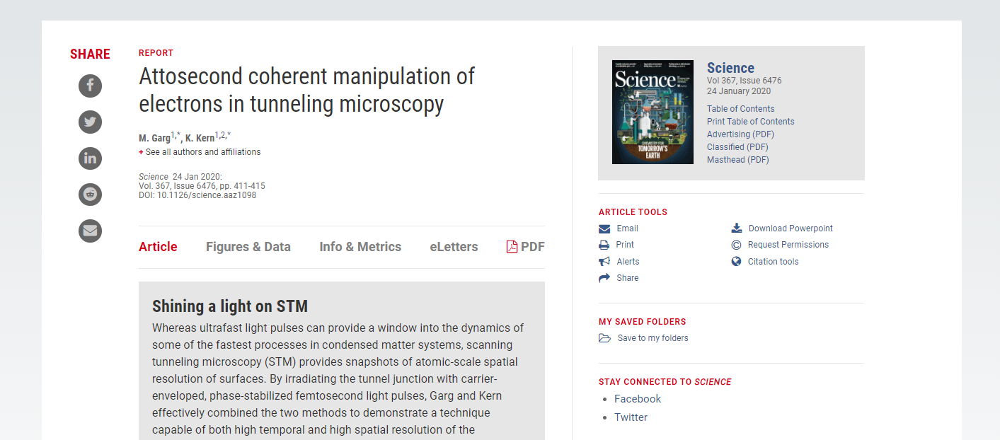
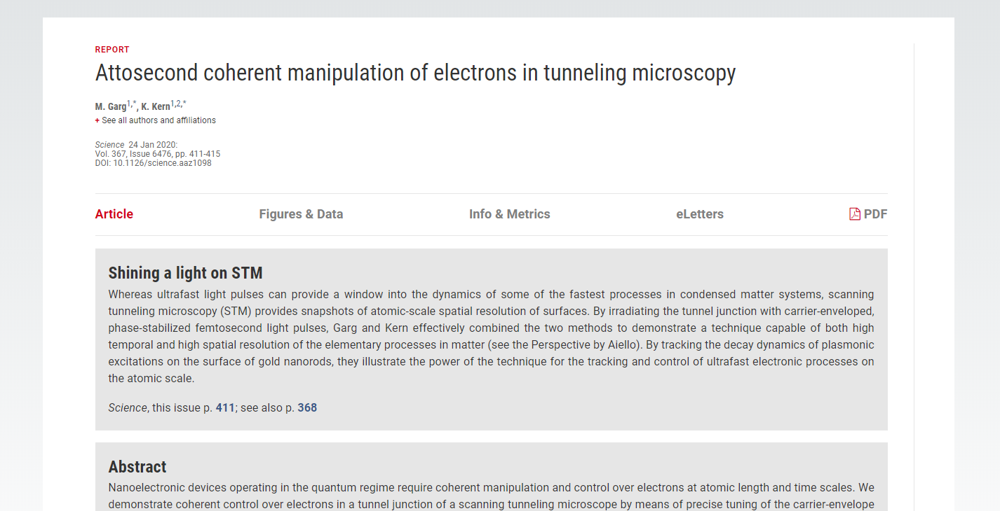

最近觉得各种期刊杂志的网站边栏大部分时候很没有意义，不仅分散注意还占用页面导致阅读不畅。所以特意做了一个油猴脚本。*(其实简悦之类的阅读优化已经不少了，但我搜了圈感觉看论文需求的没有特别合适的)*

## 安装

### Tampermonkey

首先，你需要一个Tampermonkey或类似物，基本浏览器都可以在其插件商店找到，所以不需要特殊操作。

### 脚本

先安装完上面的插件之后，再安装脚本。

脚本托管在GreasyFork上，点击即可跳转：[Reading Mode for Online Papers](https://greasyfork.org/zh-CN/scripts/402528-reading-mode-for-online-papers)，直接点击即可。

## 使用

安装后默认开启，所以不需要做任何操作，当网页加载完毕会自动应用。

> Note：但是侧边信息其实还有很多有用的东西的，所以建议需要看侧栏东西的时候可以手动关闭一下

## 效果

以Science为例，

原网页：

应用后：

## 项目地址

[LadderOperator/Reading-Mode-for-Online-Papers](https://github.com/LadderOperator/Reading-Mode-for-Online-Papers)

