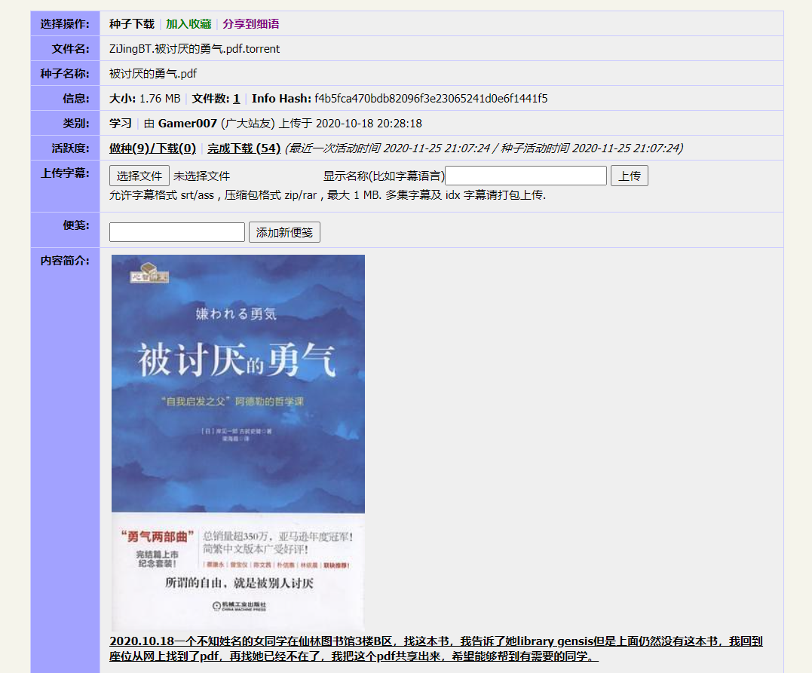

> 与人玫瑰，手有余香。

**全文约10000字，请闲暇时阅读。**

昨天下午听到了紫荆站关站的风声，到了晚上，此事终于官宣确定。万般惆怅，感觉自己失去了一位战友，并且由此串联起前面诸多牢骚。

我想为紫荆、想为我在南大见闻的种种，**以我个人的视角写一篇纪念，纪念南大校友们或有心或无心去做的一些小故事。**

这些故事或已经落幕，或正在进行中，兴许下一年它们也会代表着一个时代落幕而结束。**好好珍惜它们，也更应该珍惜用爱堆成它们的人。**

而热衷于此的人们啊，你们并不孤独。

纵然现在，新媒体们争先恐后地把相对成功者最闪耀的一面描绘得无懈可击，对其后纠结而真实的个人情感、丰富而新颖的多元观念秘而不宣------

我仍然想在"内卷"泛滥的今天，在竞争激烈而充满隔阂的今天，至少是跟周围的朋友们呼吁一句：**若你南行，请带上这朵玫瑰。**

## 与紫荆相识的日子

2020年11月12日晚，一则通知猝不及防地出现在了诸多紫荆账户内。紫荆公众号同步发布了[关站通知](https://mp.weixin.qq.com/s/NH0dWFMa-cxQbLnyv3RcCw)，潮水般的转发淹没了朋友圈和QQ空间。

几乎每个群聊都有人在同一时刻问出：**"紫荆要关了？？？"**

其实我不震惊，我在下午的时候意外提前听到了风声，半个下午已经足够让我冷静下来了。但即便如此，看见各处都在疑惑震惊，看着电脑旁边硬盘里的豆瓣TOP250，想起我曾经郁闷的日子里挑出来看的那些电影，突如其来的恍惚感仍旧填充了我，手头的事情已经难以继续。

我最早是2015年10月20日接触紫荆。这个日期，如果没记错，可能是我加入物院学生会宣传部的某次内训前后。当时需要搞一份Adobe用，部长在内训之前，必然要先手把手教会我们使用紫荆，我们也因此打开了新世界的大门。

那一份Adobe 2015 CC用了两年多，直到学校购买了正版Adobe之前，我的学习几乎都是靠这个安装包。在紫荆十周年活动《分享你与紫荆站最美好的回忆》中，我还特地提了这个安装包的重要性------**它就是那只扇起我之后许许多多邂逅与风暴的蝴蝶**。

除了软件资源紫荆还有很多很多东西。15年11月份，我第一次被人安利看完了EVA，也是在紫荆找到了合集。之后的仓鼠行为愈发不可收拾，数学物理计算机类书籍囤了又囤，可惜的是随着多次倒腾系统不少资源已经没了。

2016年寒假的"南星计划"返校招生宣讲，我甚至把这玩意儿拉出来作为南大的一项校园文化特色来说。

2017年，我差不多养成了没事点开紫荆看看资源的习惯，一大乐趣就是看看有什么奇奇怪怪的新玩意儿。**这感觉和逛地摊一样，挑自己最喜欢的东西下，然后在评论区找到同样感兴趣的人。**

进一步了解紫荆其实是托 **\@许黎之**（xxj）

的福。时值2018年，我和xxj正好作为学生助理在16级物院群里，遇到有学弟学妹提问题。xxj丢出了一份紫荆使用教程，我才知道xxj已经是紫荆的上传员了。

之后机缘巧合，2018年IT侠和紫荆联合做了一次招新宣讲。那次宣讲因为宣传上本身就困难，最后来的人数远远少于我们定制的"紫荆站 × IT侠"钥匙扣数目。

也是因为这次宣讲，我慢慢认识了紫荆的管理层，没事窜窜他们的群，然后试着把他们的教程搬运到IT侠的知识库内整合到当时还活着的bot内。

2019年我开始读研，终于有了自己在实验室的电脑。多年来我没有固定设备，因此没法稳定地辅种；而现在，我终于有机会了。

周围人说，唉，这个东西真难找，或者紫荆也搜不到------好，我去帮你看看搬运。于是我重点搬运了一些周围mac用户急缺的学术软件，然后又看见一些好书的资源搬了搬。

搬着搬着不免想夹带私货------于是又传了《献给阿尔吉侬的花束》的两个电影版本，希望把这部小说的原著安利出去。毕竟这本小说对我的影响确实很大。

但我还不是上传员，其他上传员们才是紫荆源源不断更新的主要力量。

我想很多人至今也没有特别明白"分享率"是什么东西。其实很简单，说白了就是 **"有来有往"**。我下载东西后，除了我自己用用之外，资源我不删掉，别人就可以通过种子找到你的资源，然后从你电脑上下过去，这称为"上传"。

**你上传、我下载，你下载、我上传，这就是一个很简单的双向"分享"过程**，撇开版权等问题来看，我理解的PT其实就是这么简单，这也是作为一种"江湖规矩"而存在。分享率过低导致无法下载东西，是紫荆为数不多的限制，其实也相当友好。

也正是因为这样，年久到建站之初、承载初创者个人记忆的《浙大女研究生·我要的飞翔》能够被广大校友们一个个接力传播到现在不至于无法下载。当然很多其他种子不一定有这么好运了，比如南大科幻社的第一期电子杂志《白岸》。

甚至还有某校友 **\@大忍崛起**，毕业了偶尔溜回来做了几个新软件资源的种子，然后没法一直辅种，于是和我PY让我单独下好在校内辅种。

近期印象比较深的还有一个朋友，因为在图书馆看了——这某本书，于是自己分享了一份到紫荆上。这事儿挺感动我的，虽然特别小，但是这挺珍贵，值得大惊小怪。

这些零零散散的事也不少。我不能算严格玩PT的，但这种氛围确实让我觉得很舒服。

几个月前，紫荆有一次临时维护，大家可能不知道发生了啥。其实是有天大家发现，紫荆在注册时，校验学号里的数字第一位只能是1，否则会识别为非法；这个远古BUG会对20级开始的新生造成影响。

从去年开始大家就在讨论要不要换个技术框架重构紫荆，我也摸了摸部分残缺的代码------但没想到竟然这么快就要改动它了。所幸事情最后以非常小的改动解决了。

事后大家开玩笑说，当初胡同（紫荆创立者）可能根本没有料到，这个唯一还在用`XBNBT`搭建的小破站居然能活到2020年。

紫荆宣布关站的时候，我突然觉得很搞笑：**胡同其实是预言家，偏差了几个月罢了。**

紫荆为什么会成为大家如此亲切的一个存在，我觉得其实并不在于资源。分享的乐趣与发现宝贝的兴奋，值得信任的质量与评论区的互动，以及友好的规则，都可以是紫荆站亲切氛围的一部分。

若说是资源，北邮人之类的大站可不少；**但当你踏上那不属于南大的圈子，多少会觉得自己在漂流**。套某个管理的话，紫荆关闭后，"何以为家？"，确实如此了。这不仅仅是学生的家，一些老师也习惯了紫荆，可以说这是南大地下校园文化的重要一块。

但现在，紫荆的关闭势必让大家都流向其他的站点。也许今天我们还在同一个紫荆内，明天就天各一方了------还要入乡随俗适应其他站点的规矩，兴许也没人关心你想下载的是什么，你只是偌大个PT站里一个不起眼的用户；南哪儿的印记也无处可见。在紫荆搜"南京大学"，其实藏着不少回忆呢。

**我们终归是要回到与周围人的接触中去的，这是现实世界的生活。**

但与现实不同的是，以一个个资源为中心的交流，让有限的社交扩展到整个学校，从而发现自己对分享的热爱不是一个人、对某类资源的喜爱不是一个人，孤独是可以缓解的；真实的性情，在充满着焦虑的现实世界内根本不敢露出，却在这个小破站的"调味"里得到了舒展，哪怕是"单机玩家"也能自得其乐。

**这太像一次猝不及防的毕业了。**

最后的全站优惠与留言帖，推送底下的段段回忆，分明是一次自发组织而没有冗长讲话的毕业典礼。

幸好如xxj所说，2014年，[故事里](https://mp.weixin.qq.com/s?__biz=MzA4OTk3NzMxNw==&mid=2652345855&idx=1&sn=fac88e8e3519fc98ea504566953b711d&chksm=8bf18d75bc8604636f313739c8df671bd3a0f182a3a623f2c3dfb13cadad625c0c8df2ba93c1&scene=21&token=1317287994&lang=zh_CN#wechat_redirect)的胡同最后终于和"紫荆MM"有了幸福的结局。

而紫荆，也永远会在我的网页收藏夹里躺着。

## 凋零的百合

看到这节题目，熟悉本公众号的读者可能会心一笑：**"这个人怎么又来唱衰小百合了，这难道还用说吗？"**

今天我是来说新故事的，诸位无妨继续看下去。

小百合，与紫荆站一样，有着它自己的爱情传说。

小百合的故事甚至远早于紫荆，却藏在犄角旮旯里，无人翻阅。

> 小百合站于1997年7月25日创立。
> 
> 该站名为bird（现使用chenj，该站创始者和首任站长，毕业后留校）所起，用来纪念一位他所暗恋的、在中国科学技术大学瀚海星云站上账号为lily的女生。曾沿用系统默认值的站名"大红花的国度"。小百合站一度发展为教育网内同时在线人数最多的BBS站点之一。在1999年前曾有短暂的关闭史。
> 
> ------摘自维基百科

再古早的故事，我们已经很难去一个个求证；即便你循着维基百科的记录，也只会收获一些关于自由、一些老掉牙的叹息。

毕竟从2005年之后，小百合才成为我们现在的小百合------但这个时候的小百合，仍然诞生了许多传奇。

你会问，什么是传奇？是微信封面那些闪亮无比的报道宣传？
流——失

**显然不是。**

传奇可以是一个人，可以是组织，也可以是散落在边边角角的"小透明"们。

2000年，小百合BBS技术维护组[成立了小百合工作室](https://lilystudio.org/2017spring/ "小百合工作室2017年春季招新")。在他们首页的介绍里写道，小百合工作室是"由南京大学网络爱好者自发组织的一个的非盈利学生团体，致力于传播校园网络文化，促进校园网络建设，服务广大同学，并为爱好网络和计算机科学与技术的同学提供一个交流学习、共同提高的平台，是纯公益、非营利性的民间组织"。

他们主要做了些什么呢？曾经的Linux开源镜像站，他们做过；曾经的[南大青年网站、志愿者网站、阳光教室](http://bbs.nju.edu.cn/vd48031/bbscon?board=LilyStudio&file=M.1394088132.A&num=1679 "小百合工作室招新帖")等等，他们做过；[南大掌上图书馆检索](https://twitter.com/lilystudio/status/10917406649 "南大掌上图书馆检索")、小百合移动端、米课（南大课程评分网站）他们做过。说来惭愧，这个组织，我在整个本科阶段只有两个地方听过它------一处是他们的招新横幅，另一处是他们的成员[\@idealclover](https://idealclover.top "@idealclover")。对，他就是做了南哪课表、南哪指南等项目的翠翠。

但这并不妨碍我看见他们做的那些事，2015年前后我还受益于

**"米课（MiCourse）"** 和移动端小百合过，但可惜前者已经不存在了。

小百合工作室渐渐地似乎和小百合也没有什么关系了------这句话也是我听来的，但我已经忘了是谁告诉我这些。等到我开始关注的时候，我能寻觅到的踪迹只剩下了[GitHub的代码](https://github.com/LilyStudio "小百合工作室的GitHub")。

很多人也许不知道，**其实很多百合站友（当年是学生）最后仍然留在了南大里**，在为更好的南大做着自己的贡献。他们可能藏在技术岗位、行政岗位、科研岗位上；小百合的这段回忆，旁人若不提起，便只藏在自己心里。

这真的是一个非常玄妙的事情。当我因为校长信箱改造的事情去投诉，因为校园网络建设急进而粗糙去反馈的时候，我最终都发现这些回应我的恰好是当年小百合颇有来头的站友。

2006年，一位ID叫做 [\@yaoge123](https://www.yaoge123.com/ "@yaoge123")的百合站友发布了他为南大校园网定制的[BRAS](https://www.yaoge123.com/blog/bras "yaoge123版南大BRAS")的第一个版本，以方便大家在校内访问外网和外网访问校园网（功能上类似今天的南大VPN）。

2020年的今天，他支撑了**南大Git**、**南大Box云盘**、**南大Linux开源镜像站**等等便利服务。现在最熟悉他的，可能是一直在使用这些服务的用户们。

我们再把时间回退到2013年。不，我们再退早一点吧，退到2007年。

2007年，一位电子系的研究生杨帆在小百合发帖："免费修理电脑、音箱、耳麦、电饭锅、吹风机、电水壶、mp3、台灯、风扇......会做木工，桌子、板凳有问题也可以来找我。"

于是，受到帮助的同学把他称作 **"电器侠"**。

2009年，临近毕业的杨帆想把这件事做下去，找几个接班人，却无人问津。《扬子晚报》连续报道了这件事情后，校园内和社会上反响强烈，许多同学报名参与义务维修队伍中。后来，在**南大研会网络科技部**的帮助下，"电器侠"工作室成立了。

2012年，维修主力陆续毕业，工作室面临断代威胁。同年，小百合的网友们有感于"珠江路装系统被坑"事件，在NoteBook版的倡议下，迅速组建志愿者团队 **"软件侠"**。

2013年，在团委老师牵头下，软件侠、研会网科部、电器侠最终[汇聚成了一支队伍](https://www.yuque.com/itxia/intro_for_public/brief_history "IT侠简史")，它就是现今的 **"IT侠"**。

类似的传奇有很多，此处因为我最熟悉的当然是"IT侠"，篇幅较多。

**但上面这些，不过是还能被时间沉积下来的"辉煌"。**

有许许多多利他的想法，在小百合上看似昙花一现，却给现今的南大带来了潜移默化的改变。

在前面的[《百合凋零》系列](https://mp.weixin.qq.com/s/uWeuoL0U01rTgIcShGesVw)中，我曾经写过，"校长信箱不完全是反馈不足、不满的渠道，它也是很重要的建议渠道。事实上，校长信箱的历史发帖中有许多想法是**回看起来超前的**......这些建议，短的可能很快就得到实施，长的需要四五年才最终落实甚至至今没有动静。**这意味着那些曾经的校友离开后，后人所提的不少建议其实是重复、仍未得到落实的**，比如南园六舍的翻新、热点事件的长效机制；也意味着我们现在觉得**理所当然司空见惯的很多设计**，其实来自于几年以前一些认真的前辈提出的可行建议与学校部门的支持落实，比如AED、公共空间等，尽管**有时候等待的时间也太长了**。"

小百合工作室早在十几年前就已经有了推动南大网络建设的想法和尝试；yaoge123留在南大后也推出了长远来看便利的服务；IT侠几经波折也已经能让某些商家急得背地中伤；而那些毕业、离职就离开南大的人们，他们也用不多的言语提前告诉了我们，**更好的南大，究竟需要什么？**

这一节，终归还是得回归到"百合凋零"上的。

小百合其实也有个微信公众号。从2014年运营至2018年就再也没了声音，曾经还会把一些站上的帖子拿出来发。感兴趣可以搜搜。

我们已经猝然送别了紫荆。小百合虽然还在某处服务器上运转着，却已经不能算活在大家心里了。

**我总在想，若仅仅是小百合的"凋零"，那可能还能算一件幸运的事情。**

## "浮芸"与他的NJU助手

"浮芸"？听着就像学姐（误）。

这确实是我当年入学的第一感受。

我没有见过这位学长，我对他的了解约等于无。但是还好，2016年的南大青年，**还是愿意**为这样一位人物留个推送的位置的：[《100种大学生活方式 \| 浮芸，从校园传说到南大人的精神符号》](https://mp.weixin.qq.com/s/1k7Bc5f1iwXfEM0cUH1d5Q)。

"浮芸"最初活跃在百度贴吧，在贴吧内为新生答疑解惑，同时也是多年新生咨询群的群主。

与推送里"可倘若提到'浮芸'二字，大多数南大人都会心领神会地'哦'一声"相反，这个ID现在大家不多眼熟了，但是 **"NJU助手"** 想必大家是知道的。南大青年的那则推送介绍比我的了解还要全面，我就说说我的记忆吧。

NJU助手最先进入我的视野，也是因为一个方便大家的项目------**米盒**。这个项目听起来很像前面小百合工作室的"米课"，但不太一样。这个网站搜集了各个南大课程的课件资料等以与大家共享。似乎现在类似的服务变得很多了，不过套路却也多了起来。

除了米盒，NJU助手还有个项目也已经消失了------我已经不记得那个域名，姑且称之为"Great NJU"吧。Great NJU是个工具合集网站，包括了GPA计算器等等实用功能。后来这个功能似乎还迁移到了"NJU小帮手"微信号上，但是已经很久都没更新。

NJU助手团队继承了浮芸的"事业"，在每年开学季都赶紧建立新生咨询群，**抢在无良商家们之前赶紧告诉那些新生入学必要事项**。也不知道多年以来，那些和学校暧昧不清的运营商们到底是怎么光天化日之下进行各种骚操作的。**反正本科新生如果一进校就接触了NJU助手，是一件令人安心的事情。**

助手菌日常还会挑选发一些对全校同学都很重要的消息。不知道多少人有注意过NJU助手的推送有时末尾的SLOGAN：这里只有和你**密切有关**的东西。

现今，我真的很难在南大的官方新媒体矩阵里找到那么一个公众号还能有这个意识的了。**如果硬说有，恐怕只有辅导员们勤快转发的南大学工。**

我现在读研了，有时也挺羡慕本科生。研究生几乎没有NJU助手这般的照顾，而学校也没有给新生多少实用的引导------仿佛一个`ehall.nju.edu.cn`丢出来，就真的够了一样。

NJU助手作为一个民间团体，坚持了这么多年，也有新人不断加入，真的挺不容易的。**既要照顾新生，又要改造"伸手"，学长学姐们真的太难了。**

## 万能的表白墙

表白墙起始的年份我并不确定，我的记忆中是2014年。

我其实后来也才从[知乎的问题](https://www.zhihu.com/question/48916723 "如何评价南京大学表白墙？")知道，最初表白墙其实不只有一个人，只是最终坚持下来的运营者只有初代墙了。因为某些机缘巧合，我其实是知道初代墙的身份的。初代墙在离开前，把QQ号托付给了二代目，还留了一段"推墙"视频------现在翻可能比较难翻了。

**初代墙的时候，表白墙还真的以表白为主。**后来，墙又逐渐分化出了好多职能------失物招领、树洞、评论区辩论等诸多奇怪的功能。

我大概是在表白墙最单纯的时候开始水墙的，彼时活跃到列表里不少好友都是以"表白墙看见你眼熟"为理由加的好友。

回想过来，整个大学四年都被BBQ贯穿，有开心事也有难过的事，而且几乎都对自己的人生轨迹产生了影响。

最开始的表白墙，在我印象里是一个充满友爱、和气、逗趣的氛围。

有人提问题了，大家在评论区各显神通来解答；有人提出一个有意思的话题，评论区能写很长很长针锋相对但也逻辑清晰的辩论；时常也有抖机灵神评论，网友真的个个都是人才。

**不过，几乎任何一个对外开放的平台，最后都逃不过闲杂人等的侵蚀。**

大约在表白墙建立一两年后，表白墙上软广、伸手党、发泄党多了起来。矛盾激化也越来越容易，有时候表白墙上那些芸芸众生的发言和表现让你开始怀疑，我的身边难道其实都是这么些情绪化、不讲理、以己度人的人吗？

信息量随着知名度的不断上升而暴增，**想都不用想表白墙的运营是多么大的工作量**。这种状况在二代目开始发生了一点点转变。

其实，二代目我也略微知道是谁，甚至有过一面之缘。二代目的时候，虽然名义上仍然只有一个运营者，实际上表白墙接受的信息流却有了多支分流------失物招领引导到了南京大学全服侠（校会运营）；情感树洞到了晚上会交给"墙君"；一些征友启事大家会发到"红娘兔"；剩余的还是由二代目来发布。

说起"墙君"，我至今有他的小号。说起来，其实他的"解忧杂货铺"并不能真正地解答我的那些疑惑。**但有这么一个有信任感的倾听者在那一头，还是会比那些没有回音的"技术树洞"要好很多。**

等到三代目开始，表白墙已经变成多人运营了。这也是我逐渐淡出表白墙的时候。

在这个时期我经历了好多匪夷所思的事情，我更加坚信------**永远、永远不要试图从网络上去了解别人，你根本看不见一个人真实的悲喜。**

就像这句话一样，我也不知道这些运营者们的悲喜究竟几何。

表白墙承载过的不仅仅是个人的情感释放，**还承载过诸多群体的激烈冲突**。南大校园内的舆论事件逐渐脱离似有人监控的小百合，最后集中在表白墙这里爆炸开来，信息密集的时候表白墙也不得不用一个总结公告顶一下。

他们一定会犹豫要不要发、担心能不能发，有时自己其实就已经置身在这些言论的风暴里却要真的像墙一样稳当，同时也要为自己在做的事情能够存续而绞劲脑汁。

完全无偿无收入乃至自费钱财、时间、精力地去做这么一件事情，无论效果如何，**坚持下去便是奇迹**。

虽然我已经不怎么看表白墙了，**我仍然真诚地希望这些直到退休都不一定能说"我其实曾是南大表白墙"的人，能够被大家知道。**

## 指南好难

前面其实提过一嘴，说研究生入学几乎没有任何引导，本科外校的研究生新生进入南大就不比大一新生能对南大的七七八八清楚多少。

据笔者多年来在南大的观察，研究生新生除极个别院系，大多数**无任何新生手册**，只有有限的"入学教育"，参与率还非常低；但其实从生活上说，本科生、研究生共享一套生活基础设施，因此同样的新生指南往往有重复内容。

新生手册的内容每年更新的部分一般占较少篇幅，有很多内容实际长期不变；如果院系要从头制作一个排版的手册，设计上花费精力较大、印刷上经费亦有限。

于是，目前比较通行的是如下解决方式：

-   **口头传递**：核心工作人员必然不多，且由于每个人自己的接触面不一样，因此这种口头传递信息的方式费时费力，也非常容易造成伸手党，对于无论研一还是本一的同学而言都无助于以后更多问题的自主检索能力。

-   **依托群公告、群文件**：微信群这种落后的文件管理自不必谈，Q群尽管在文件管理上更有优势，但也有碎片化的问题。公告和群文件散乱分布，并不适合查找，更别说全文检索。

-   **转发推送**：至今，仍然没有一个公众号可以做到一次推完所有相关内容，而且微信链接不方便记忆、转发麻烦，可能得用收藏功能才可以随时转发。此外，微信推文本身不能在大多数搜索引擎内检索，因此实际上反而割裂了信息流动，这是微信生态的痼疾。

以上方式或多或少可以临时起作用，但是最终都会因为链接更新、换群、换人，或者信息量过于庞大不成体系而难以起到效果。

此外，由于新生一般进入学校后一段时间内仍处于"萌新"状态，可能需要一段时间才会对常见的几种问题或需求产生概念，因此只在开学推送、传递的方式会有不小缺漏。这类工作应当有一个**长期稳定、及时更新**的托管渠道，且足够方便宣传、转发。

有这么一个人，他就想到这个问题，做了这么一件事------把大家每年发来发去的重复的东西整理起来做个文档，这样大家一起维护，就能每年惠及新生了。

于是，最初可查的[《南大生活指南》](https://www.yuque.com/njuguidebook/guidebooks/dev "《南大生活指南》")由2019级地理学院研究生[\@GeRongcun](https://github.com/gerongcun "@GeRongcun")（葛学长）在南京大学2019级研究生交流群期间整理完成。葛学长恰好是紫荆站上~~床~~传员之一，我有幸在紫荆站的群里意外看见了这个文档，于是补了点鼓楼的部分。

巧合的事情发生了。2019年的5月，前面提到的翠翠[\@idealclover](https://github.com/idealclover "@idealclover")在本科毕业既南京大学校庆之际，想要把常见的校内网址汇总，并且放一些对大家学习生活有帮助的内容，制作成一个主页。最初的版本发布时，我又恰好在空间看见了。

一个很自然的想法发生了------把两个异曲同工的项目结合到一起，让他们的努力互相补充以最大化对大家的帮助怎么样？

于是我跑去翠翠的GitHub，联系上了翠翠和葛学长，开始推进这个计划。大家合作后，以葛学长的《南大生活指南》为部分参照补充，制作了[南哪指南](https://nju.today/ "南哪指南")主页。

更巧的事情发生了。

前面提到的[\@NJU助手](https://www.yuque.com/greatnju "@NJU助手")团队也想到了类似的问题。他们根据多年经验，更新了大量实用内容，汇总了官方信息，援引了葛学长的《南大生活指南》和翠翠的南哪指南，也自己整理了一份面向新生的文档。

看起来热火朝天，不是吗？

但是半年后，我慢慢感觉到事情并不简单。

葛学长的指南挂了一句有意参与者加群。**于是过了半年，我们的群终于多了一位新人。**

翠翠毕业了。我上次PR的内容至今还没更新到指南上去，**但是似乎大家使用的热情也已经过去了。**

NJU助手的团队我不知道做得如何了，应该还好吧？

指南这种项目，真的做起来太难了------**它必须要团队协作。**

它既需要人手充足，也需要分布广泛，这样指南才能避免盲区，大家各取所需------

**但是没有人想参与、延续做这种事情，毕业将会敲响这种项目生命周期最后的钟声。**

我时常觉得这种事情，总得有个组织来牵头做。但我环顾周遭，毫不意外地发现：**这几个圈子，似乎就那么几个人罢了。**

## 玫瑰啊，你往哪里去

紫荆站，今天24点就要与我们真的再见了，但是我们已经无法像对当年的小百合一样，聚集在南园的已经消失的喷泉为它献上紫荆花。

小百合还没有关站，但这对于校外的毕业校友而言已经没有什么区别了。

小百合工作室，我不知道发生了什么，我已经很久没有见过踪迹，就连GitHub都已经没了动静。

yaoge123老师，在发这篇推送的时候，大概早已连轴转了几个小时。

IT侠，仙林和鼓楼都在为现在校级社团制度乱七八糟的新规定而烦心。

百合站友们已经快没了声音，十大热门甚至连一个水帖都没了。

NJU助手的推送频率减少了，不知道是不是和大家紧密相关的消息已经真的不多。

表白墙还在日复一日发着，评论区出现了一大批新面孔，但也走了不少有趣的人；偶尔话题甚至能上微博热搜了，这以前谁敢想。

红娘兔最近生意似乎不好，但前面成了几对也挺开心。

权服侠每天凌晨发完一天的失物总结后，终于可以晚安了。

指南项目们也没有什么更新，葛学长忙里偷闲更新了不少地理学院用的资料，顺便还[给紫荆站做了一个镜像页](https://mp.weixin.qq.com/s/yX55mvAS4PUvocK6gISwOw)留作念想。

翠翠虽然毕业了，还在维护他的南哪课表，最近刚刚[更新了2.0版本](https://mp.weixin.qq.com/s/WLHHBeL7xW_RbuIhAJqi5Q)。

我也终于在紫荆站关站前，为大家这些年的东西做了一次见证。我只能写我目力所及的事情，如果有遗漏，还请大家包涵。

恰好今天我看见了原中文男足写的一篇推送：[《旧时代的大学生活 vs 内卷时代的大学生活》](https://mp.weixin.qq.com/s/tOcrr7SBrBXbo2_hiAabFw)。

我非常幸运，我觉得我刚进入南京大学的时候算是"旧时代"，至少我是大概按照"旧时代"这么过的------

我只选我感兴趣的课、感兴趣的经典阅读，分数并不高；我参加了[我喜欢的社团](https://mp.weixin.qq.com/s/JFI6qjYgnckf4N-nxmBCew)并且收获许多、乐在其中；偶尔我还可以写写推送，为我觉得可惜、不公平的事情多说几句话。

我觉得至少认识我的人都觉得我过得挺开心的，直到今天我没有感受到"内卷"的太多压力。但我看到周围人的痛苦，我也会跟着觉得难受------忙来忙去，有的心中郁结，有的疲于奔命。在这种情形下，周围爆炸的资讯似乎还在不停告诉他们：他们事情永远做不到别人那样子。

有个学弟前不久就"内卷"和焦虑的问题[写了篇推送](https://mp.weixin.qq.com/s/a0gwzfGdIgyHl-dDavUSOQ)，结尾问了个问题：

"你认为，是什么给你带来了焦虑，有什么可以缓解的方法？"

我当时的回答如下：

"事实上，我几乎从来没有因为自己如何而陷入过这一类焦虑过。

因为我一直认为自己获得的东西基本都属于期望之外的，和我身边同样环境一起长大的很多同龄人相比，我本身就已经足够幸运。我要做的就是**别原地踏步，往前多走两步**，同时也**别忘了身边的人**，仅此而已。

即使遇到再难的问题，我的第一反应都是**先调研了解真实情况**，并且快速做一个是否可行的尝试，**根据实践结果再改进**。只要每次和过去比有一点点改进，剩下的应当放心交给时间本身，有时间焦虑不如被更多的尝试所填充。

**没有什么人能拒绝成为一个能不断提出方案和尝试解决办法的人所带来的自信。**

这种态度在被动学习阶段还不够突出，但对主动学习工作乃至探索的阶段而言，这就是我一直坚信的方法论。"

这不过是从个人方法而言，实际上我们的焦虑大多来自于周围。毕竟南大青年《大学的100种方式》这样的系列推文，我真的已经几年没有看见过了。

**分享的精神，不仅仅是分享资源，更是分享快乐、分享知识、分享生活，甚至还可以是分享自己的建议和设想**；而这些在这个时代的大学生群体中似乎已经式微。当然也可能是我一直以来一厢情愿的理想化遭到打击罢了。

一些对此嗤之以鼻的人可能觉得什么"别忘了身边的人"、什么"分享"都是单向付出的道德绑架，是没有意义的，甚至是浪费自己精力。

我得说，**分享其实是一种双向过程，但并不是以立即"交换"的形式**，急不得。有分享的氛围存在长久而言将是一种幸运，"内卷"与焦虑，恰恰站在了"分享"的反面：你明明有千百种方式去探索自己，为什么要作茧自缚？若你感到单调，参与到分享中来必使你发现自己认知的盲区。

"予人玫瑰，手有余香"，在这个"内卷"泛滥的时候应当有新义。"玫瑰"是什么，"余香"是什么，我相信认真看完的人心里已经有了答案。

**那么，若你南行，请带上这朵玫瑰吧。**

